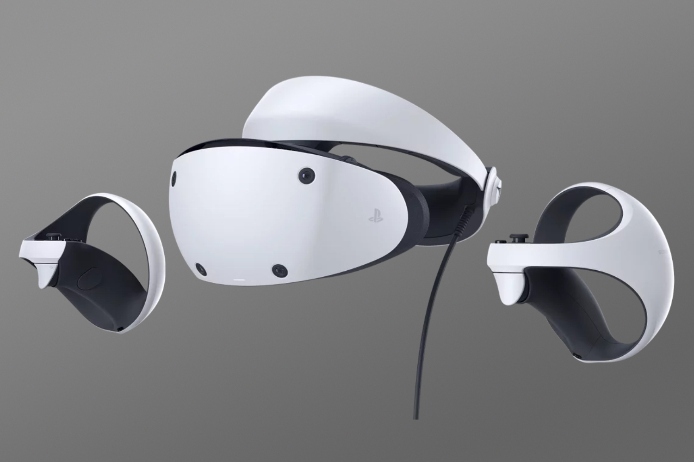

+++
title = "200 $ de moins sur le PSVR2, 2 350 % de ventes en plus"
date = 2024-08-01T09:47:32+01:00
draft = false
author = "Mickael"
tags = ["Actu"]
image = "https://nostick.fr/articles/vignettes/juillet/PSVR2.jpg"
+++

Second souffle ou déstockage ? Sony a lancé il y a quelques jours aux États-Unis (et au Royaume-Uni) une grosse promo sur le PSVR2 dont le prix a dévissé de 200 $, rien de moins. Le casque de réalité virtuelle peut désormais être acheté 350 $ chez les revendeurs habituels — cela reste cher, mais moins que les 550 $ demandés jusqu'à présent.

Surprise, ou pas : la promo a donné un coup de fouet aux ventes du PSVR2, et pas qu'un peu puisqu'on parle d'une hausse de… 2 350 % ! Selon le site *[The Shortcut](https://www.theshortcut.com/p/exclusive-psvr-2-sales-spike)* qui a eu accès à des stats Amazon, le casque s'est davantage vendu dans les premières 24 heures de la promotion que durant les 7 premiers mois de l'année. 

Évidemment, les ventes ne devaient pas être formidables avant ce gros rabais pour être multipliées par quasiment 25. Mais tout de même, ce n'est pas négligeable. Hélas, en France et en Europe pour le moment, le prix de l'appareil n'a pas bougé, il faut toujours casquer 599 €, mais peut-être que cela évoluera dans les prochains jours.

La question qui se pose maintenant est de savoir s'il s'agissait d'un « coup » de Sony pour voir si son casque VR était vraiment trop cher (pas besoin d'une promo pour en avoir le cœur net), et si ce rebond spectaculaire des ventes signera un renouveau de l'intérêt de PlayStation pour ce produit. Les exclusivités se font en effet très rares pour l'accessoire, Sony ne faisant manifestement [aucun effort pour soutenir sa plateforme](https://nostick.fr/articles/2024/juin/2106-sony-sapin-psvr2/).

Ce rabais est peut-être tout simplement le moyen pour le constructeur de vider ses stocks, et de glisser le casque sous le tapis des produits à oublier. Sony lui a offert une retraite dorée, avec [un adaptateur PC qui lui permettra de se connecter aux jeux SteamVR](https://nostick.fr/articles/2024/juin/0306-le-psvr2-sera-bientot-compatible-pc-grace-a-un-adaptateur-a-60/).