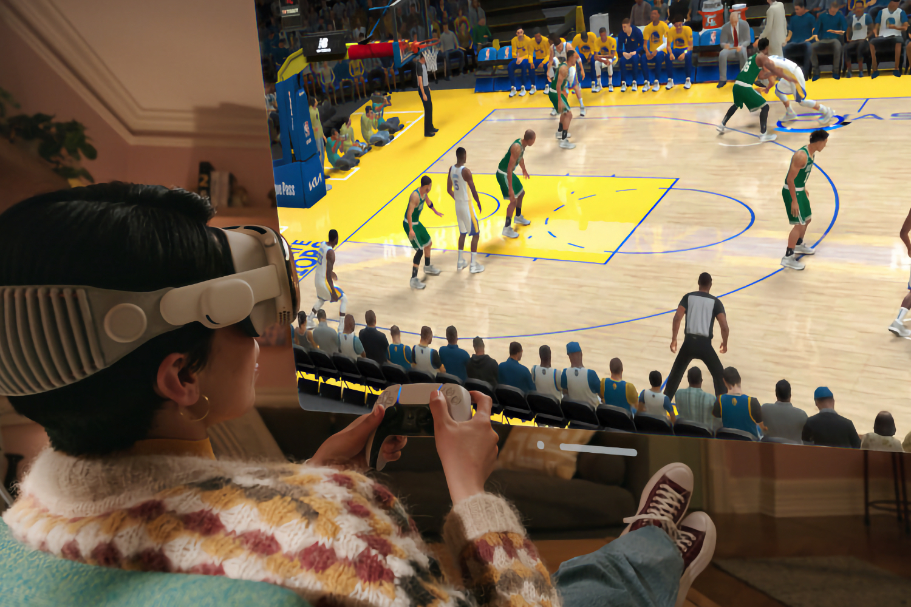
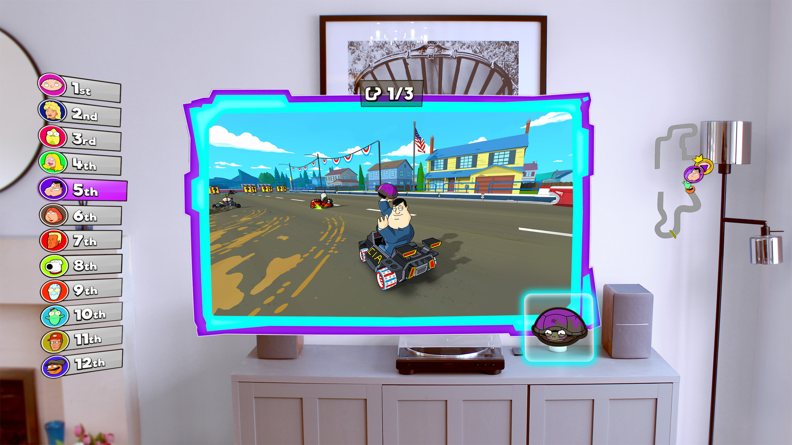
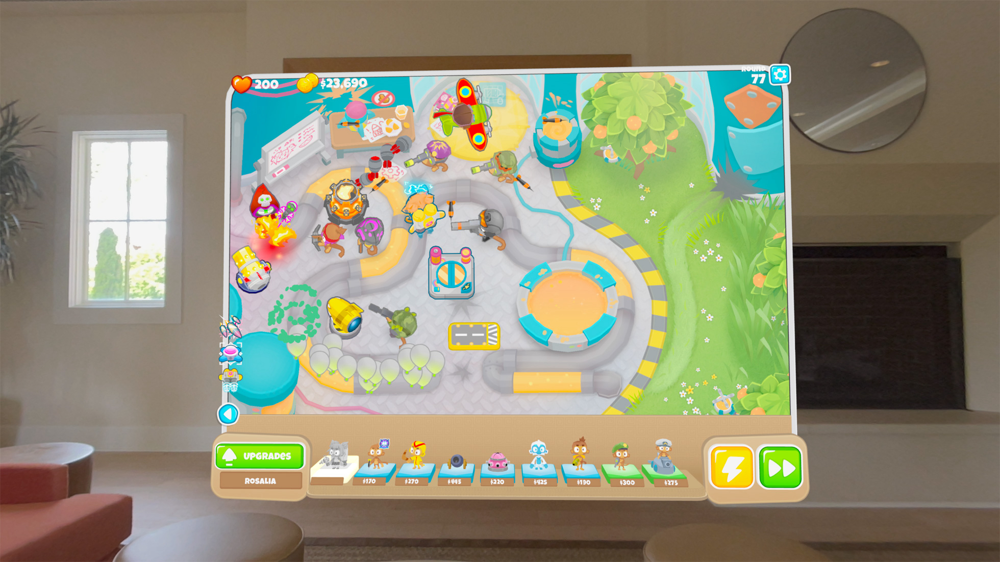
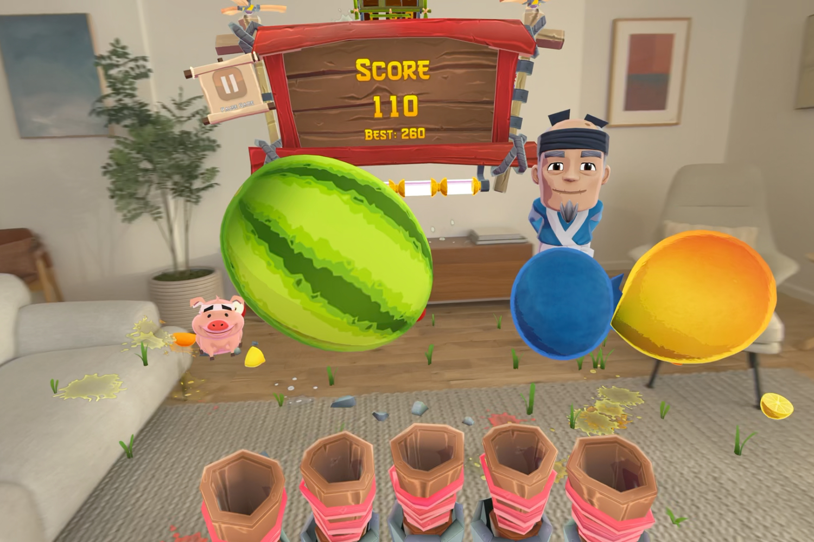

+++
title = "Apple se fiche comme d'une guigne du jeu vidéo sur le Vision Pro"
date = 2024-08-01T09:00:32+01:00
draft = false
author = "Mickael"
tags = ["XXL"]
type = "une"
image = "https://nostick.fr/articles/vignettes/aout/apple-vision-pro-jeu.jpg"
+++

**Malgré des caractéristiques techniques de haut vol et un prix tout aussi élevé, le Vision Pro n'est pas un appareil destiné aux joueurs fortunés.** En fait, tout ce qu'on peut espérer à l'heure actuelle, et probablement pour un long moment encore, ce sont des titres en 2D jouables dans des écrans virtuels, avec quelques éléments graphiques positionnés ici et là dans l'environnement de l'utilisateur à l'image des récents *Bloons TD 6+* et *Warped Kart Racers*.

On est loin, très loin, de ce ce que peuvent proposer les meilleurs représentants immersifs du genre, comme *Asgard's Wrath 2* (Quest) ou *Half-Life Alyx* (SteamVR). À la décharge d'Apple, ces deux titres sont en VR et pas en réalité mixte ; en fait, il n'existe aucun jeu VR pour le Vision Pro, et pour cause : le casque d'Apple n'est pas compatible avec les contrôleurs VR, uniquement avec les manettes de consoles.

Les rares jeux en réalité mixte pour le Vision Pro tiennent davantage de l'anecdotique ou du carrément injouable, à l'image de l'horrible *Super Fruit Ninja* — ce n'est pas tellement la faute des jeux, plutôt des interactions mise au point par Apple, qui passent par la reconnaissance des gestes des mains et des doigts. Quand il s'agit de contrôler l'interface d'une app, cela fonctionne plutôt bien ; mais dès qu'il faut être rapide et précis, les manipulations deviennent très vite frustrantes.

Plutôt que des jeux, Apple préfère probablement des « expériences » interactives comme [l'amusant *What If…? An Immersive Story*](https://nostick.fr/articles/2024/juin/0306-test-what-if-an-immersive-story/), qui mettent en avant toutes les capacités du Vision Pro sans trop frustrer l'utilisateur avec des gestes compliqués. Mais qu'il s'agisse de jeux ou d'expériences immersives, pour les multiplier et faire du Vision Pro une place forte de la réalité mixte, encore faut-il avoir les développeurs prêts à s'investir dans la plateforme. Et ça n'est manifestement pas le cas.

Le site *[MobileGamer.biz](https://mobilegamer.biz/inside-apple-arcade-again-late-payments-stonewalled-studios-terrible-tech-support-and-vision-pro-woes/)* a fait parler ses sources et ce n'est pas glorieux du tout pour Apple et pour son casque XR. « *Développer pour le Vision Pro, c'est comme remonter 10 ans en arrière, car malgré la puissance annoncée – et le coût – ce n'est pas une machine conçue pour le jeu vidéo* », déplore un développeur. « *Faire fonctionner des jeux complexes sur cette plateforme, c'est difficile* », ajoute-t-il.

Les ingénieurs d'Apple n'ont pas l'air de savoir comment fonctionne le casque. Le support technique est « *affreux* », précise une source, « *le pire que j'ai jamais vu* ». Les spécialistes du constructeur se montrent « *incapables de fournir des infos sur le fonctionnement du matériel et du logiciel* ».

Pourtant, le jeu vidéo fait partie des arguments marketing mis en avant par Apple pour tenter de refourguer sa camelote XR. Et le constructeur a déjà approché des développeurs pour concevoir des jeux pour le Vision Pro… mais sans compensation financière, ni garantie que les titres soient promus dans la boutique officielle ! Une approche « *totalement déroutante* », s'amuse un d'entre eux, et qui contraste avec le tapis rouge déployé par Meta.

Ce n'est pas une surprise, Apple n'aime pas le jeu vidéo et pire encore, Apple ne comprend pas le jeu vidéo. On a bien de temps en temps des poussées de fièvre comme au début d'Apple Arcade et de ses ambitions ([ça n'aura pas duré longtemps](https://nostick.fr/articles/2024/mars/2603_applearcade/)) ou encore cette idée saugrenue de [caser des jeux de consoles AAA au chausse-pied dans l'iPhone](https://nostick.fr/articles/2024/juin/2606-gros-jeux-iphone-strategie-apple-flop/), une passade qui durera jusqu'à ce qu'Apple cesse de signer des chèques aux éditeurs.

Le Vision Pro pourrait être une machine de rêve pour les joueurs, certes hors de prix, mais qui pourrait apporter une immersion inédite en réalité virtuelle et des expériences incroyables en réalité augmentée. Ça va être difficile, vu l'apathie d'Apple, voire son aversion envers les devs de jeux vidéo. [À moins de se contenter de jouer à des émulateurs](https://nostick.fr/articles/2024/mai/0205-apercu-de-lemulateur-virtual-boy-pour-apple-vision-pro/).