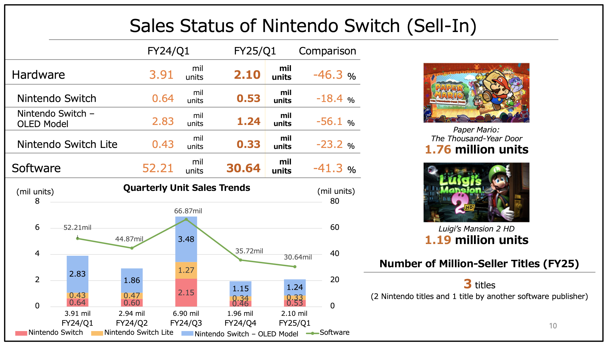
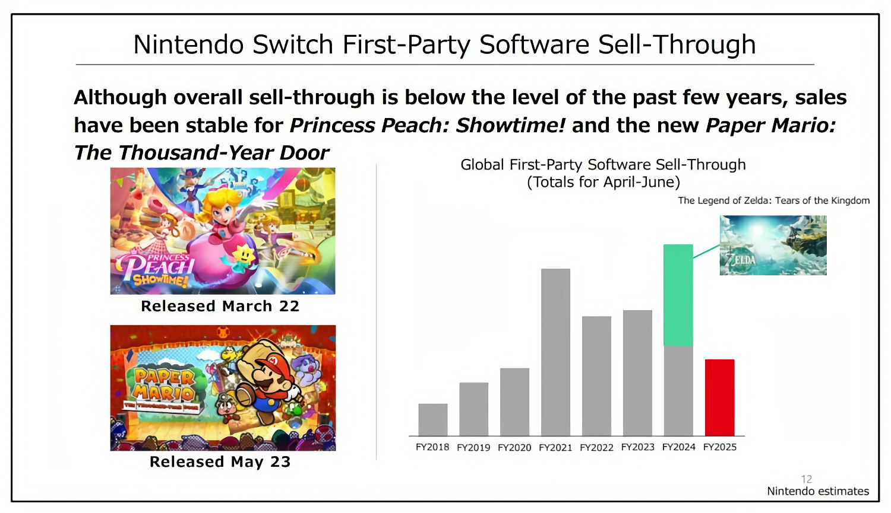

+++
title = "Les ventes plongent : fin de course pour la Switch"
date = 2024-08-02T12:47:32+01:00
draft = false
author = "Mickael"
tags = ["Actu"]
image = "https://nostick.fr/articles/2024/mai/0905-switch-2-tout-ce-que-lon-sait/Switch1.jpg"
+++

")

Nintendo a voulu tirer jusqu'à la dernière goutte possible de la Switch, mais au bout d'un moment, il faut se rendre à l'évidence : la vénérable console sortie en 2017 n'a plus grand chose à offrir. Et ça se voit dans les [résultats](https://www.nintendo.co.jp/ir/pdf/2024/240802e.pdf) du deuxième trimestre : le chiffre d'affaires (équivalent à 1,5 milliard d'euros) a plongé de 46 % par rapport à l'an dernier, tandis que le bénéfice net, à 500 millions d'euros, a trébuché de 55 % !

Quant à la Switch elle-même, elle a péniblement franchi le cap des 2 millions d'unités vendues en avril, mai et juin (2,1 millions, précisément), ce qui représente un recul de 46 % d'une année sur l'autre. Le fait que Nintendo ait décidé de faire vivre à sa console hybride une année presque sèche en termes de grosses nouveautés n'a pas aidé.

Il y a bien quelques vraies nouveautés qui sortent du lot, comme *Mario & Luigi: L'Épopée fraternelle*, *Zelda: Echos of Wisdom* ou encore *Princess Peach Showtime!*, mais pour le reste le catalogue s'est enrichi de remakes ou de bizarreries (*Endless Ocean Luminous*, *Emio Famicom Detective Club*…). Pas vraiment des poids lourds, que Nintendo garde au chaud pour la Switch 2. Sur le trimestre, Nintendo a compté un peu plus de 30 millions de copies de jeux vendues, soit 41 % de moins que l'an dernier.

À noter tout de même : deux de ces remakes, *Luigi's Mansion 2 HD* et *Paper Mario : La Porte Millénaire* ont dépassé le million de copies vendues (respectivement 1,19 et 1,76 million). C'est bien, mais c'est une toute petite fraction des quelque 143,42 millions de Switch en circulation (Nintendo dénombre 128 millions de joueurs actifs) ! Le constructeur prévoit d'ailleurs d'en vendre 13,5 millions durant l'exercice fiscal, qui s'achève en mars prochain. Cela parait jouable, surtout avec un petit coup de pouce du type rabais pour les fêtes de fin d'année.

La Switch pourrait finalement faire aussi bien, voire dépasser, la vaillante DS et ses 154 millions d'unités ! Les joueurs de leur côté attendent évidemment des nouvelles de la future console : Nintendo a annoncé en mai dernier qu'elle sera dévoilée avant le 31 mars 2025. [Mais à quoi va-t-elle bien ressembler ?](https://nostick.fr/articles/2024/mai/0905-switch-2-tout-ce-que-lon-sait/)