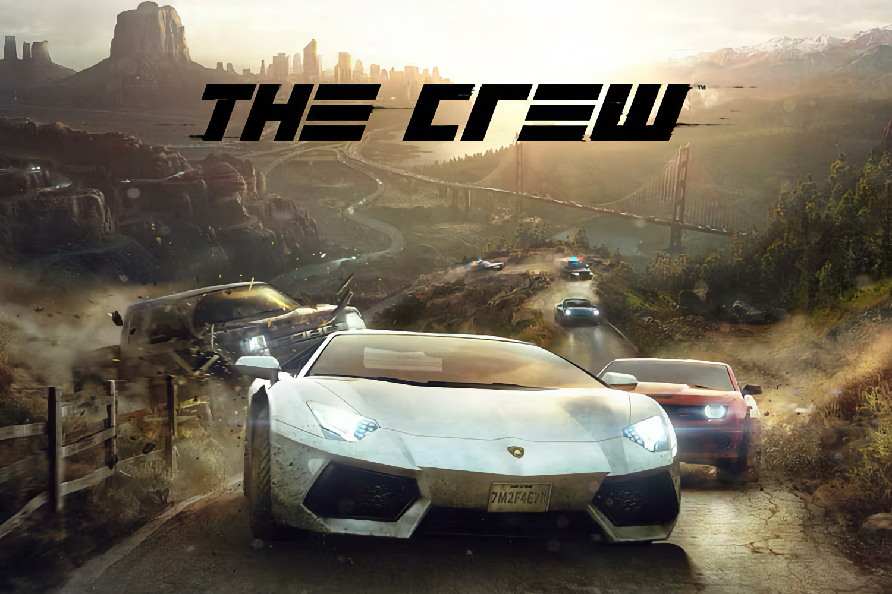

+++
title = "Stop Killing Games : une pétition européenne pour empêcher les éditeurs de tuer leurs jeux"
date = 2024-08-02T08:40:32+01:00
draft = false
author = "Mickael"
tags = ["Actu"]
image = "https://nostick.fr/articles/vignettes/aout/the-crew-ubisoft.jpg"
+++

Le secteur du jeu vidéo est possiblement la seule industrie culturelle ayant le pouvoir de détruire ses créations des années après leur commercialisation. De plus en plus de jeux vidéo exigent une connexion à internet pour fonctionner ; ce n'est pas un problème en soi, ce qui l'est davantage c'est lorsque l'éditeur cesse tout support : le jeu n'est alors plus du tout accessible.

Résultat : les joueurs ayant acheté le jeu perdent leur accès. Pire encore, certains éditeurs décident de détruire toutes les copies encore fonctionnelles du jeu et empêchent les joueurs de remettre le titre en service de quelque manière que ce soit. 

On a eu un exemple de ce zèle récemment, quand Ubisoft a mis un point final à son jeu de voitures *The Crew* : l'entreprise a non seulement coupé les serveurs, mais elle est allée jusqu'à [retirer le titre de la bibliothèque des joueurs](https://nostick.fr/articles/2024/avril/1204-ubisoft-efface-the-crew-partout/)… comme si *The Crew* n'avait jamais existé !

Il s'agit là d'une « *atteinte aux droits des consommateurs* », mais aussi à la culture au sens large, comme [l'explique](https://citizens-initiative.europa.eu/initiatives/details/2024/000007_fr) l'initiative « Stop Killing Games » auprès de la Commission européenne. Cette initiative cherche à recueillir un maximum de signatures de joueurs basés dans l'UE, afin de pousser le régulateur à se saisir du problème.

Il s'agit d'imposer aux éditeurs « *l'obligation de laisser ces jeux vidéo dans un état fonctionnel* ». Et plus précisément, d'empêcher le blocage à distance des jeux vidéo par les éditeurs, et à fournir des des « *moyens raisonnables* » pour faire en sorte que les jeux puissent continuer à fonctionner. Pas question de toucher à la propriété intellectuelle des jeux ni aux droits sur la monétisation. 

L'initiative ne s'attend pas plus à ce que l'éditeur consacre des ressources aux jeux abandonnés : « *Nous convenons qu'il est irréaliste de s'attendre à ce que les entreprises soutiennent les jeux indéfiniment et nous ne prônons pas cela de quelque manière que ce soit* ». L'idée est de s'assurer que les jeux soient dans un état « *raisonnablement fonctionnel* ». Les entreprises devraient mettre en place un « plan de fin de vie » qui permette de modifier ou de patcher le jeu pour qu'il puisse continuer de fonctionner.

 

Pour les jeux multijoueurs en ligne, l'initiative propose de remettre au goût du jour la possibilité de laisser les joueurs héberger eux mêmes les parties, sur des serveurs privés. Cela veut toutefois dire que l'éditeur doit intégrer cette option lors du développement. De même, certaines fonctions pourraient être impossibles à retrouver après l'arrêt du support officiel : « *Il y a une grande différence entre un jeu qui manque de certaines fonctionnalités par rapport à un jeu qui est totalement injouable sous quelque forme que ce soit* ».

Actuellement, la législation en vigueur et les organisations de défense des consommateurs ne sont pas à même de bien protéger les consommateurs contre la pratique de « débrancher » complètement un jeu vidéo après la vente.

L'initiative « Stop Killing Games », lancée par Ross Scott, propose donc de signer la pétition à cette [adresse](https://www.stopkillinggames.com), et à la partager autant que possible. À l'heure actuelle, les seuils de signatures sont encore très loin d'avoir été atteints, alors à votre bon cœur !