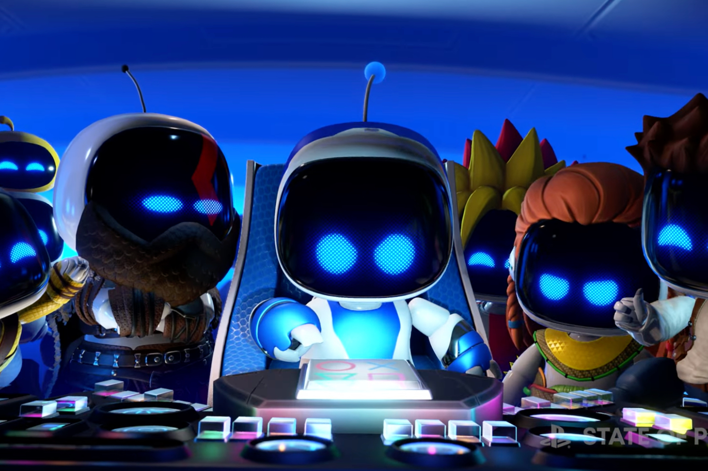
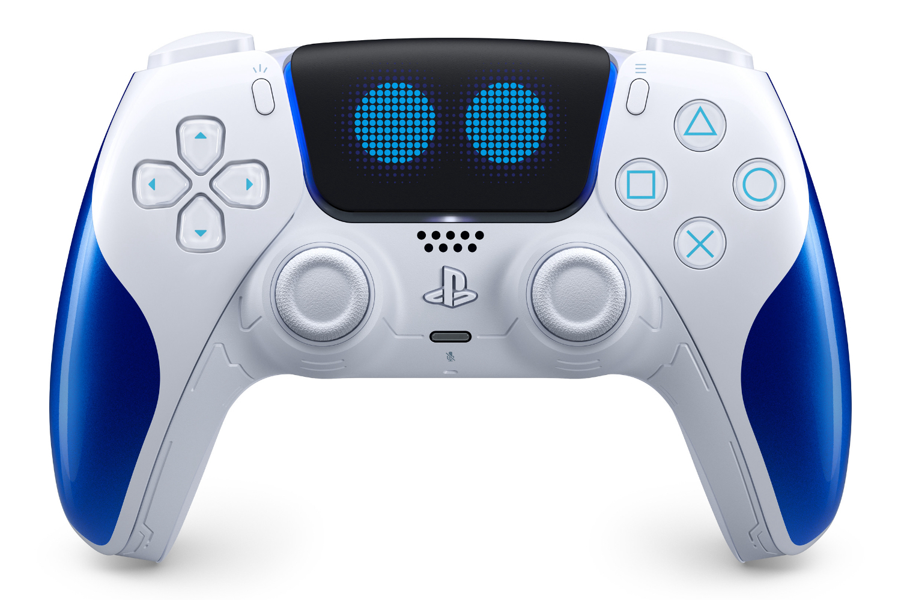
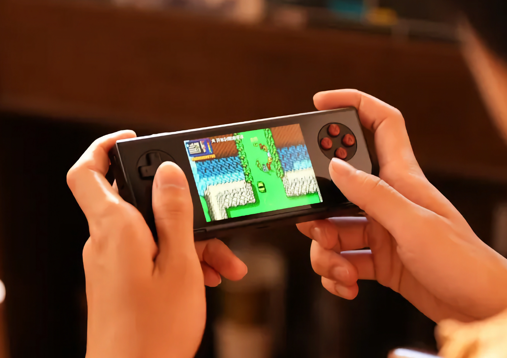
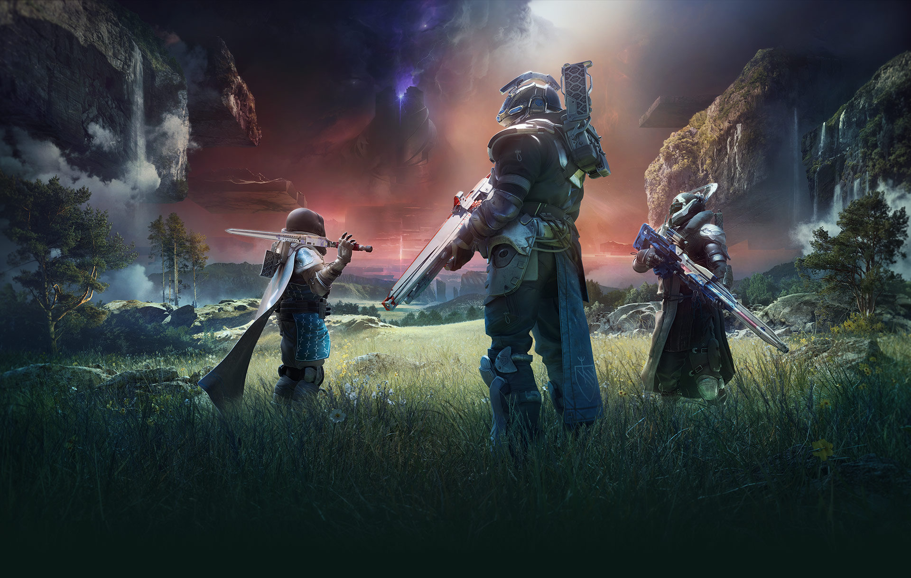
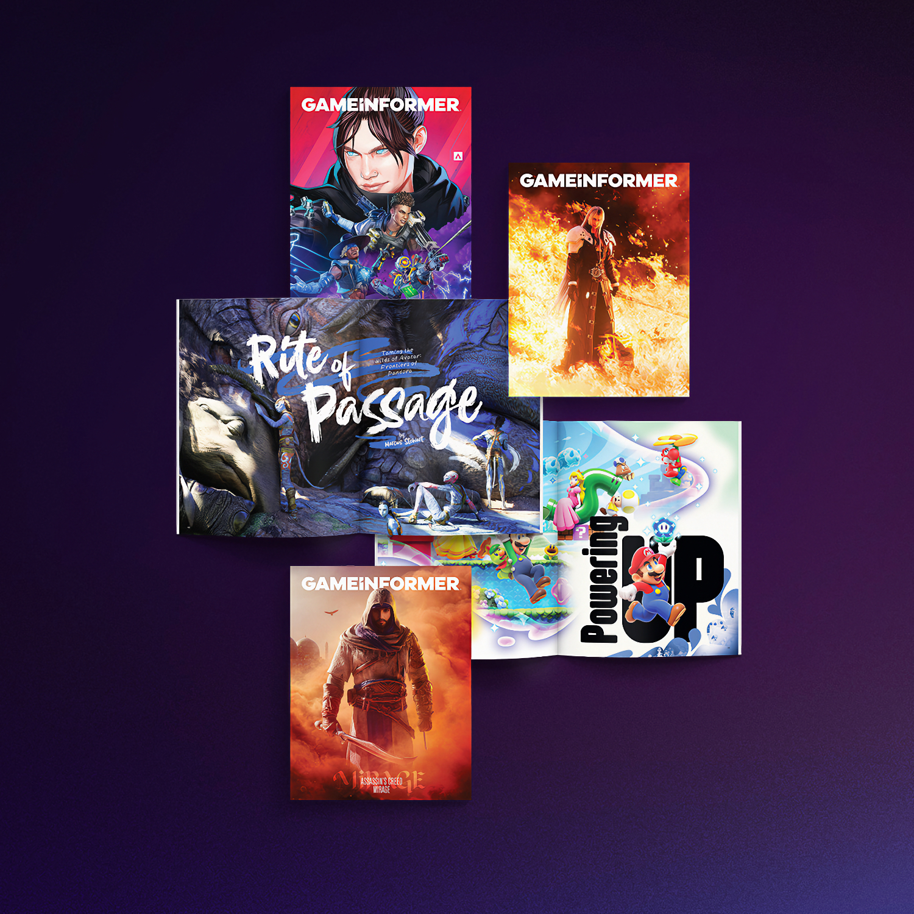
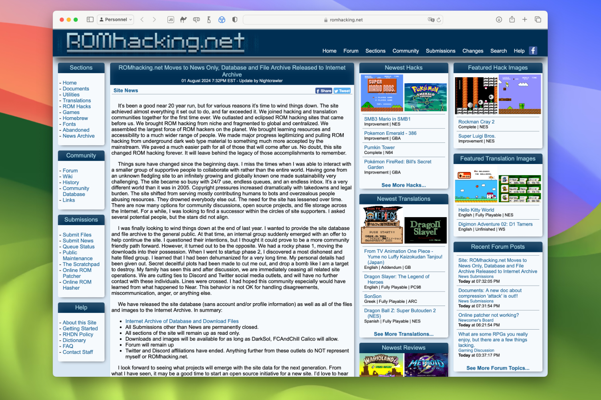

+++
title = "On vide le backlog de la semaine : Astro Bot, Braid, Pocket MICRO, Bungie…"
date = 2024-08-03T10:47:32+01:00
draft = false
author = "Mickael"
tags = ["XXL"]
image = "https://nostick.fr/articles/vignettes/aout/astro-bot-week-end.jpg"
+++

L’actualité du jeu vidéo ne s’arrête pas à la poignée d’articles publiés sur *Nostick* ! Histoire de rattraper le retard accumulé, voici un retour rapide sur quelques unes des infos les plus importantes (ou insignifiantes) de la semaine.

## L'image de la semaine : l'édition spéciale Astro Bot de la DualSense

Contrairement à Xbox et à [sa manette Deadpool bien bombée](https://nostick.fr/articles/2024/juillet/1707-xbox-deadpool/) que personne ne peut acheter, PlayStation aime l'argent : tout le monde pourra s'offrir la DualSense édition spéciale *Astro Bot* ! La manette [reprend](https://blog.playstation.com/2024/07/29/first-look-astro-bot-limited-edition-dualsense-wireless-controller/) évidemment les coloris blanc et bleu du héros, ainsi que les deux yeux adorables (mais pas animés) sur le touchpad.

Au delà la mascotte, Astro Bot est très spécial pour PlayStation : le robot a toujours servi de démo pour les différentes technologies du constructeur. *Astro Bot Rescue Mission*, sorti en 2018 sur PSVR a démontré que les jeux en réalité virtuelle pouvaient être sympas. Quant à *Astro's Playroom*, le jeu fourni en standard avec la PS5, c'est une brillante démonstration des capacités de la DualSense.

Cette nouvelle aventure solo, dont on découvrira les premières minutes [dans cette actu](https://nostick.fr/articles/2024/juillet/2907-astro-bot-demo/), va également tirer parti de toutes les capacités de la manette de la PS5 (et pas uniquement de cette édition spéciale !). Le contrôleur sera en préco le 9 août en France, la commercialisation débutera le 6 septembre, le même jour que la sortie d'*Astro Bot*.

 

Attention, les quantités sont limitées alors dégainez rapidement vos 80 € !

## Ça fait envie : Pocket MICRO d'Ayaneo

Ça va être compliqué de ne pas craquer pour le Pocket MICRO d'Ayaneo, un hommage appuyé au Game Boy Micro de Nintendo mais fonctionnant sous Android. Cette console portable calibrée pour le rétro-gaming intègre deux sticks encadrant un écran IPS de 960 x 640, un d-pad et quatre boutons, sans oublier deux paires de gâchettes.

De quoi voir loin pour émuler toutes sortes de consoles, ce d'autant qu'il y a une batterie plutôt imposante de 2 600 mAh (6 heures d'autonomie annoncée), de 6 à 8 Go de RAM et de 128 à 256 Go de stockage. Ça en fait des ROMs qui seront sûrement bien servies par le processeur Helio G99… Le tout fourré dans un boîtier en aluminium.

 

Le Pocket MICRO est proposé sur [Indiegogo](https://www.indiegogo.com/projects/pocket-micro-tribute-to-classic-pocket-handhelds#/), à partir de 190 $, soit grosso modo la même chose en euros. Il y a des tas de paliers, alors à vous de voir ce que votre portefeuille vous permet ! Les premières livraisons débuteront en septembre.

## Ça fait pas super envie : les ventes misérables de l'édition anniversaire de Braid

On peut être une darling du jeu indé et ne pas trouver de clients. L'édition anniversaire de *Braid* sorti le 14 mai dernier n'a pas connu le succès escompté par son créateur, Jonathan Blow, qui [parle](https://www.youtube.com/watch?v=8KR5i98aCy0) même de « *ventes horribles* ». Il concède que cette édition spéciale se vend mieux que des titres rétro comme ceux de Jeff Minter ou même que la compile *Atari 50*. Mais ça reste « *merdique* » pour qu'une entreprise puisse en vivre.

 

Le game designer laisse même entendre que le jeu n'aurait pas été rentable vendu uniquement sur Steam, pourtant la plus grande plateforme pour le jeu, sans les frais avancés pour le portage sur les autres systèmes. *[Braid, Anniversary Edition](http://braid-game.com/)* est aussi disponible sur PlayStation, Switch, Xbox, il y a même des versions iOS et Android pour les abonnés Netflix.

Le studio du développeur, Number None, et son éditeur Thekla n'ont pourtant pas lésiné : cette édition contient en effet 40 nouveaux niveaux, des graphismes et une bande son revus, et même 15 heures de commentaires. Et l'avenir ? Il est « *incertain, on va dire ça comme ça* », avance Jonathan Blow, inquiet.

*Braid*, sorti à l'origine en 2008 sur le Xbox Live Arcade, puis sous Windows et Mac OS X l'année suivante, a été un véritable succès critique et public. Mais 16 ans plus tard, peut-être que le jeu de plateformes/puzzle très méta fait définitivement partie du passé.

## Les emmerdes de la semaine chez Bungie

Bungie, propriété de Sony depuis deux ans, n'en finit plus de dégraisser les effectifs. En octobre dernier, une centaine de personnes étaient licenciées, et on a appris cette semaine qu'ils seront rejoints par 220 pauvres hères supplémentaires. En neuf mois, le studio a perdu un quart de son personnel.

Pete Parsons, le CEO de Bungie, a [avancé](https://www.bungie.net/7/en/News/article/newpath) les arguments habituels pour expliquer cette nouvelle charrette : augmentation des coûts de développement, changements dans l'industrie et conditions économiques difficiles persistantes, la triplette classique qui impacte toute l'industrie du jeu vidéo depuis deux ans. 

Bungie a aussi des raisons plus spécifiques qui expliquent ce dégraissage, et qui sont entièrement de la faute de la direction de l'entreprise : plusieurs projets ont été lancés en « incubation », chacun mené par des cadres issus des équipes existantes. « *Nous avons finalement réalisé que ce modèle diluait trop rapidement nos talents* », indique le boss.

« *Inexcusable* », [accuse](https://x.com/A_dmg04/status/1818668997443023183) Dylan Gafner, alias dmg04, le community manager de Bungie (toujours en poste). Il déplore « *la responsabilité [qui] retombe sur les travailleurs qui ont sans cesse fait avancer les choses pour satisfaire notre communauté* ». Les appels à la démission de Pete Parsons se sont multiplié cette semaine, le boss ayant aussi une fâcheuse tendance à [participer](https://www.eurogamer.net/bungie-ceo-criticised-for-spending-millions-on-classic-cars-as-calls-for-leadership-changes-escalate) aux enchères de voitures de luxe quand son entreprise et ses employés souffrent.

La pilule est d'autant plus difficile à avaler que *The Final Shape*, l'ultime extension de *Destiny 2*, a connu le succès.  Et ça aurait pu être encore pire. Pete Parsons révèle aussi que 155 employés de Bungie vont rejoindre les rangs de Sony dans les prochains trimestres. Sans l'acquisition de 2022, ces 155 personnes auraient pu perdre leur boulot… 



Bungie va également refiler aux studios PlayStation un de ses projets non précisé ; il s'agit d'un jeu d'action se déroulant dans un univers SF original. Pour l'occasion, un tout nouveau studio va être créé pour poursuivre le développement de ce titre. Bungie, qui compte désormais 850 salariés, veut désormais se consacrer entièrement à *Destiny* (le troisième volet ?) et à *Marathon*, son prochain jeu service, qui sortira sur PlayStation 5 évidemment, mais aussi Windows et Xbox. 

Cette agitation chez Bungie n'est pas de bon augure pour la suite des opérations. En 2022, lors de l'acquisition par Sony, il était clair que le studio resterait indépendant… tant que les résultats restent au rendez-vous. Si ce n'est pas le cas, Sony [aurait](https://www.ign.com/articles/bungie-devs-say-atmosphere-is-soul-crushing-amid-layoffs-cuts-and-fear-of-total-sony-takeover) la possibilité de dissoudre le conseil d'administration pour prendre le contrôle total de Bungie. 

D'après le fouineur [Jeff Grubb](https://www.reddit.com/r/PS5/comments/1egshfk/jeff_grubb_hermen_hulst_runs_bungie_now_they/), Hermen Hulst le patron des studios PlayStation a tout simplement pris le pouvoir et c'est lui qui mènerait désormais la barque. Marathon a plutôt intérêt à fonctionner si Bungie ne veut pas se retrouver en studio support pour d'autres jeux du groupe.

## On n’a pas eu le temps cette semaine mais on pense à eux

Après 33 ans de bons et loyaux services, *Game Informer* [met](https://x.com/gameinformer/status/1819399257071214854) la clé sous la porte. Ce vétéran américain de la presse (papier) sur les jeux vidéo était la propriété de la chaîne de magasins GameStop, qui n'est pas non plus en très grande forme. Tous les employés du magazine ont été virés.

Puisqu'on parle de disparition, comment ne pas évoquer la fermeture de *[ROMhacking.net](http://romhacking.net/)*, dont le contenu va être transféré chez *[Internet Archive](https://archive.org/details/romhacking.net-20240801)* à des fins de préservation. Depuis 20 ans, le site offre des traductions et des hacks de ROMs, améliorant les jeux originaux ou les adaptant à des besoins spécifiques. On peut se tourner vers le wiki *[Data Crystal](https://datacrystal.romhacking.net/wiki/Data_Crystal)* pour retrouver quelque chose d'équivalent et toujours en vie.



Le rétro-gaming, ce n'est pas que pour les jeux d'arcade. *Metropolis 1998* s'inspire des meilleurs jeux de construction des années 90, comme *Sim City* bien sûr, mais aussi *Rollercoaster Tycoon* et *Dwarf Fortress*, avec le style graphique isométrique de l'époque et un gameplay modernisé. Et ça a l'air super ! Le jeu est en accès anticipé sur [Steam](https://store.steampowered.com/app/2287430/Metropolis_1998/) et [Itch.io](https://yesbox.itch.io/archapolis).

## osef

Personne ne vous en voudra d'avoir loupé la [bande annonce](https://www.youtube.com/watch?v=Icnysn53neU) du film *Bordelands* sorti il y a 10 jours et que le monde entier a complètement zappé. Et ce sera pareil pour la sortie du film, programmé le 7 août (il ne devrait pas y rester longtemps).

## Dans le reste de l'actu déchaînée

- La Xbox n'a pas l'air très en forme, en revanche Microsoft mise plus que jamais sur le Game Pass et le service Xbox Cloud Gaming, dont nous vous proposons le test avec une clé Fire TV d'Amazon ! [C'est à lire ici.](https://nostick.fr/articles/2024/juillet/2907-xbox-cloud-gaming-fire-tv-stick-test/)
- Sony fait monter la sauce autour d'*Astro Bot*, sa prochaine grosse exclusivité PS5. Et quoi de mieux que de proposer une longue démo du jeu en vidéo ! [À découvrir dans cette actu.](https://nostick.fr/articles/2024/juillet/2907-astro-bot-demo/)
- Si vous vous êtes toujours demandé pourquoi *Call of Duty* vous colle avec des joueurs de votre niveau plutôt qu'avec des joueurs choisis au hasard, [voici la réponse.](https://nostick.fr/articles/2024/juillet/2907-call-of-duty-matchmaking-hasard/)
- Les développeurs de *Subnautica* ont truffé leur jeu de captures d'écran du deuxième volet à sortir l'année prochaine. [C'est parti pour la chasse aux trésors.](https://nostick.fr/articles/2024/juillet/3007-subnautica-2-creature-inedite/)
- Il n'aura échappé à personne que les Jeux olympiques battent leur plein à Paris, mais bizarrement aucun jeu *Mario & Sonic* n'est sorti ! [La réponse à cette énigme est ici.](https://nostick.fr/articles/2024/juillet/3007-mario-sonic-paris-2024-jo/)
- *Visions of Mana*, le gros RPG de Square Enix qui sort fin août, est d'ores et déjà jouable sous la forme d'une démo surprise ! [Tous les détails par là.](https://nostick.fr/articles/2024/juillet/3107-visions-of-mana-demo/)
- Oups. Le développeur de Quantum Lock a perdu le code source du jeu. Résultat : il ne peut plus faire de correctifs et a décidé d'en arrêter la vente. [Sauvegardez, bon sang !](https://nostick.fr/articles/2024/juillet/3107-quantum-lock-developpeurs-perdu-code-source/)
- Les ventes abyssales de Xbox ne se sont pas arrangées au printemps. Et Microsoft n'a pas l'air super motivé pour redresser la barre. [À lire par ici.](https://nostick.fr/articles/2024/juillet/3107-ventes-xbox-coulent-pic/)
- Microsoft toujours, mais du côté des services cette fois ! L'éditeur prépare activement sa boutique Xbox mobile. [La preuve ici !](https://nostick.fr/articles/2024/juillet/3107-microsoft-ne-devrait-plus-trop-tarder-boutique-mobile/)
- Le Vision Pro, ce n'est vraiment pas pour le jeu vidéo. Apple ne se donne même plus la peine d'y croire, [comme on le déplore par là.](https://nostick.fr/articles/2024/aout/0108-apple-vision-pro-jeux-developpeurs/)
- Sony a décidé de donner une seconde chance au PSVR2… ou de vider les stocks de son casque de réalité virtuelle ! Un gros rabais et [les ventes repartent en flèche.](https://nostick.fr/articles/2024/aout/0108-psvr2-ventes-promo/)
- Les éditeurs devraient donner la possibilité aux acheteurs de leurs jeux de continuer à y jouer même après la fin du support. [Signez la pétition !](https://nostick.fr/articles/2024/aout/0208-stop-killing-games-petition-europe-tuer-jeux/)
- Ça commence à se voir que ce n'est plus trop la forme pour la Switch ! Les ventes du dernier trimestre ne sont vraiment pas fameuses, comme on le verra [dans cette actu](https://nostick.fr/articles/2024/aout/0208-nintendo-switch-ventes-baisse/).