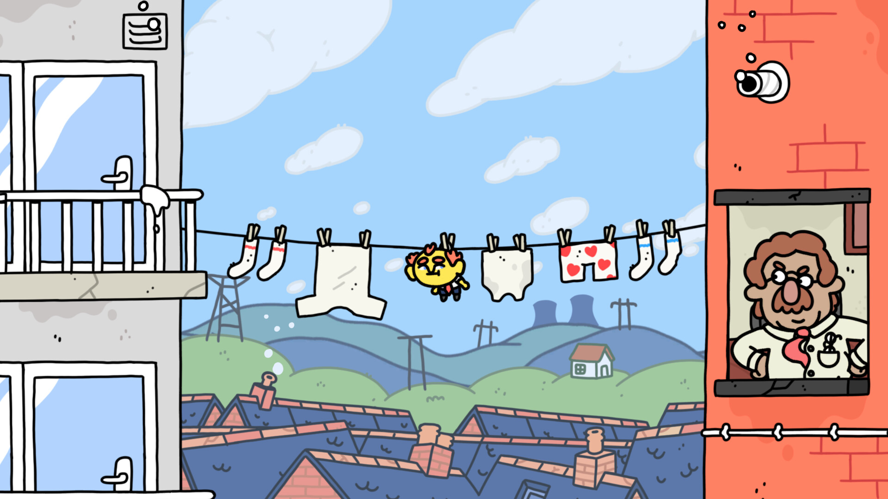
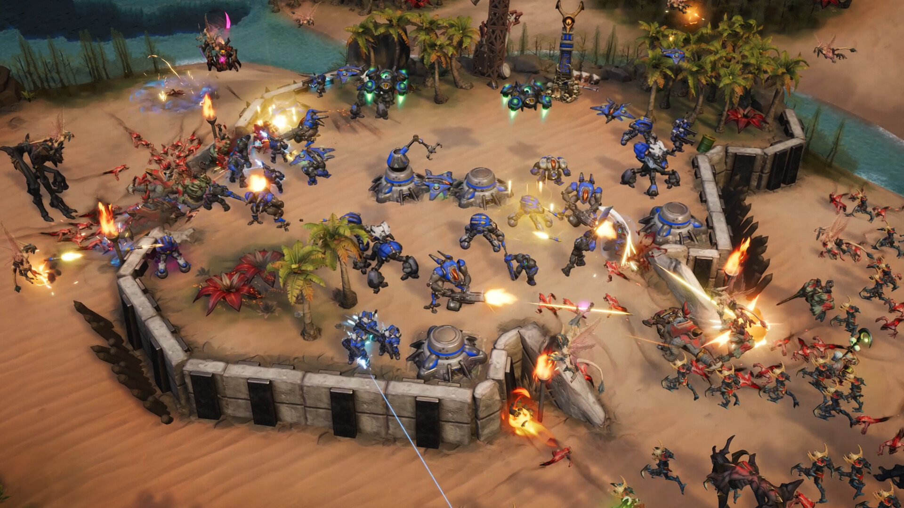

+++
title = "Thank Goodness You're Here!, World of Goo 2 : le récap des sorties de la semaine (04/08)"
date = 2024-08-04T08:00:01+01:00
draft = false
author = "Félix"
tags = ["C’est dispo"]
image = "https://nostick.fr/articles/2024/aout/0408-thank-godness-world-of-goo-2-sorties-semaine/thank.jpg"
+++

Entre la plage, les restaus moules-frites à volonté et cet énorme coup de soleil qui vous a tenu alité pendant plusieurs jours, vous n’avez peut-être pas eu le temps de vous intéresser aux nouveautés du moment. Qu’à cela ne tienne : voici les sorties de ces derniers jours qui ont retenu notre attention.

## Vous prendrez bien une tranche de rosbif ?

On s’est bien poilé cette semaine avec ***Thank Goodness You're Here!***, un poin’t n click rigolo et très british du studio Coal Supper édité par Panic. On y incarne un petit bonhomme qui se retrouve au cœur du nord de l'Angleterre, dans l'étrange ville de Barnsworth. On va devoir fouiller à droite à gauche sur de jolis tableaux très colorés prétextes à une avalanche de gags tous plus absurdes les uns que les autres. De nombreux PNJ y sont présents, avec lesquels ont peut interagir pour déclencher des dialogues marrants et de chouettes animations. Pas grand-chose à se mettre sous la dent côté gameplay, le jeu se laissant parcourir pour son humour anglais particulier qui pourra plaire tout comme laisser sur le carreau. J’ai fait la démo et c’était fun, mais je suis pas sûr d’y mettre les 18 € demandés [sur Steam](https://store.steampowered.com/app/2366980/Thank_Goodness_Youre_Here/). À voir si c’est votre tasse de thé (anglais de préférence). Dispo sur Mac, PC, PS4/5 et Switch.

## Chacun ses Goo 

Tout cela ne nous rajeunit pas. Plus de 15 ans après le premier opus, 2D Boy a publié cette semaine ***World of Goo 2***, la suite de l’illustre premier volet qui est rapidement devenu un symbole des jeux indés à succès. On ne change pas une formule qui gagne : il s’agit toujours de créer des structures à l’aide de petites créatures rondes pour attendre la fin du niveau, sachant que tout risque de s’effondrer si vous n’arrivez pas à maintenir un certain équilibre. Ce second opus ne réinvente pas la roue mais introduit de nouvelles mécaniques, comme des Goo liquides ou taille XXL. C’est visiblement une suite fidèle au premier jeu qui ne devrait pas vous déstabiliser. *World of Goo 2* a été bien accueilli par la critique, bien que *[NintendoLife](https://www.nintendolife.com/reviews/switch-eshop/world-of-goo-2)* regrette des contrôles pas terribles sur Switch. Dispo sur PC, Mac, Linux et Switch pour 27 € (que chez [Epic](https://store.epicgames.com/fr/p/world-of-goo-2), mais vous pouvez l’acheter directement sans DRM sur [le site des devs](https://worldofgoo2.com)).



## C’est dans les vieux pots…

Allons y avec le jeu multi gratos de la semaine, qui n’est pas cette semaine un énième looter-shooter (Dieu merci), mais un RTS créé par un studio composé de vétérans de Blizzard. ***‌ Stormgate*** propose un univers mêlant science-fiction et fantastique basé sur l'Unreal Engine 5. On y retrouve 3 factions (tiens tiens) dans un jeu qui cherche à être aussi accessible aux vieux de la vieille qu’aux nouveaux venus. Si vous espériez *Starcraft 3*, c’est malheureusement un peu plus compliqué que ça : le jeu affiche des évaluations « moyennes » [sur Steam](https://store.steampowered.com/app/2012510/Stormgate/), où il vient de sortir en early-access payante (entre 25 € et 60 € selon le pack choisi). Si certains louent un gameplay sympa, d’autres critiquent une version du jeu pas assez travaillée techniquement et une campagne pas folichonne. *Stormgate* sera disponible gratuitement pour tous à partir du 13 août, donc au vu de ce lancement en demi-teinte, vous pouvez tranquillement attendre deux semaines avant de voir ce que ça vaut.

## Danse avec les poissons

***‌Thalassa: Edge of the Abyss*** a un pitch intrigant : on y incarne un scaphandrier explorant les restes  d’un navire ayant sombré dans des circonstances mystérieuses. Notre détective aquatique va donc devoir fouiller les diverses pièces de l’épave à la recherche de différents indices pour recoller les morceaux. *[VG247](https://www.vg247.com/thalassa-edge-of-the-abyss-review)* a adoré et décrit un jeu à histoire très sympathique se parcourant à la première personne, avec de bons dialogues et une intrigue captivante. Si vous cherchez une petite enquête pour cet été et que l’ambiance à la *Titanic* vous parle, ça devrait être une bonne pioche. 20 € [sur Steam](https://store.steampowered.com/app/1783680/Thalassa_Edge_of_the_Abyss/), sachant qu’une démo est disponible pour vous faire une idée.

 

## En vrac

Mis à part tout cela, on notera cette semaine la sortie de *‌**The Garden Path***, une sorte d’*Animal Crossing* plus mystérieux au style graphique original pensé pour être joué à petite dose chaque jour. Les retours sont bons et ça coûte 19,50 € sur [Steam](https://store.steampowered.com/app/1638500/The_Garden_Path/), alors pourquoi pas. Sinon, cette semaine a été marquée par la sortie de ***Sword of Convallaria*** un gacha tactique visiblement assez vénère sur les microtransactions mais qui pourra tout de même en intéresser un ou deux par ses graphismes au style GBA. C’est dispo sur [iOS](https://apps.apple.com/us/app/sword-of-convallaria/id6451019582), Android et [PC](https://store.steampowered.com/app/2526380/Sword_of_Convallaria/). On notera aussi la sortie de ***Tomba!*** dans une *[Special Edition](https://store.steampowered.com/app/2851150/Tomba_Special_Edition/)* sur Steam et console : il s’agit d’un jeu de plateforme de la PS1 considéré [comme culte](https://en.wikipedia.org/wiki/Tomba), de retour dans une version plus adaptée à nos machines modernes. Enfin, le tactical shooter de Riot *Valorant* est désormais dispo sur PS5 et Xbox, sans crossplay PC pour des raisons évidentes.
