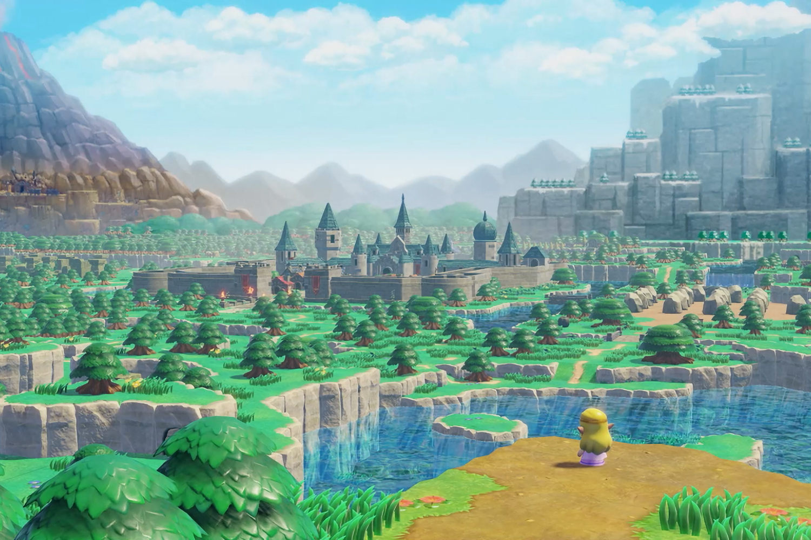

+++
title = "Echoes of Wisdom : une vidéo des capacités de Zelda"
date = 2024-08-05T14:01:32+01:00
draft = false
author = "Mickael"
tags = ["Trailer"]
image = "https://nostick.fr/articles/vignettes/nostick.jpg"
+++

L'attente est longue jusqu'au 29 septembre, mais elle vaut le coup : *The Legend of Zelda: Echoes of Wisdom* s'annonce en effet plutôt bien merci ! Le premier jeu à mettre en scène la princesse Zelda (même s'il parait que Link sera jouable) méritait bien une vidéo présentant quelques uns des mécanismes de base, et là voilà :

 

En plus des fameux « échos » du titre, en fait des items et des personnages que Zelda peut reproduire à volonté, on y voit la capacité de synchronisation pour faire bouger des objets (et même des échos). La vidéo permet aussi de fondre de plaisir devant l'univers graphique qui semble tout droit sortis du remake de *Link's Awakening* ! Et pour cause, il semble que ce soit le même studio, Grezzo, qui soit à l'origine de ce nouveau *Zelda*.