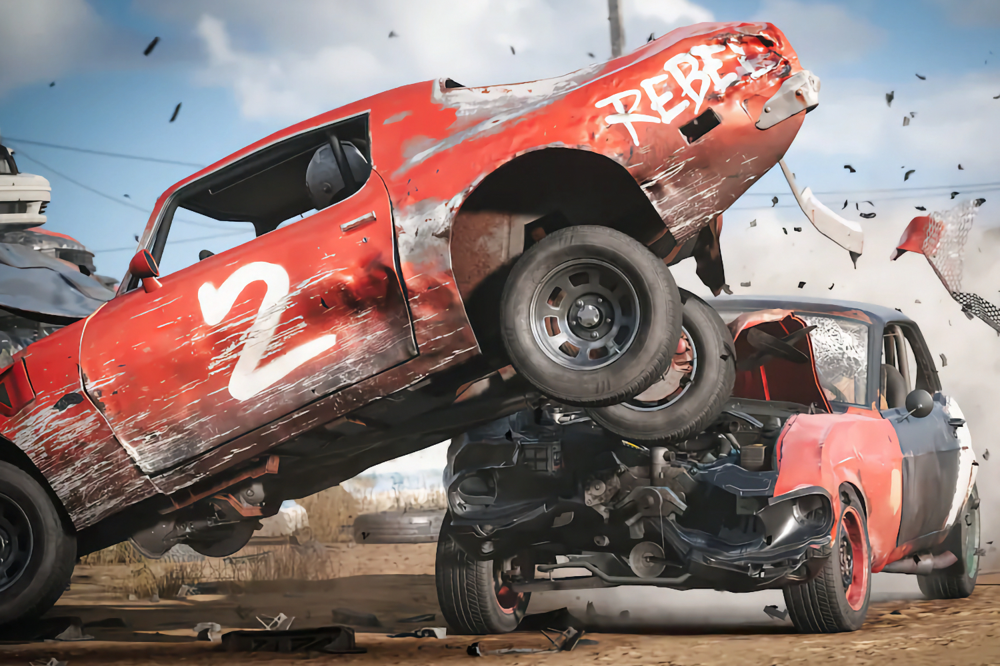

+++
title = "Wreckfest 2 : deux fois plus rapide, deux fois plus dangereux"
date = 2024-08-05T08:14:32+01:00
draft = false
author = "Mickael"
tags = ["Trailer"]
image = "https://nostick.fr/articles/vignettes/aout/wreckfest-2.jpg"
+++

La sueur, la poussière, les carrosseries défoncées, le goût du sang dans la bouche et les deux mains sur le volant, oui, on est bien dans le monde merveilleux de *Wreckfest* ! Le jeu de castagne de bolides va revenir dans un deuxième volet, toujours édité par THQ Nordic, et développé par le studio Bubear.

 

Pas besoin de changer une équipe qui gagne : contrairement à d'autres jeux de bagnoles dans lesquels il vaut mieux éviter de froisser la tôle, *[Wreckfest 2](https://wreckfest2.thqnordic.com)* restera une ode à la bourrinerie et c'est tant mieux. Bubear a repensé le moteur physique pour tirer parti du matos PC actuel (le premier volet est sorti en 2018), ce qui signifie des crashs encore plus réalistes et un système amélioré pour les armures et la gestion des dommages.

Le jeu va également proposer une plus grande personnalisation des voitures ; le mode carrière est « *entièrement réimaginé* », et le multi sera aussi de la fête avec un matchmaking basé sur le niveau des joueurs, ainsi qu'un mode local en split-screen. THQ Nordic ne donne aucune date de sortie malheureusement.