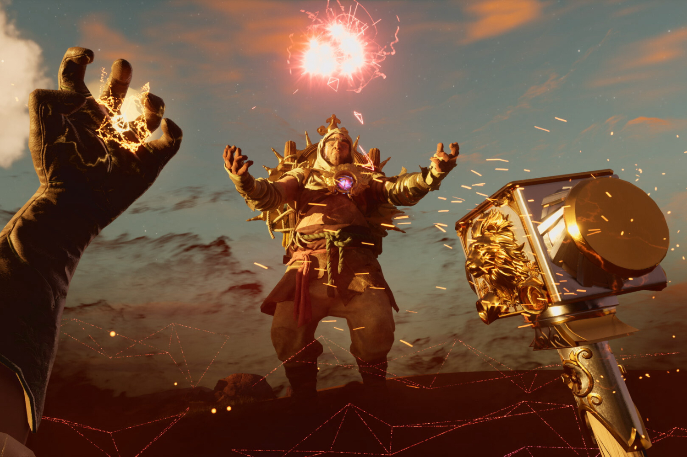

+++
title = "Le développeur de Nightingale n'est vraiment pas content de l'état actuel du jeu"
date = 2024-08-06T14:47:32+01:00
draft = false
author = "Mickael"
tags = ["Actu"]
image = "https://nostick.fr/articles/vignettes/nostick.jpg"
+++

Quand un jeu sort en accès anticipé, parfois des mois voire des années avant la version finale, il n'est pas rare d'entendre l'insatisfaction des développeurs qui, bien sûr, préfèreraient que leurs jeux soient terminés et conformes à ce qu'ils avaient en tête. Mais c'est aussi à ça que servent les *early access*, à finaliser et à peaufiner un jeu.

Sauf que chez Inflexion Games, on n'est vraiment pas content de la version anticipée de *Nightingale* ! Le développement de l'ambitieux survival fantasy disponible depuis six mois est loin d'être terminé ; le studio a multiplié les mises à jour, les correctifs et les fonctions QoL qui facilitent la vie des joueurs, mais c'est encore très loin d'être suffisant.

 

Dans un journal de bord vidéo, Aaryn Flynn le CEO d'Inflexion déclare ne pas être satisfait du tout de l'état actuel du jeu. « *nous ne sommes pas satisfaits du sentiment général, nous ne sommes pas satisfaits du nombre de joueurs* ». La version early access a [écopé](https://opencritic.com/game/16458/nightingale) d'un badge « faible » sur OpenCritic, avec une moyenne de 59 sur 100. Quant aux joueurs, ils sont habituellement [moins de 400](https://steamdb.info/app/1928980/charts/) sur Steam, après un pic à près de 50 000 à l'ouverture de l'accès anticipé.

Une grosse mise à jour prévue d'ici la fin de l'été devrait changer pas mal de choses, notamment l'apport d'un peu plus de dirigisme dans les objectifs ; actuellement, le jeu laisse une grande marge de manœuvre au joueur, une liberté qui peut décourager l'implication. Il sera aussi possible à l'avenir de concevoir des structures plus grandes et plus complexes.

 

Nightingale est dispo sur [Steam](https://store.steampowered.com/app/1928980/Nightingale/) pour une trentaine d'euros.