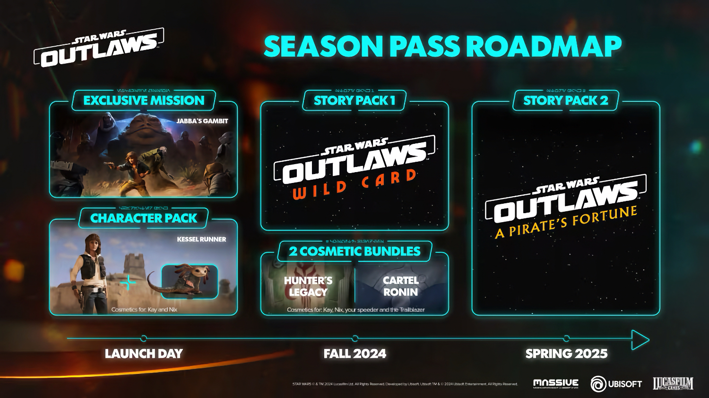

+++
title = "Star Wars Outlaw : pas encore sorti, déjà du contenu en plus (payant)"
date = 2024-08-06T08:00:32+01:00
draft = false
author = "Mickael"
tags = ["Actu"]
type = "telex"
+++

Le gros jeu de l'été pour Ubisoft, c'est bien sûr *Star Wars Outlaws*, qui sortira le 30 août (ou 3 jours plus tôt pour ceux qui raquent). Le titre, en mode « monde ouvert » comme il se doit, promet déjà de longues heures d'exploration et d'aventures, mais l'éditeur a d'ores et déjà [annoncé](https://news.ubisoft.com/en-us/article/3oDeg1rH3qrXBttnBaxN5Y/star-wars-outlaws-postlaunch-roadmap-revealed) du contenu supplémentaire, sous la forme d'un season pass payant bien évidemment.

Le jour du lancement, le pass activera un pack de cosmétiques pour Kay et Nix, les deux protagonistes du jeu, et surtout une mission exclusive pour Jabba. C'est dès cet automne que les choses sérieuses commenceront, avec des machins cosmétiques en plus sans intérêt et surtout, une extension « Wild Card ». Key y infiltrera un tournoi de Sabbacc où elle fera la rencontre d'un certain Lando Calrissian (connais pas).

Enfin, au printemps 2025, il y aura une nouvelle extension, « A Pirate's Fortune » dans laquelle Key tombera sur le hors la loi fameux à travers toute la galaxie, Hondo Ohnaka (connais pas, pour de vrai cette fois). 