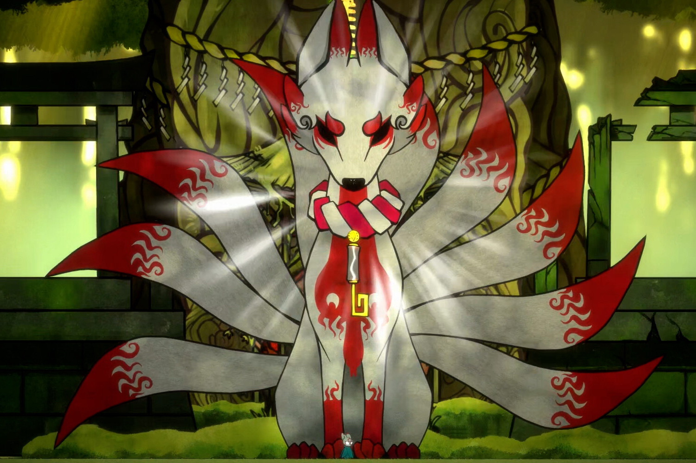

+++
title = "La chute de l'éditeur Humble Games met les studios dans l'embarras"
date = 2024-08-06T06:00:32+01:00
draft = false
author = "Mickael"
tags = ["Actu"]
image = "https://nostick.fr/articles/vignettes/aout/bo-Path-of-the-Teal-Lotus.jpg"
+++

Comment on pouvait le craindre, c'est le bordel pour les studios qui ont fait confiance à Humble Games pour éditer leurs jeux. Le groupe Ziff Davis, propriétaire de l'éditeur (ainsi que de sa boutique associée Humble Bundle) a assuré que le soutien et l'assistance aux développeurs étaient une « top priorité ». Mais quand [on vire la quasi-totalité de l'équipe](https://nostick.fr/articles/2024/juillet/2407-humble-games-licenciements/), soit 36 personnes, il ne faut pas s'attendre à des miracles.

Si les relations avec les studios tiers ont été confiées à une boîte de consultants — ce qui laisse imaginer la qualité du suivi —, les développeurs empêtrés dans cette affaire l'ont mauvaise. C'est le cas de Squid Shock, qui a le malheur d'avoir lancé *Bo: Path of the Teal Lotus* quelques jours avant la restructuration.

 

« *Notre lancement n'a pas été sans défis* », [reconnaissent](https://x.com/SquidShock/status/1819405518831518064) les dévelopeurs. « *La fermeture de notre éditeur signifie que nous avons manqué un soutien crucial après le lancement, ce qui pourrait mettre en péril l'avenir de notre studio* ». Le 25 juillet, l'équipe a perdu l'accès aux différents outils systèmes critiques ; elle conserve la possibilité de gérer la version Steam du jeu (à cette [adresse](https://store.steampowered.com/app/1614440/Bo_Path_of_the_Teal_Lotus/)), mais pas la déclinaison pour consoles.

Le portage sur consoles ainsi que le processus de vérification et de validation (QA) étaient pris en charge par Humble Games. Ce sont évidemment des fonctions essentielles qu'il a manquées au studio. Heureusement, il devrait être en mesure de les récupérer, mais le mal est fait. C'est pourquoi Squid Shock lance un [Patreon](https://www.patreon.com/squidshock) pour soutenir le développement de *Bo* et la suite des opérations. Il démarre à 1 $ et grimpe jusqu'à 100 $, des paliers qui permettent d'obtenir toutes sortes de goodies.

Les développeurs sont habitués à ce mode de fonctionnement participatif : le développement de leur jeu a été en partie assuré sur Kickstarter.