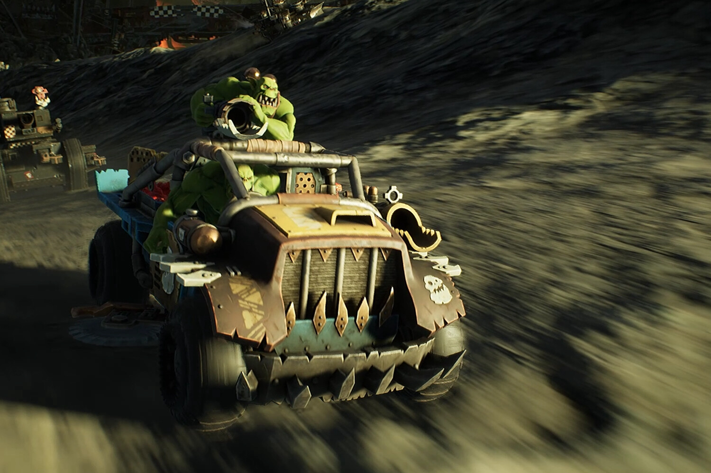

+++
title = "Warhammer 40,000: Speed Freeks : comme Mario Kart, en un peu plus bourrin"
date = 2024-08-07T09:09:32+01:00
draft = false
author = "Mickael"
tags = ["Trailer"]
image = "https://nostick.fr/articles/vignettes/aout/Warhammer-40000-Speed-Freeks.jpg"
+++

Vous aussi, vous trouvez que la franchise *Fast & Furious* s'est embourgeoisée ? Que *Mad Max*, c'est bien sympathique mais que c'est quand même de la petite bière tiède qui vous en touche une sans faire bouger l'autre ? Alors voici exactement ce qu'il vous faut (peut-être) : *Warhammer 40,000: Speed Freeks* ! Ce titre développé par le studio Caged Element est l'adaptation du jeu de plateau du même nom sorti en 2018, et issu de la franchise Warhammer 40K, bien sûr.

Sauf qu'ici, point de dés ni de tour par tour, on est en face d'un jeu d'action, en free-to-play (gare aux micro-transactions). Proposé depuis hier en accès anticipé, *Speed Freeks* nous envoie au 41e millénaire dans des courses d'Orks à bord de véhicules brindezingues lourdement armés.



Plusieurs modes sont à disposition des amateurs délicats de force brute : « Konvoi Mortel » où deux équipes de 8 joueurs s'affrontent tout en propulsant un bibelot vers la ligne adverse ; et « Rékup' Mortelle », là aussi une course avec des équipes de 8 joueurs qui doivent se diriger vers des points de capture. Il doit y en avoir d'autres, mais ce n'est pas très clair. Quant à la monnaie du jeu, elle sert à équiper et à pimper sa caisse.

En ce qui me concerne, je ne dirais pas non à une adaptation de *[La Course à la mort de l'An 2000](https://fr.wikipedia.org/wiki/La_Course_à_la_mort_de_l%27an_2000)*, c'est quand vous voulez.