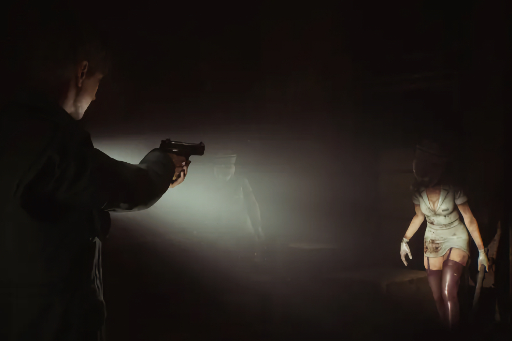

+++
title = "Les développeurs du remake de Silent Hill 2 : « Donnez-nous une chance ! »"
date = 2024-08-06T16:02:32+01:00
draft = false
author = "Mickael"
tags = ["Actu"]
image = "https://nostick.fr/articles/vignettes/aout/silent-hill-2.jpg"
+++

Le remake de *Silent Hill 2* a beaucoup à prouver. Konami a maltraité la licence à tel point que les joueurs n'ont — assez légitimement — aucune confiance envers l'éditeur. Et ils ne laissent rien passer au studio qui développe le jeu, la Bloober Team, qui a à son tableau de chasse des titres horrifiques comme *Layers of Fear* et *The Medium*.

La bande annonce [publiée](https://www.youtube.com/watch?v=ayKICAIUHkA) durant le State of Play de janvier dernier n'a rien fait pour rassurer les fans : trop porté sur la bagarre, le trailer laissait entendre que ce nouveau *Silent Hill 2* serait d'abord et avant tout un jeu d'action, ce que l'original de 2001 est très peu. 

Les développeurs de Bloober ont d'ailleurs rapidement tué la polémique en [expliquant](https://www.eurogamer.net/even-bloober-team-wasnt-a-fan-of-silent-hill-2-remakes-combat-focused-trailer) que la vidéo avait été produite par Konami et qu'ils n'avaient pas eu leur mot à dire. L'honneur est sauf, mais les craintes de se retrouver avec un nanar entre les mains sont toujours bien vivaces.

 

Alors que la sortie approche (c'est pour le 8 octobre sur PC et PS5), Piotr Babieno, le patron du studio polonais, veut se mettre les joueurs dans la poche. Dans une interview à *[Rolling Stone](https://www.rollingstone.com/culture/rs-gaming/bloober-teams-piotr-babieno-talks-silent-hill-2-criticisms-1235061338/)*, celui qui est aussi producteur du remake affirme vouloir créer des jeux « *auxquels nous voudrions jouer nous mêmes, et des jeux qui seront très importants pour les joueurs* ».

Face à un tel monstre vidéo-ludique qui a plus que contribué à poser les bases du jeu horrifique et a même élevé le genre à de nouveaux sommets, le processus de développement a été « *un voyage intimidant* », il a fallu trouver le bon équilibre entre « *préservation et innovation* ». Piotr Babieno et son équipe ont eu accès aux créateurs du jeu original chez Konami : « *Cela nous a pris beaucoup de temps pour y arriver, avec de nombreuses discussions créatives et beaucoup de travail acharné, mais nous sommes très satisfaits du résultat* ».

Les mots sont bien gentils, mais ici ce qui va compter, ce sont les actes, le jeu en lui-même. « *Je réalise que la confiance se gagne par des actions, pas par des paroles. C’est pourquoi nous avons une politique de ne pas commenter [les spécificités du jeu] et de ne pas susciter d’espoirs* ». Il ne demande qu'une petite chose aux joueurs et aux fans : « *donnez-nous une chance* ».

Le boss espère que lorsque les joueurs se lanceront dans cet univers à la fois très connu et inédit pour la première fois, « *ils comprendront que les choix que nous avons fait l'ont été pour le meilleur* ». Rendez-vous dans deux mois.