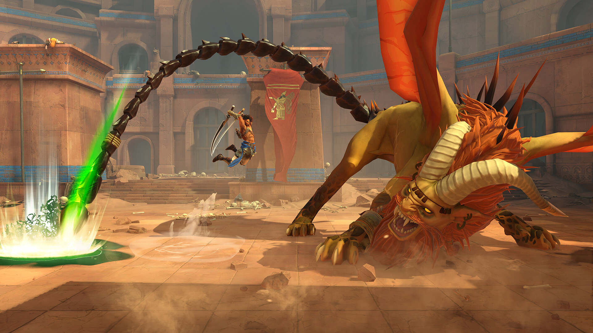

+++
title = "Prince of Persia The Lost Crown crapahute à l'aise sur Steam Deck"
date = 2024-08-08T06:54:32+01:00
draft = false
author = "Mickael"
tags = ["Actu"]
type = "telex"
+++

L'excellent *Prince of Persia The Lost Crown*, sorti en début d'année sur toutes les plateformes, sera — enfin ! — proposé sur [Steam](https://store.steampowered.com/app/2751000/Prince_of_Persia_The_Lost_Crown/) dans la journée. Pour une raison que seule Ubisoft comprend, le jeu était jusqu'à présent vendu sur PC uniquement via l'horrible *launcher* de l'éditeur. Je ne dis pas que Steam est forcément mieux, mais au moins la boutique de Valve est sur mon PC et surtout dans mon Steam Deck !

 

D'ailleurs, Ubisoft est aux [petits soins](https://x.com/princeofpersia/status/1821214773331079578) pour les possesseurs de la console PC : avec les réglages Extra, *The Lost Crown* tournera à 60 FPS sur le Steam Deck LCD, et à 90 FPS sur le modèle OLED ! Le jeu est particulièrement bien adapté à la mobilité, comme on l'a vu avec la version Switch. Peut-être que cette version Steam donnera un second souffle au titre, sérieux prétendant au titre de meilleur Metroidvania.