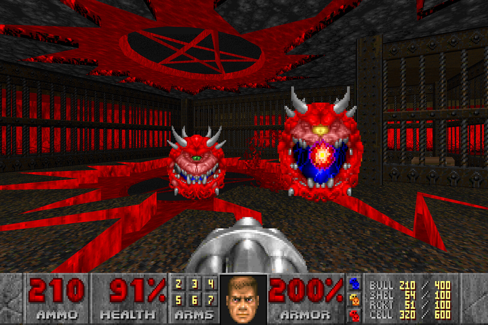

+++
title = "Doom et Doom II enfin réunis, avec tout un tas de nouveautés en bonus"
date = 2024-08-08T16:47:32+01:00
draft = false
author = "Mickael"
tags = ["Actu"]
image = "https://nostick.fr/articles/2024/aout/0808-doom-reunion-nouveautes/doom.jpg"
+++

*Doom* est un des plus grands jeux de l'histoire des jeux vidéo. *Doom II* est aussi un des plus grands jeux de l'histoire des jeux vidéo. Quoi de plus logique alors pour id Software de regrouper *Doom* et *Doom II* dans un bundle commun ! Apparu sur [Steam](https://store.steampowered.com/app/2280/DOOM__DOOM_II/) mais pas encore disponible à l'achat, ce pack comprend donc les deux jeux, plus tout un tas de goodies, d'extensions et de maps supplémentaires ajoutées au fil des années.

Un des morceaux de bravoure de cette réédition est un tout nouvel épisode solo, « Legacy of Rust », développé par les ptits gars de chez id, Nightdive et MachineGames. En tout, on devra faire le ménage dans 187 maps solo, plus 43 maps deatchmatch. 

 

Et comme si cela ne suffisait pas, le studio en a profité pour rafraîchir les deux jeux en y ajoutant tout un tas de nouveaux trucs en plus : les modes multi en ligne en deatchmatch et coop jouables jusqu'à 16 joueurs, le support des mods de la communauté à télécharger depuis le jeu, le choix dans les bandes son (MIDI ou IDFKA), la prise en charge du rendu multithreading jusqu'à 4K à 120 FPS, de nouvelles options d'accessibilité…

La bonne nouvelle, s'il en fallait une en plus, c'est qu'a priori, tous ceux qui ont acheté le *Doom* original sur Steam bénéficient gratuitement de *Doom II* et de tout le reste.

**Mise à jour —** Ayé, il est maintenant possible d'acheter le pack Doom et Doom II au prix de [10 €](https://store.steampowered.com/app/2280/DOOM__DOOM_II/) sur Steam. Le bundle est aussi disponible chez PlayStation, Xbox et sur Switch.