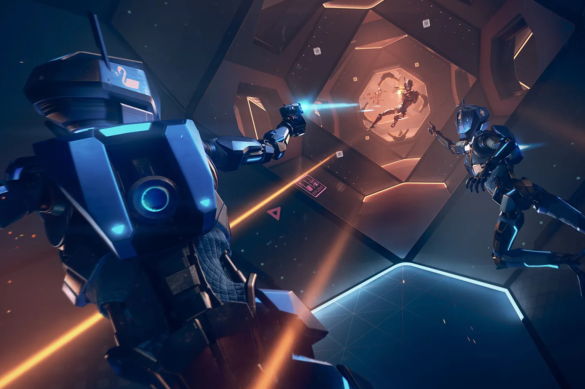

+++
title = "Meta ferme Ready at Dawn, un de ses meilleurs studios de jeux VR"
date = 2024-08-08T05:30:00+01:00
draft = false
author = "Mickael"
tags = ["Actu"]
image = "https://nostick.fr/articles/vignettes/aout/Echo-Combat.jpg"
+++

Telle une sauterelle affamée, Meta saute de tendance en tendance pour ne pas se faire complètement ringardiser. Maintenant que le métavers est passé de mode, le géant des réseaux sociaux a pivoté vers l'intelligence artificielle. Cela ne veut pas dire que Meta a complètement abandonné le développement matériel et logiciel pour la réalité virtuelle/augmentée/mixte/machin. 

Mais disons qu'après les pertes bien réelles enregistrées depuis 2020 par la division Reality Labs en charge du métavers (50 milliards de dollars !), le groupe cherche à réduire un peu les dépenses pour cette activité qui rapporte des nèfles. Il se [murmure](https://www.theinformation.com/articles/reality-comes-to-metas-reality-labs) que le budget destiné à cette division va fondre de 20 % d'ici 2026. 

 

Première victime collatérale : Ready at Dawn va [fermer](https://www.androidcentral.com/gaming/virtual-reality/ready-at-dawn-studios-closing), quatre ans seulement après son acquisition par Oculus Studios, propriété de Meta qui va se priver d'une expertise rare dans le milieu de la VR. Ready at Dawn n'est en effet pas le premier venu : le studio s'est lancé dans la réalité virtuelle en 2017 avec *Lone Echo* et *Echo Arena*, deux jeux pour Oculus Rift, puis *Echo Combat* l'année suivante, et enfin *Lone Echo II* en 2021.

L'an dernier, après l'annonce de la fermeture des jeux multi *Echo Arena* et *Combat*, un premier couperet tombe : un tiers des employés est licencié alors que Meta est dans son « année de l'efficacité » — 20 000 emplois ont été supprimés. Er donc nous voilà arrivé au bout du bout, avec la fin définitive du studio. C'est bien malheureux, car la plateforme Quest a besoin de jeux innovants.

Avant de se lancer tête la première dans la VR, Ready at Dawn était un studio au pedigree prestigieux : on lui doit entre autres des *God of War* pour PSP (*Chains of Olympus* et *Ghost of Sparta*), *The Order: 1886* pour PS4 ou encore *Okami* sur la Wii.