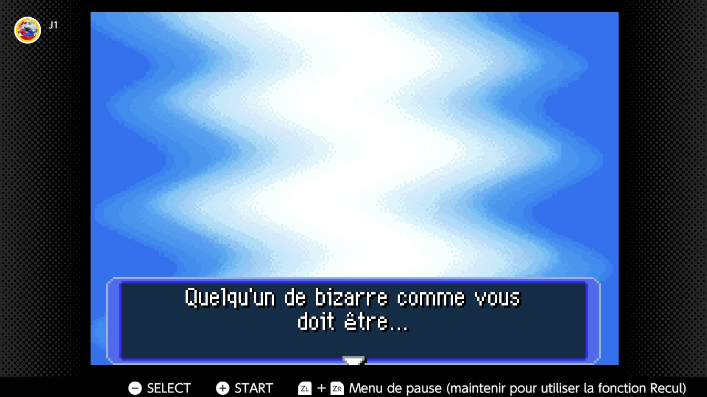

+++
title = "« Qui suis-je ? » : demandez-le à Pokémon Donjon Mystère"
date = 2024-08-09T17:47:32+01:00
draft = false
author = "Mickael"
tags = ["Actu"]
image = "https://nostick.fr/articles/2024/aout/0908-pokemon-donjon-mystere-test-personnalite/pokemon-donjon-mystere.jpg"
+++

 

Dans le grand capharnaüm des spin-off de Pokémon, Nintendo a fait une petite fleur hier aux abonnés Switch Online + Pack additionnel en leur refilant *Pokémon Donjon Mystère: Équipe de secours rouge*. Le jeu, sorti sur GBA 2005 au Japon[^1], n'est pas le meilleur du genre, qui reste quoi qu'on en dise *Pokémon Pinball* évidemment. Mais il y a de quoi s'occuper un petit week-end tranquillou.

Contrairement à la franchise originale, dans *Donjon Mystère* le joueur n'incarne pas un humain chasseur de bestioles, mais… une bestiole ! Enfin, disons que l'humain se retrouve on ne sait comment dans la peau d'un Pokémon, qui doit donner des coups de main à d'autres créatures avec l'aide d'un partenaire.

Mais ce qui est le plus rigolo avec ce jeu, c'est le tout début. Le joueur est en effet invité à remplir un questionnaire de personnalité qui va permettre au jeu de déterminer quel Pokémon il incarnera. Et les questions vont parfois fouiller assez loin dans la psyché du joueur… Voici quelques exemples :

 

 

 

 

Et le pire c'est qu'après avoir répondu à toutes ces questions très privées, le jeu se fout de votre gueule !

 

 

 

 

Tout ça pour au bout du compte, incarner…

Nintendo qui va gratouiller là où ça fait mal dans votre tête, finalement ce n'est pas si mal, et ça coûte moins cher qu'une séance chez le psy.

[^1]: *Pokémon Donjon Mystère: Équipe de secours bleue* est sorti la même année, mais sur DS. *Rouge* est d'ailleurs le dernier jeu à être sorti sur GBA.