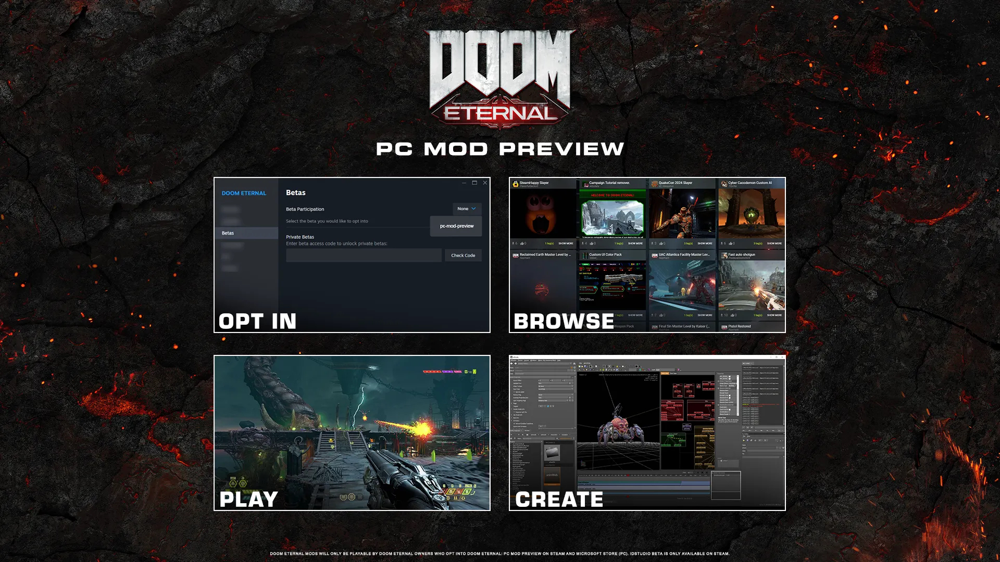
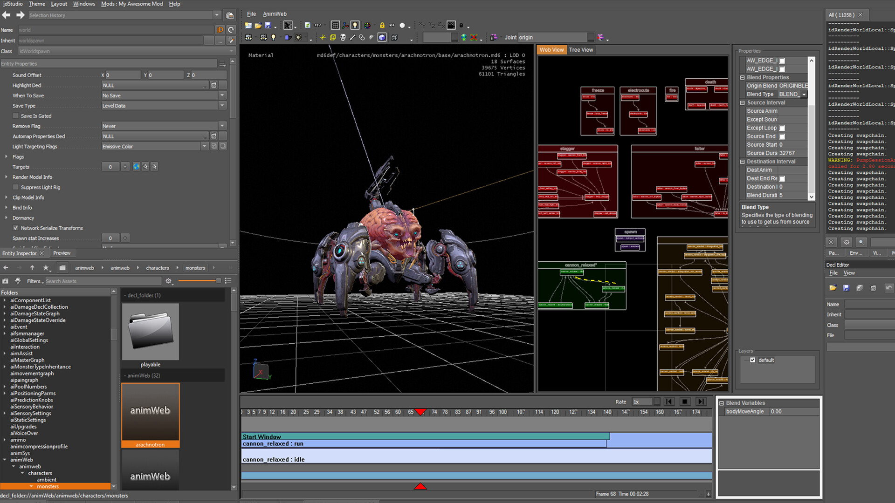

+++
title = "Doom Eternal va se faire modder (officiellement)"
date = 2024-08-09T07:02:32+01:00
draft = false
author = "Mickael"
tags = ["Actu"]
image = "https://nostick.fr/articles/2024/aout/0908-doom-eternal-mod-officiel/doom-eternal-mod.jpg"
+++

À l'occasion de la QuakeCon qui a débuté hier, id Software a mis le paquet sur les anciens et glorieux épisodes de *Doom*, notamment avec la réédition des [deux premiers volets réunis dans un pack ultime](https://nostick.fr/articles/2024/aout/0808-doom-reunion-nouveautes/), et avec du contenu supplémentaire. Mais il n'y en avait pas que pour les vieilleries !

En attendant (on croise les doigts) des nouvelles du prochain *Doom: The Dark Ages*, le studio a fait une fleur à la communauté du modding en [annonçant](https://slayersclub.bethesda.net/en-US/article/doom-eternal-pc-mod-preview?linkId=100000279163235) des outils officiels pour trafiquer *Doom Eternal*. Les bidouilleurs n'avaient pas attendu le feu vert d'id pour transformer le FPS en profondeur ([jetez un œil par ici](https://www.nexusmods.com/doometernal)).

Néanmoins, pouvoir travailler avec des outils certifiés par le studio assure une plus grande stabilité aux mods qui ne risquent pas de ne plus fonctionner sur un coup de tête du studio. Les créateurs peuvent télécharger dès à présent idStudio (Beta) sur [Steam](https://store.steampowered.com/app/2545650/DOOM_Eternal_idStudio/) pour concevoir leurs mods (oui, c'est velu mais pour débuter on peut toujours se rendre sur le [site officiel](https://idstudio.idsoftware.com)).

Quant aux joueurs, ils peuvent eux aussi en profiter dès maintenant en récupérant la mise à jour 6.66 Rev 3 de *Doom Eternal*, dans laquelle s'active l'aperçu PC Mod. Une fois que c'est fait, il sera possible de consulter les mods disponibles, les télécharger, et y jouer. Cet aperçu est disponible pour la version Steam du jeu, la mouture distribuée sur le Microsoft Store ne devrait pas tarder à le proposer.

Une foire aux questions complète est à lire [ici](https://idstudio.idsoftware.com/faq).