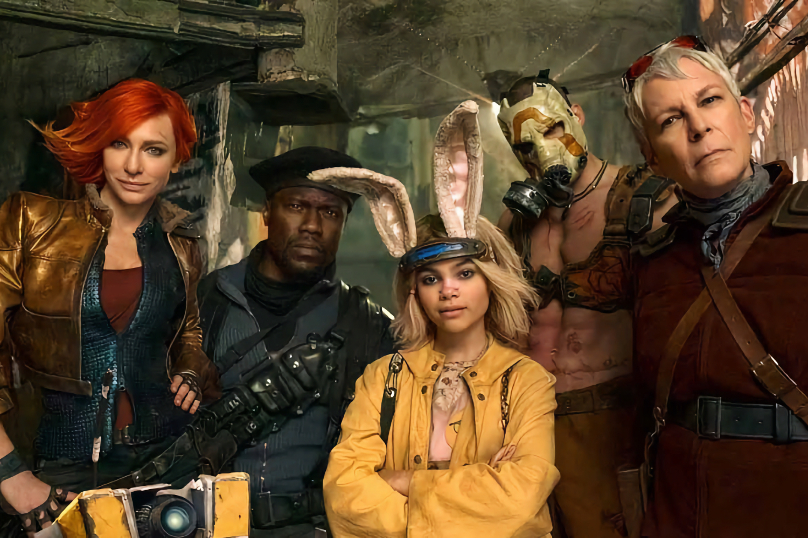
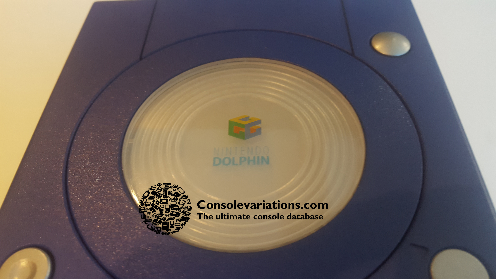
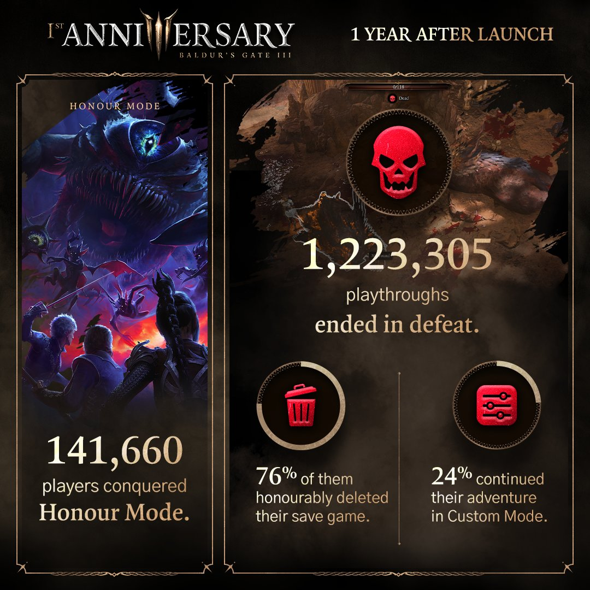
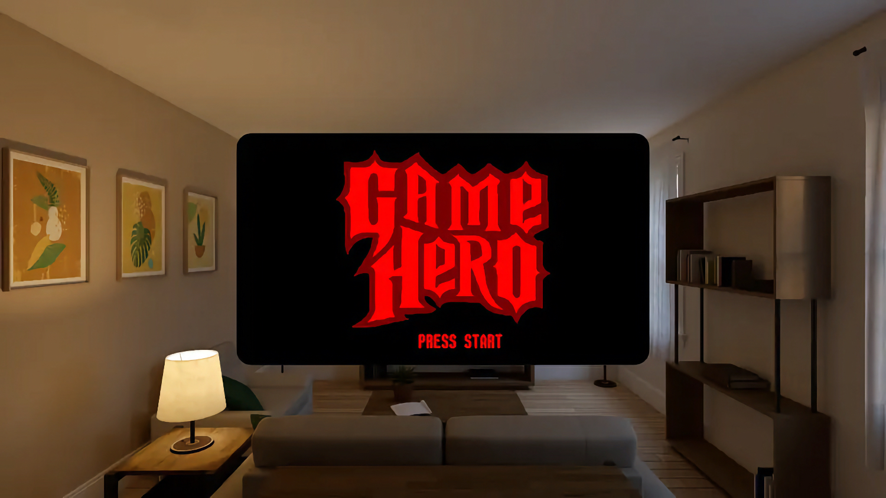

+++
title = "On vide le backlog de la semaine : Balatro, Baldur's Gate 3, Warner Bros, Dolphin…"
date = 2024-08-10T06:00:32+01:00
draft = false
author = "Mickael"
tags = ["XXL"]
image = "https://nostick.fr/articles/vignettes/aout/borderlands.jpg"
+++

L’actualité du jeu vidéo ne s’arrête pas à la poignée d’articles publiés sur *Nostick* ! Histoire de rattraper le retard accumulé, voici un retour rapide sur quelques unes des infos les plus importantes (ou insignifiantes) de la semaine.

## L'image de la semaine

Avant que la GameCube devienne la GameCube, Nintendo développait dans un secret assez relatif ce qui allait devenir sa future console cubique : le projet Dolphin (un nom qui doit évoquer quelque chose aux amateurs d'émulation !). On ne connaissait des prototypes qu'une [photo floue](https://x.com/PaulFelixKelly/status/1820497980744716625), mais un modèle est tombé entre les mains de *ConsoleVariation* qui a [partagé](https://x.com/consolevariant/status/1820489954361016672) un cliché propre de la machine.

Le design a déjà un air de famille avec la future console, même si le logo est à mi-chemin entre celui de la N64 et de la GameCube. Pour les amateurs de noms de projets, sachez que la N64 était appelé « Reality » en interne, la Wii « Revolution » (pourquoi se gêner), la Wii U « Cafe » et la Switch « NX ».

## Le chiffre de la semaine : 197 400 joueurs ont fait un gros câlin à l'ours de Baldur's Gate 3

*Baldur's Gate 3* est sorti il y a un peu plus d'un an (le 3 août 2023 sur Windows, après une longue période de bêta) et depuis, le RPG de Larian ne cesse de remporter des hochets pour la qualité de son histoire, de sa réalisation et de son gameplay. Il s'en est passé des choses pour le jeu, et aussi pour les courageux aventuriers qui se sont vaillamment lancés dans l'exploration des terres de Faerûn.

À l'occasion de ce premier anniversaire, Larian a [dévoilé](https://x.com/baldursgate3/status/1821187150081356110) quelques chiffres rigolos : 141 600 joueurs ont terminé la campagne en mode Honneur, le plus difficile du lot avec en plus un permadeath assez fatal — si un perso meurt, le jeu prend fin. Cela représente 12 % seulement des 1,2 million de fous furieux qui ont tenté leur chance dans ce mode, et qui en sont mort (un quart d'entre eux ont continué leur aventure avec un mode de difficulté plus adapté).

Parmi les autres chiffres bizarres, 1,9 million de joueurs ont été [transformés](https://x.com/baldursgate3/status/1821186927779004770) en meule de fromage, une affliction possible dans le jeu mais qui n'enlève rien aux capacités du joueur à poursuivre son aventure.

Pour finir dans la joie et l'allégresse, 30 % des joueurs ayant [décidé](https://x.com/baldursgate3/status/1821187589925122366) de grimper aux rideaux avec Halsim ont choisi [la forme ours du druide](https://nostick.fr/articles/2024/juillet/1207-baldurs-gate-3-sexe-ours/), soit 197 400 amateurs de frissons sauvages. Vous êtes incorrigibles. Et si vous n'avez pas encore fini le jeu, ne cliquez pas [ici](https://x.com/baldursgate3/status/1821188332770197871), Larian donne des stats sur les différentes fins de la campagne. Non ne cliquez pas.

## Ça fait envie : Balatro en 2025

*Balatro* va certainement terminer dans la *short list* des nommés pour le jeu de l'année, et pourquoi pas dans celle pour l'année prochaine aussi ! Le développeur LocalThunk a en effet [annoncé](https://x.com/BalatroGame/status/1821184855876804841) que ~~sa drogue~~ son jeu de cartes hautement addictif recevra une grosse mise à jour en 2025, « *avec de nouvelles idées et de nouvelles stratégies* ». Pas de jaloux, toutes les plateformes seront servies, et cette mise à jour sera gratuite.

Sorti en début d'année, *Balatro* est devenu une darling du jeu indé, aussi bien chez la critique que chez les joueurs : le titre a en effet dépassé le cap des 2 millions de copies vendues ! On le retrouve régulièrement dans le classement des jeux les plus populaires du Steam Deck, où il est particulièrement à son aise. Il ne manque plus que les versions iOS et Android, qui sont en cours ([attention aux contrefaçons !](https://nostick.fr/articles/2024/mai/3105-non-balatro-nest-pas-sur-mobile/)).

S'il est indéniable que *Balatro* est un jeu de cartes dérivé du Poker, son créateur est fermement opposé au principe des jeux d'argent. LocalThunk est même [allé](https://x.com/LocalThunk/status/1820752209765961746) jusqu'à stipuler dans son testament (!) que la propriété intellectuelle de son jeu ne pourra jamais être vendue ou licenciée à une société de paris en ligne ou à un casino, y compris après sa mort !

## Les emmerdes bien méritées de la semaine pour Warner Bros 

C'est pas la joie pour le groupe Warner Bros Discovery qui, [à force d'empiler les réorganisations, restructurations et décisions les plus stupides](https://nostick.fr/articles/2024/mars/warnerbros/) finit par se retrouver avec un gros trou dans ses finances. 

Il y a les problèmes liés aux réseaux télévisés, qui ont forcé le groupe a déprécier la valeur de cette activité de près de 10 milliards de dollars (!), les clients préférant les services de streaming. Il y a aussi le recul de 6 % du chiffre d'affaires (à 9,7 milliards) au deuxième trimestre, toutes les divisions étant dans le rouge.

À commencer par celle qui nous intéresse, l'activité liée aux jeux vidéo dont les revenus ont plongé de 41 % pendant le trimestre. Il faut dire que la comparaison est difficile : l'an dernier, Warner profitait à plein du carton de *Hogwarts Legacy* — il aurait été difficile de faire aussi bien avec n'importe quel autre jeu mais pas bol, ça a été pire encore avec [*Suicide Squad: Kill the Justice League*](https://nostick.fr/articles/2024/juillet/1507-test-suicide-squad-kill-the-justice-league/), le plus gros bide de l'année.

Pour redresser la barre de ce navire qui file tout droit vers l'iceberg, une solution envisagée par David Zaslav, le CEO de la boîte, est de vendre des licences de certaines de ses IP. Warner Bros Discovery a dans son catalogue une ribambelle de franchises, qui vont de Harry Potter aux super-slips de DC, en passant par *Mortal Kombat*, Matrix, Game of Thrones et autres Looney Tunes.

« *Il y a beaucoup d'intérêt de la part d'autres acteurs pour profiter de certaines de ces propriétés intellectuelles pour les jeux, ce que nous examinons* », a confirmé le patron du groupe. Les 11 studios qui travaillent sous l'égide de WB pourraient ne plus être les seuls à avoir accès au grand coffre à jouets de l'entreprise. Et pourquoi pas Batman dans l'univers d'*Alan Wake* chez Remedy ? Ou encore un Souls-like bien vénère de FromSoft avec Bugs Bunny ?

Quant à la stratégie future, WB mise toujours sur le free-to-play et le jeu service, parce que ça a tellement bien marché avec *Suicide Squad* sans doute. C'est d'ailleurs ce qui a motivé l'acquisition de Player First Games, développeur de *MultiVersus*, le clone de *Smash* avec les licences du groupe.

## On n’a pas eu le temps cette semaine mais on pense à eux

 

*A Quiet Place: The Road Ahead*, le jeu tiré de la franchise ciné *Sans un bruit*, sortira le 17 octobre sur PC, PS5 et Xbox Series S/X. Comme dans les films, il faudra se faufiler dans un monde plein de méchants extra-terrestres, sans faire de bruit…

 

Capcom fait monter la sauce autour de *Dead Rising Deluxe Remaster* avec une vidéo de gameplay mettant en scène l'inénarrable Franck faisant la chasse aux zombies. On apprend aussi que la bande originale du premier jeu sera au rendez-vous après que l'éditeur ait réglé des petits soucis de licences. Le jeu sortira le 19 septembre.

Si vous avez crâmé 4 000 € pour un Vision Pro, faites-en au moins quelque chose d'intéressant, comme émuler le Virtual Boy de Nintendo ! L'émulateur VirtualFriend est finalement disponible sur l'[App Store](https://apps.apple.com/us/app/virtualfriend-vb-emulator/id6479948317?platform=vision), et ça vaut vraiment le coup. [On avait fait un aperçu de la version bêta.](https://nostick.fr/articles/2024/mai/0205-apercu-de-lemulateur-virtual-boy-pour-apple-vision-pro/)

## osef

Que celui qui a toujours voulu acheter des tickets de cinéma dans *Roblox* lève la main ! J'ai des questions à lui poser, maintenant que c'est bizarrement [possible](https://variety.com/2024/gaming/news/beetlejuice-2-movie-tickets-roblox-virtual-box-office-1236094529/)… mais uniquement pour *Beetlejuice 2*. Ça aurait pu être pire, le truc aurait pu essayer de refourguer des places pour *Borderlands*.

## Dans le reste de l’actu déchaînée

- Ça devient compliqué pour Paradox Interactive qui n'arrive pas à se dépêtrer de la catastrophe *Cities: Skylines 2*. Son nouveau jeu *Prison Architect 2* a été repoussé aux calendes grecques. [L'actu est à lire ici.](https://nostick.fr/articles/2024/aout/0508-prison-architect-2-report-paradox-interactive/)
- *Fast & Furious*, mais en mieux et sans ~~Baboulinet~~ Vin Diesel : c'est *Wreckfest 2* qui s'est offert [un premier trailer à voir par là !](https://nostick.fr/articles/2024/aout/0508-wreckfest-2-thq-nordic/)
- Les développeurs de *Black Myth: Wukong* et *Phantom Blade Zero* ne sont pas les plus grands fans de la Xbox, comme [on le lira dans cette actu.](https://nostick.fr/articles/2024/aout/0508-black-myth-wukong-phantom-blade-zero-xbox/)
- Après le méga carton de Baldur's Gate 3, le studio Larian est parti dans d'autres aventures… non sans avoir planché sur un quatrième volet ! [Plus d'infos par ici.](https://nostick.fr/articles/2024/aout/0508-baldurs-gate-4-larian-developpement/)
- Au milieu d'une année pleine de remakes, ça fait plaisir de voir un jeu original chez Nintendo, et quel jeu ! Zelda: Echos of Wisdom s'est un peu plus dévoilé cette semaine, [c'est à voir ici.](https://nostick.fr/articles/2024/aout/0508-zelda-echoes-of-wisdom-capacites-nintendo/)
- L'éditeur Humble Games a charcuté ses effectifs et maintenant, ce sont les studios qui trinquent. [On le déplore par là.](https://nostick.fr/articles/2024/aout/0608-chute-humble-games-bo-path-of-the-teal-lotus/)
- Développer un jeu, c'est long, c'est compliqué, et on n'est jamais content du résultat. [C'est le cas du studio en charge de Nightingale.](https://nostick.fr/articles/2024/aout/0608-nightingale-inflexion-developpeur-pas-content/)
- Les dévs du remake de *Silent Hill 2* ont la pression, les joueurs ne laisseront rien passer ! Mais ils demandent tout de même qu'on leur laisse une petite chance alors [s'il vous plait soyez sympa.](https://nostick.fr/articles/2024/aout/0708-silent-hill-2-developpeurs-donnez-chance/)
- Bientôt une bonne surprise pour les joueurs pécé ? *Final Fantasy 16* pourrait bien passer une tête d'ici la fin de l'été ! [On croise les doigts par ici.](https://nostick.fr/articles/2024/aout/0708-ff16-pc-ne-devrait-plus-trop-tarder/)
- *Star Wars: Jedi Survivor* a déjà eu un peu de mal à rouler correctement sur PS5 et Xbox Series S/X, qu'en sera-t-il de la version PS4 et Xbox One ? [On sera bientôt au courant.](https://nostick.fr/articles/2024/aout/0708-star-wars-jedi-survivor-ps4-xbox-one/)
- Parce qu'on a toujours besoin d'un bourrin près de chez soi, *Warhammer 40,000: Speed Freeks* a fait son entrée en trombe et en free to play. [Roulez vers cette actu pour en savoir plus.](https://nostick.fr/articles/2024/aout/0708-warhammer-40000-speed-freeks-bourrin-courses/)
- Comme les autres consoles, la PS5 connait un ralentissement des ventes. Pas de quoi effrayer PlayStation pour autant. [Découvrez pourquoi dans cette actu.](https://nostick.fr/articles/2024/aout/0708-ventes-ps5-playstation-q1-2024/)
- Oui, il y aura bien un mode zomblards dans *Call of Duty: Black Ops 6*, et [voici une bande annonce pour le prouver.](https://nostick.fr/articles/2024/aout/0708-call-of-duty-black-ops-6-mode-zombie/)
- Ready at Dawn ne fera plus de jeux VR : le proprio Meta a décidé de fermer le studio créateur d'*Echo Combat* (et dans une précédente vie, de *The Order: 1886*). [Plus d'infos par ici.](https://nostick.fr/articles/2024/aout/0808-meta-ferme-ready-at-dawn/)
- Les jeux de bagnoles, c'est bien, mais ce qui est encore mieux c'est quand ils s'inspirent des jeux SNES ! Tenez, comme *Victory Heat Rally* que [vous retrouverez par là.](https://nostick.fr/articles/2024/aout/0808-victory-heat-rally-viendra-faire-crisser-les-pneus/)
- *Doom* et *Doom II* réunis ensemble dans un pack, c'est une bonne idée, mais y ajouter de nouveaux contenus, on ne sait plus que dire tellement la joie et la félicité nous inonde. On peut par aller lire [l'actu qui va bien ici.](https://nostick.fr/articles/2024/aout/0808-doom-reunion-nouveautes/)
- *Doom* toujours, mais *Eternal* cette fois, qui a enfin droit à des outils de mods officiels. [À lire dans cette actu.](https://nostick.fr/articles/2024/aout/0908-doom-eternal-mod-officiel/)