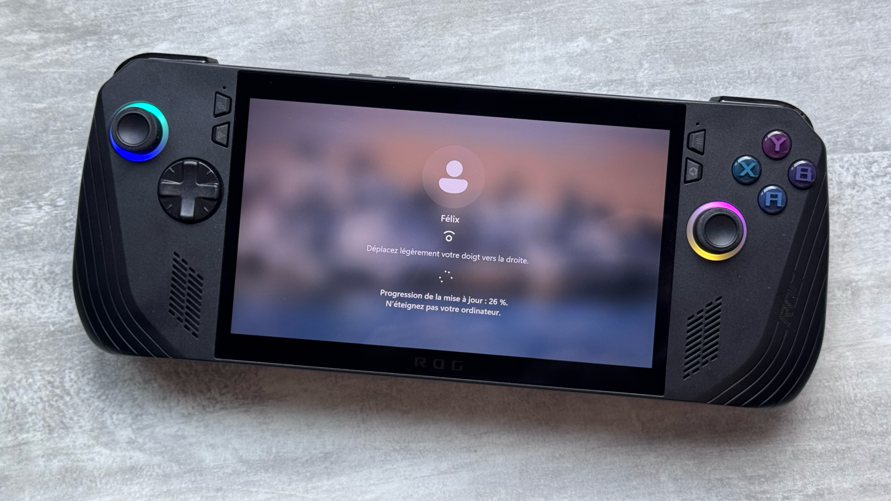

+++
title = "SteamOS sur ROG Ally : la prise en charge officielle se rapproche"
date = 2024-08-10T07:10:32+01:00
draft = false
author = "Félix"
tags = ["Actu"]
image = "https://nostick.fr/articles/2024/aout/0708-call-of-duty-black-ops-6-mode-zombie/calof.jpg"
+++

Valve préparerait-elle un lancement de SteamOS pour la ROG Ally ? Ça serait bien tant Windows est une plaie sur la console d’Asus, son interface n’ayant pas du tout (*du tout*) été pensée pour être utilisée sur un écran tactile de 7 pouces. Si l’arrivée de la distribution Linux sur nos machines de bourgeois reste pour le moment un doux rêve, il semblerait que Valve planche sur le sujet, où du moins qu’elle commence à s’intéresser à ce qui se fait ailleurs. *[SteamDeckHQ](https://steamdeckhq.com/news/new-steamos-beta-update-desktop-image/)* a remarqué que la dernière bêta de SteamOS [apportait](https://store.steampowered.com/news/app/1675200/view/4361258795952118017) « *la prise en charge des touches supplémentaires de la ROG Ally* ».

C’est une première, Valve ayant jusqu’à présent concentré ses efforts sur son propre matériel sans jamais ajouter des correctifs pour des consoles tierces. L’entreprise n’a pour le moment jamais cherché à ouvrir son OS à d’autres machines. Elle propose bien [une ISO de récupération](https://help.steampowered.com/en/faqs/view/1B71-EDF2-EB6D-2BB3) qui peut être bidouillée, mais la documentation précise que « *tout pourrait ne pas fonctionner correctement* » sur d’autres supports et qu’il ne s’agit pas vraiment de SteamOS 3. Il y a déjà moyen de l’installer ailleurs en trafiquant, mais il faut aimer mettre les mains [dans le cambouis](https://bazzite.gg).

L’ouverture de SteamOS serait tout bénef’ pour Valve, qui fait son beurre sur la commission qu’elle prélève à l’achat de chaque jeu. La disponibilité sur d’autres machines ne devrait pas trop cannibaliser ses ventes de matériel, le Steam Deck gardant l’avantage d’être largement moins cher que la concurrence tout en disposant déjà [d’une solide base de convaincus](https://nostick.fr/articles/2024/avril/2604-6-mois-avec-le-steam-deck-oled/). En novembre dernier, deux membres de l’équipe Steam Deck avaient assuré *[à PCGamer](https://www.pcgamer.com/steamos-on-handheld-pcs/)* vouloir déployer le système sur d’autres appareils, à commencer par des consoles portables similaires. On croise les doigts pour une sortie proche : SteamOS serait parfait pour un dualboot avec Windows sur la [ROG Ally X](https://nostick.fr/articles/2024/juillet/2907-coup-doeil-sur-la-rog-ally-x/) qui vient juste de sortir.