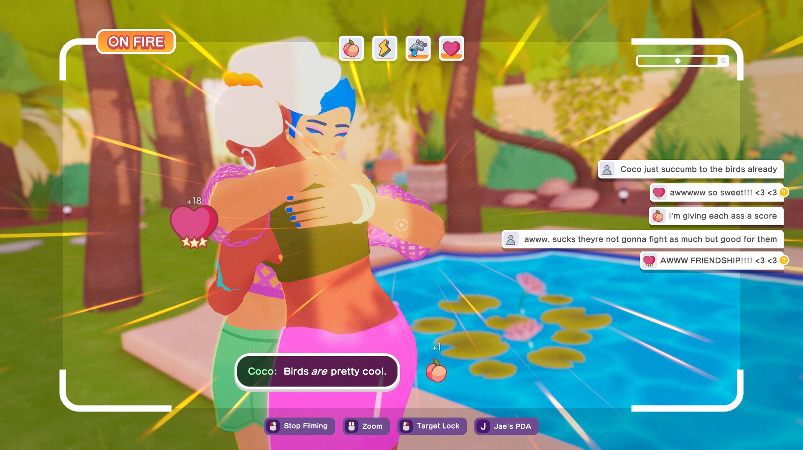
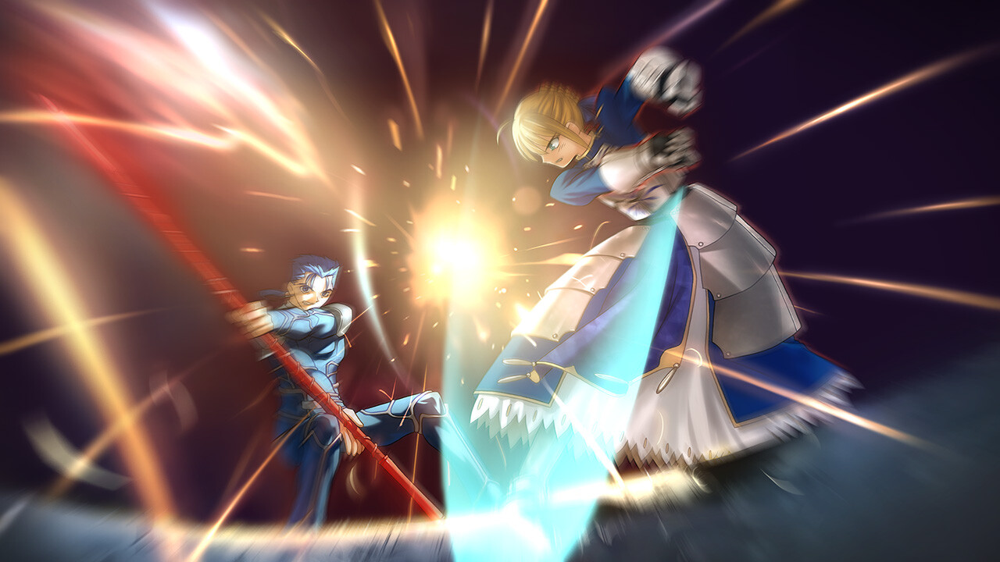

+++
title = "The Crush House, Fate/stay night Remastered : le récap des sorties de la semaine (11/08)"
date = 2024-08-11T02:30:02+01:00
draft = false
author = "Félix"
tags = ["C’est dispo"]
image = "https://nostick.fr/articles/2024/aout/1108-crush-house-cat-quest-sorties-de-la-semaine/crush.jpg"
+++

Entre la plage, les restaus moules-frites à volonté et les soirées mousse qui durent jusqu’à 4h, vous n’avez peut-être pas eu le temps de vous intéresser aux nouveautés du moment. Qu’à cela ne tienne : voici les sorties de ces derniers jours qui ont retenu notre attention.

## La maison des secrets

C’est toujours assez calme en ce mois d’août, mais on notera tout de même la sortie du dernier Devolver **The Crush House**. On en avait déjà [un peu parlé](https://nostick.fr/articles/2024/avril/0405-the-crush-house-est-un-simulateur-de-tv-realite-des-annees-2000-parce-que-pourquoi-pas-apres-tout/) lors de sa présentation : il s’agit d’un jeu dans lequel on incarne le caméraman d’une émission de télé-réalité qui doit faire les plus beaux plans pour satisfaire l’audience, l’argent engrangé permettant d’acheter différentes améliorations. On peut piocher dans un casting haut en couleur et sélectionner les meilleures pubs pour maximiser les bénéfices. C’est assez hybride avec un mélange de management et de simulation de vie, ce concept fun étant bercé par une toile de fond aussi colorée que mystérieuse. J’ai testé la démo à la sortie, qui m’avait plutôt convaincue par ses dialogues sympas et son gameplay original. Le jeu complet est visiblement réussi, les testeurs louant l’humour du titre et son idée de base qui tient la route. [17 € sur Steam](https://store.steampowered.com/app/2337820/The_Crush_House/), une démo est disponible pour les curieux.

## Chat-peau de pirate

La licence **Cat Quest** est de retour avec un 3e opus axé sur le monde de pirate. Si vous ne connaissez pas, sachez que c’est de l’action RPG mignon avec un monde ouvert en 2,5D. Adieu l’univers Fantasy, on incarne cette fois un jeune chat faisant cap sur les Charaïbes à la recherche d’un trésor légendaire. On peut se déplacer à pied ou en bateau, résoudre des quêtes et se castagner à droite à gauche. L’aventure se termine en une dizaine d’heures, ce qui sera pas mal pour ceux qui n’aiment pas boucler sur le même jeu pendant des semaines. Les testeurs ont été conquis, décrivant un jeu avec un bon rythme et des combats sympas. Est-ce le *Skull and Bones* que l’on attendait tous ? Sans doute pas, mais si vous cherchez un action-RPG pas prise de tête, ça devrait faire le job. 20 € sur [Steam](https://store.steampowered.com/app/2305840/Cat_Quest_III/) (il y a une démo), également dispo sur Switch et toutes les consoles.



## La Fate est finie pour les joueurs PC

Grosse semaine pour les fans de visual novels : ***Fate/stay night*** est sorti en version remastérisée sur Steam et sur Switch. Il s’agit visiblement d’une légende du genre qui n’avait jamais quitté le Japon, et la nouveauté avait de quoi donner envie. Malheureusement, la version anglaise est toute pétée avec des textes erronés et des morceaux de décors ou des personnages qui n’apparaissent pas au bon moment. Il faudra donc attendre encore un peu avant de découvrir ce classique suivant l’histoire d’un jeune homme à la quête du Saint Graal dans une intrigue mêlant magie et combats épiques. En l’état, aucune raison d’y lâcher[ les 30 euros demandés](https://store.steampowered.com/app/2396980/Fatestay_night_REMASTERED/), mais pourquoi pas dans 2-3 semaines et après plusieurs patchs.

## Ava pas la tête ?

**Creatures of Ava** est sorti cette semaine. Il s’agit d’un jeu d’aventure cozy avec des espèces de Pokémon qui a l’air plutôt sympa. L’histoire a été rédigée par [Rhianna Pratchett](https://fr.wikipedia.org/wiki/Rhianna_Pratchett) (*Rise of the Tomb Raider, Mirror's Edge*) et invite à suivre une jeune exploratrice partant sillonner une planète divisée en 4 écosystèmes distincts que l’on nous promet « *grouillants de vie* ». Le but va être d’évacuer un maximum de créature et de plantes face à une mystérieuse infection qui se propage. Les combats sont sans violence et le joueur alterne séance de collecte et puzzle. Le jeu a réussi à charmer la critique par son histoire et son concept, bien que ça reste un titre à moyen budget avec quelques bugs ici ou là. [Pour 25 €](https://store.steampowered.com/app/2304440/Creatures_of_Ava/), ça a l’air honnête si le trailer vous fait envie. Dispo sur PC, Xbox et dans le Game Pass.


