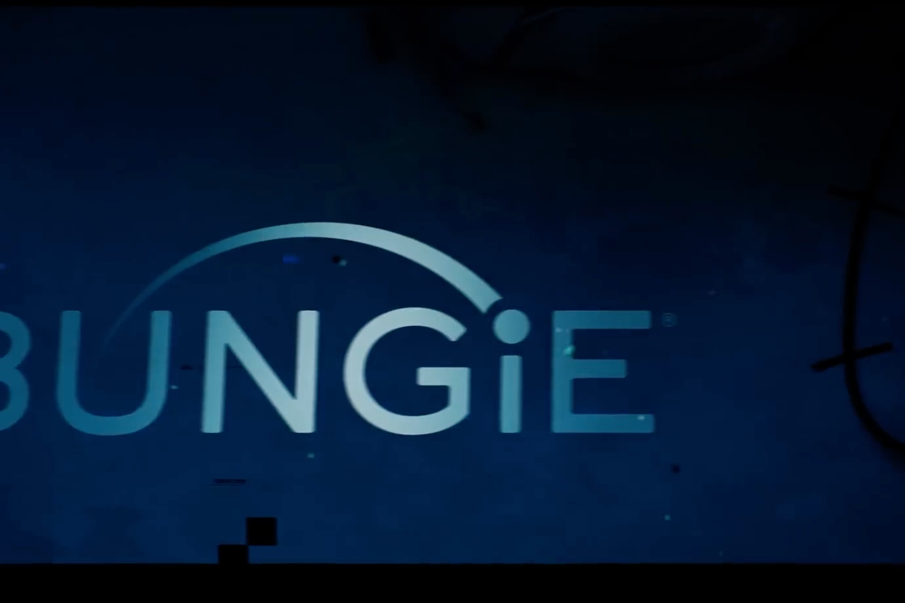

+++
title = "Destiny 2, Marathon : ça continue de craindre chez Bungie"
date = 2024-08-12T06:00:32+01:00
draft = false
author = "Mickael"
tags = ["Actu"]
image = "https://nostick.fr/articles/vignettes/aout/bungie-logo.jpg"
+++

C'est compliqué en ce moment chez Bungie. Le studio propriété de Sony a dû dégraisser du personnel fin juillet ([220 postes, soit 17 % des effectifs](https://nostick.fr/articles/2024/aout/0308-backlog-semaine-astro-bot/#les-emmerdes-de-la-semaine-chez-bungie)), une coupe claire qui suivait une précédente charrette d'une centaine d'employés en fin d'année dernière. Et  le succès de « The Final Shape », l'extension ultime de *Destiny 2*, n'y a rien fait : ces licenciements étaient en fait [prévus](https://www.gamefile.news/p/bungies-deep-job-cuts-were-in-the) *avant* le lancement du DLC…

Sony, qui a signé un chèque de 3,6 milliards de dollars pour ce bateau ivre, a fait de Bungie le navire amiral de sa stratégie jeu service. Si même un énorme carton comme *Destiny 2* ne parvient pas à soutenir l'activité et la croissance de Bungie, quel jeu service pourrait bien réussir à souffler dans les voiles de tout le groupe ? On doit d'ailleurs avoir les mains moites chez PlayStation, *[à quelques encablures de la sortie de Concord](https://nostick.fr/articles/2024/juillet/2207-concord-playstation-flop/)*). 
 
Au delà des questions légitimes que peut se poser la direction de Sony — Bungie valait-il réellement le prix payé ? —, les joueurs aussi s'inquiètent de la suite. Sur Reddit, l'équipe de *Destiny 2* a [tenté](https://www.reddit.com/r/DestinyTheGame/comments/1endzvd/a_quick_note_from_the_destiny_2_team/) de rassurer : « *Nous savons que les récents changements chez Bungie ont généré des incertitudes sur l'avenir de Destiny. Soyez assurés que nous sommes toujours engagés envers Destiny, que nous continuerons de soutenir notre communauté avec transparence et que nous fournirons des mises à jour régulières sur le jeu* ».

Ces mises à jour seront moins importantes que les précédentes extensions, mais au moins les joueurs continueront à avoir des nouveautés à se mettre sous les yeux. Quant au message de transparence, il a un peu de mal à passer auprès des joueurs, échaudés par les promesses et qui ont souvent été déçus. 

À tel point qu'ils sont nombreux aujourd'hui à demander la démission de Pete Parsons, le CEO de Bungie, qui a [claqué](https://www.pcgamer.com/gaming-industry/bungie-developers-express-fury-and-sorrow-over-layoffs-following-the-revelation-that-ceo-pete-parsons-allegedly-spent-at-least-2-414-550-on-vintage-cars-in-the-past-2-years/) 2,6 millions de dollars dans des bagnoles de luxe ces dernières années. Chacun fait ce qu'il veut de ses sous, mais cela donne mauvaise impression…

 

Quant à l'avenir, il s'annonce tout aussi compliqué que le présent ! *Destiny 3* est certainement en chantier, mais la sortie n'est pas pour demain, ni même après demain. Le prochain gros morceau pour Bungie est *Marathon*, mais l'optimisme n'est guère de mise. Selon le bien informé Jason Schreier, le statut actuel du développement du jeu est « *pas super* ».

« *Il y a une raison pour laquelle [Marathon] a été repoussé d'une année entière* », [affirme](https://www.youtube.com/watch?v=gnduZPaqx5Q&t=570s) le fouineur de *Bloomberg*. « *Les personnes avec qui j'ai parlé sont un peu pessimistes quant à la possibilité que cela respecte même la date limite actuelle, mais on verra. Je ne sais pas exactement quand c'est prévu — quelque part en 2025, je ne suis pas sûr* ». À quoi ressemblera Bungie l'année prochaine ? C'est de plus en plus difficile à prévoir.