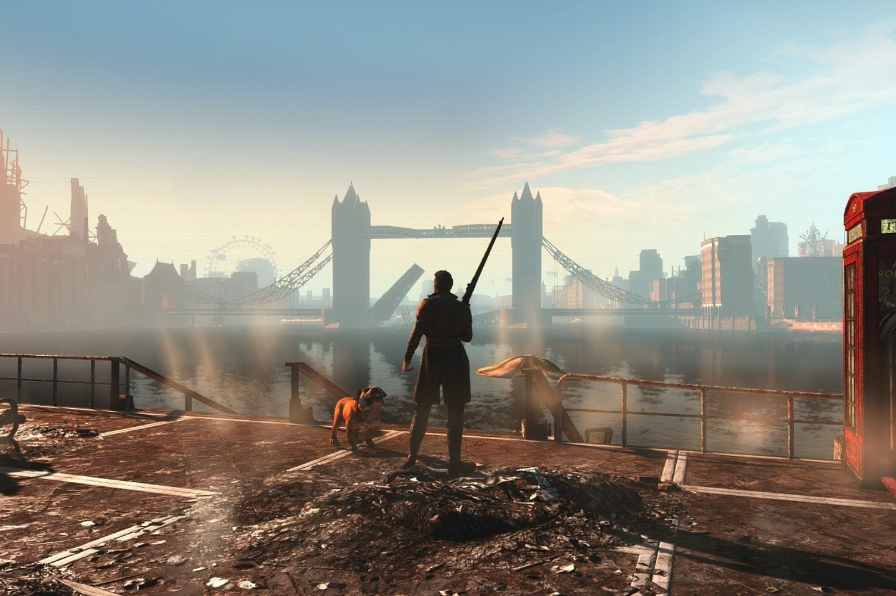

+++
title = "Les développeurs de l'énorme mod Fallout: London veulent créer des jeux indés"
date = 2024-08-12T08:07:32+01:00
draft = false
author = "Mickael"
tags = ["Actu"]
image = "https://nostick.fr/articles/vignettes/aout/fallout-London.jpg"
+++

 

Qui ne voudrait pas faire une petite balade de santé dans un Londres post-apo ? Depuis deux semaines, c'est possible grâce à [*Fallout: London*, énorme mod de *Fallout 4*](https://nostick.fr/articles/2024/juillet/2507-fallout-london-apocalypse-londres/) qui a demandé des années de boulot acharné à la Team Folon. 

Bethesda se refusant toujours obstinément à sortir un nouvel épisode de *Fallout*, les fans du jeu se sont jetés comme des morts de faim sur l'opportunité de vivre une aventure inédite (et gratuite) dans cet univers. La preuve : le mod a été [téléchargé](https://gog.prowly.com/341821-fallout-london-becomes-the-fastest-redeemed-game-of-all-time-on-gog-and-brings-in-an-update) à plus de 500 000 copies… au premier jour de sa mise en ligne sur GOG.com !

Malgré la sortie du mod, la Team Folon est encore très loin d'avoir terminé son boulot. La première version souffre de quelques petits soucis qui seront corrigés au fur et à mesure des patchs améliorant la stabilité de *London*. Des mises à jour plus conséquentes sont également dans les tuyaux pour ajouter le contenu qui a été mis de côté.

Dean Carter, qui supervise le développement de *Fallout: London*, a [assuré](https://www.youtube.com/watch?v=aXld-FJOqHE) à la *BBC* que les développeurs vont continuer à peaufiner le mod « *au moins jusqu'à la fin de l'année* ». Mais d'ores et déjà, l'équipe réfléchit à l'avenir. Le succès de ce premier jet a donné des idées : « *Autant j'aime le fait que ce soit un projet gratuit — nous pouvons offrir le jeu gratuitement à toute la communauté — mais la gratuité ne paie pas nos factures* », a expliqué le boss.

Le financement du mod a été assuré par la communauté, au travers de dons. Ensuite, la Team entend se transformer en une entreprise de développement de jeux indés. Un studio qui « *nous permettra de concevoir entièrement nos propres idées, de créer notre propre jeu, et de vraiment travailler avec la communauté sans avoir à rendre de comptes à qui que ce soit au-dessus de nous, comme Bethesda ou d'autres* », décrit Dean Carter.

*Fallout: London* a été un « *excellent tremplin* », une « *excellente plateforme* » qui permet au futur studio de travailler avec la communauté qui s'est formée autour du mod. C'est prometteur, surtout si ces futurs jeux continuent de s'inspirer de l'esprit de *Fallout* : il existe un vrai appétit pour ce type de jeux, surtout après le carton atomique de la série Amazon.