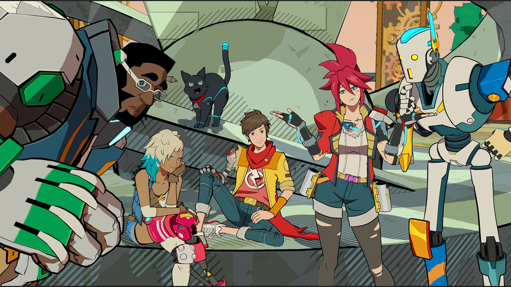

+++
title = "Krafton vient à la rescousse de Tango Gameworks"
date = 2024-08-12T07:00:32+01:00
draft = false
author = "Félix"
tags = ["Actu"]
image = "https://nostick.fr/articles/2024/aout/1008-bientot-steamos-sur-la-rog-ally/windows.png"
+++ 

Un rayon de soleil dans l’actualité déprimante de l’industrie du jeu vidéo : Tango Gameworks ne va pas fermer ses portes. Krafton, l’éditeur coréen derrière *PUBG*, *The Callisto Protocol* et le futur *[inZOI](https://nostickreloaded.substack.com/i/139360804/le-trailer-de-la-semaine)* a annoncé avoir racheté le studio ainsi que la licence *Hi-Fi Rush*. « *KRAFTON entend collaborer avec Xbox et ZeniMax pour assurer une transition en douceur et maintenir la continuité au sein de Tango Gameworks* », indique un [communiqué de presse](https://press.krafton.com/en-US/KRAFTON-Strengthens-Global-Presence-Through-Strategic-Integration-of-T) publié dans la nuit.

Ce changement n'aura pas d'impact sur le catalogue de jeux de Tango Gameworks, qui comprend plusieurs autres titres comme *The Evil Within* 1 et 2, *Ghostwire : Tokyo*. Krafton explique que le rachat va permettre « *à l'équipe talentueuse de continuer à développer la licence Hi-Fi Rush et d'explorer de futurs projets* ». Pour rappel, ce jeu d’action rythmique a fait un carton de par son univers coloré et son gameplay bien fichu. Il a remporté plusieurs BAFTA en plus d’avoir été porté sur PS5 en début d’année. 

Le studio Tango Gameworks n’est donc pas passé loin de déposer le bilan. Fondé en 2010, il est passé sous le giron de Microsoft en 2021… qui a annoncé [sa fermeture](https://nostick.fr/articles/2024/mai/0705-fin-de-partie-pour-arkane-austin-et-tango-gameworks/) au mois de mai. Une décision [incompréhensible](https://nostick.fr/articles/2024/mai/1105-semaine-du-jeu-video/#les-larmes-de-crocodile-de-xbox) pour un studio sous le feu des projecteurs grâce au succès de *Hi-Fi Rush*, et qui avait provoqué un tollé chez les joueurs. Ne reste maintenant plus qu’à attendre *Hi-Fi Rush 2* en exclu PS5 pour faire un joli pied de nez à Microsoft (bon ok non, on le veut sur PC aussi).