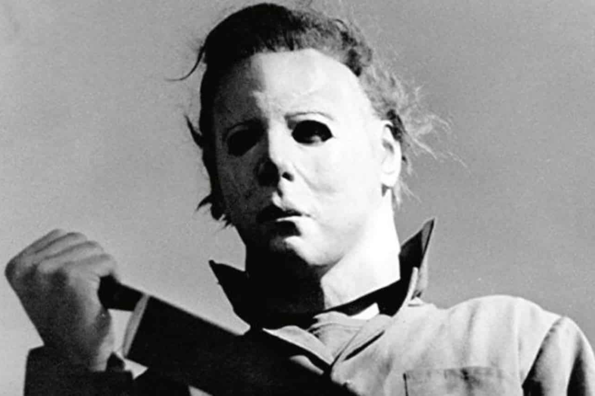

+++
title = "Halloween va se faire adapter en jeu, avec l'aide de John Carpenter"
date = 2024-08-13T07:11:32+01:00
draft = false
author = "Mickael"
tags = ["Actu"]
image = "https://nostick.fr/articles/vignettes/aout/halloween.jpg"
+++

Le sobriquet « maître de l'horreur » est largement galvaudé, n'importe quel petit faiseur sachant ménager un minimum son jumpscare peut maintenant prétendre à ce titre. Mais le seul, vrai et unique maître de l'horreur n'est autre que John Carpenter. Si son œuvre immense parle pour lui — *Halloween*, *The Thing*, *Fog*, *Christine*, *Escape from New York*… —, il est un peu moins regardant sur l'exploitation qui est faite de son héritage.

Du moment qu'il touche son chèque, il autorise à peu près tout et n'importe quoi. Et surtout n'importe quoi, comme la dernière trilogie *Halloween* pas formidable de David Gordon Green. Du coup, la prudence s'impose quand un projet comme celui de Boss Team Games est [annoncé](https://www.ign.com/articles/halloween-unreal-engine-5-john-carpenter-boss-team-games?utm_source=substack&utm_medium=email). Il s'agit de développer deux nouveaux jeux basés sur la licence qui a vu naître l'increvable Michael Myers, et plus spécifiquement le tout premier film de 1978.

Un de ces jeux sera développé sous Unreal Engine 5, et inclura la contribution de John Carpenter (qui se trouve être aussi un joueur invétéré, en particulier les jeux de rôle et les FPS).  « *En tant que grand passionné de jeux vidéo, je suis ravi d'aider à donner vie à nouveau à Michael Myers dans ce jeu, et j'espère vous effrayer à en perdre la tête* », a déclaré le réalisateur. On verra si son implication ira au-delà d'un intérêt poli.

Ces jeux permettront de revivre les grandes moments du film en incarnant des personnages entrés dans l'inconscient collectif. Boss Team Games a déjà bûché sur des jeux d'horreur, en particulier *Evil Dead: The Game*, déjà une adaptation d'une énorme franchise. Le titre avait été assez bien reçu, alors pourquoi pas retenter le coup avec *Halloween* ? Il faudra se montrer patient avant de voir le résultat final, le studio n'ayant donné aucune date.