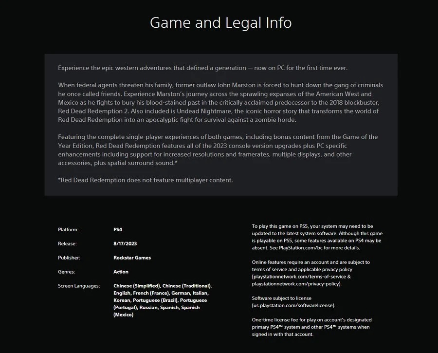

+++
title = "Le portage PC de Red Dead 1 teasé sur… le PS Store ?"
date = 2024-08-13T15:30:32+01:00
draft = false
author = "Félix"
tags = ["Actu"]
type = "telex"
+++ 

14 ans après sa sortie sur PS3 et 360, *Red Dead Redemption* ne devrait plus trop tarder à sortir sur PC. Au mois de mai, [le launcher PC de Rockstar](https://nostick.fr/articles/2024/mai/1405-read-dead-redemption-pourrait-bientot-canarder-sur-pc/) a vendu la mèche à travers une ligne de code faisant la retape d’une version Windows accompagné du DLC *Undead Nightmare*. Aujourd’hui [la page PS Store](https://store.playstation.com/en-us/product/UP1004-CUSA36842_00-REDEMPTION000001) de *RDR1* sur PS4 a été mise à jour avec un nouvel indice explicite : « *Découvrez les aventures épiques de l'Ouest qui ont marqué toute une génération - maintenant sur PC pour la première fois* ».

 

Pourquoi la page du PS Store fait-elle la promotion d’un portage PC ? Allez savoir, mais la capture vient du fuiteur @[Wario64](https://x.com/Wario64/status/1823224534159196470) réputé pour ses bons tuyaux. Le ménage a été fait depuis, mais on pouvait y lire que le portage apporterait les différentes améliorations des versions Switch et PS4 sorties l’année dernière ainsi que le DLC. Les pécéistes pourront se régaler grâce à « *des améliorations spécifiques* » à la plateforme comme la prise en charge des hautes résolutions et taux de rafraîchissement, des écrans multiples et d'autres accessoires ainsi que du son spatial surround. Moi qui arrivait justement sur la fin de la sympathique trilogie *[Lonesome Dove](https://fr.wikipedia.org/wiki/Lonesome_Dove_(série_littéraire))*, Rockstar n’aura pas besoin d’en dire beaucoup plus pour me faire cracher au bassinet.