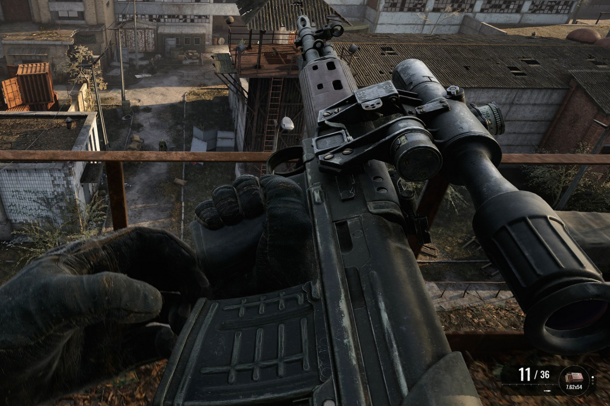

+++
title = "Une nouvelle vidéo de Stalker 2 plonge un peu plus au cœur de Tchernobyl"
date = 2024-08-13T07:25:32+01:00
draft = false
author = "Mickael"
tags = ["Trailer"]
image = "https://nostick.fr/articles/vignettes/aout/stalker2.jpg"
+++

Prévu pour le 5 septembre, *Stalker 2: Heart of Chornobyl* a eu du retard à l'allumage puisque le jeu de GSC Game sera finalement [disponible](https://nostick.fr/articles/2024/juillet/2707-backlog-semaine-nintendo-marvel-vs-capcom-assassins-creed-shadow/#on-na-pas-eu-le-temps-cette-semaine-mais-on-pense-à-eux) le 20 novembre. Ça n'est pas très grave, deux mois d'attente en plus ou en moins pour un titre qui, à l'origine, étant censé sortir en… 2022. Mais étant donné les conditions de travail du studio — basé en Ukraine —, ça n'est pas très grave.

 

Pour se faire pardonner, les développeurs avaient promis une vidéo « Deep Dive » de ce nouvel épisode qui, tout le monde l'aura compris, se déroule dans la cité riante de Tchernobyl. Même si la vidéo dure 35 minutes (mettez les sous-titres), les détails sont un peu légers. 

Plus de 3 heures de séquences ont été filmées pour faire avancer l'histoire. 35 armes seront à la disposition du joueur, certaines d'entre elles pourront être améliorées. Le système d'inventaire ne devrait pas dépayser les vétérans de *Stalker*, notamment le système de rangement à la Tetris. *Stalker 2* est un des gros jeux de l'année pour Xbox, puisqu'il s'agit d'une exclusivité de fait (il sera aussi dispo sur PC, et sur le Game Pass).