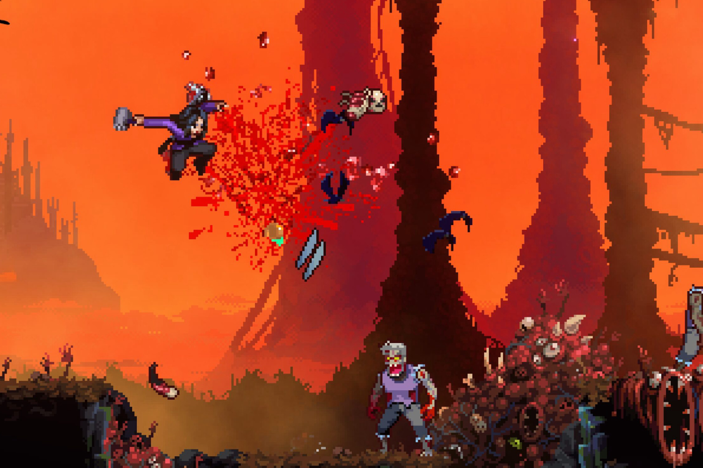

+++
title = "Allons bon, c'est déjà Halloween (et Evil Dead) !"
date = 2024-08-14T09:30:32+01:00
draft = false
author = "Mickael"
tags = ["Trailer"]
image = "https://nostick.fr/articles/vignettes/aout/ash-evil-dead.jpg"
+++

Vous vous rappelez de [cette histoire de deux jeux basés sur le film *Halloween* de 1978](https://nostick.fr/articles/2024/aout/1308-halloween-adaptation-john-carpenter/) ? Hé bien voici déjà le premier ! Baptisé *RetroRealms: Halloween*, c'est un beat'em up 16 bits en scrolling 2D très années 90. Personne ne s'en plaindra ! On entre dans la peau du dérangé de Michael Myers parti trucider autant d'innocents que possible, la routine.



Et ça n'est pas tout. Le studio Boss Team Games a aussi dévoilé un second jeu sous la même ombrelle [RetroRealms](https://retrorealmsgame.com), cette fois tout entier dédié à la gloire ~~des films de requins~~ d'*Evil Dead* ! Le principe est le même que le *Halloween* ci-dessus, sauf que c'est Ash Williams qui va dégommer du deadite et autre créature. Détail intéressant : le studio WayForward, à qui l'on doit la saga *Shantae*, a donné un coup de main pour ce deuxième jeu.

Chacun de ces deux jeux sera vendu 25 $ l'unité à partir du 18 octobre, sur PC, Xbox, PlayStation et Switch. Un bundle vendu 50 $ sera aussi proposé, on ne fera aucune économie en achetant les deux titres, en revanche il sera possible de jouer dans l'un avec le héros de l'autre, et vice versa.

Quant à l'autre jeu *Hallowen* en développement, il repose sur l'Unreal Engine 5 et ce bon vieux John Carpenter donne un coup de main.