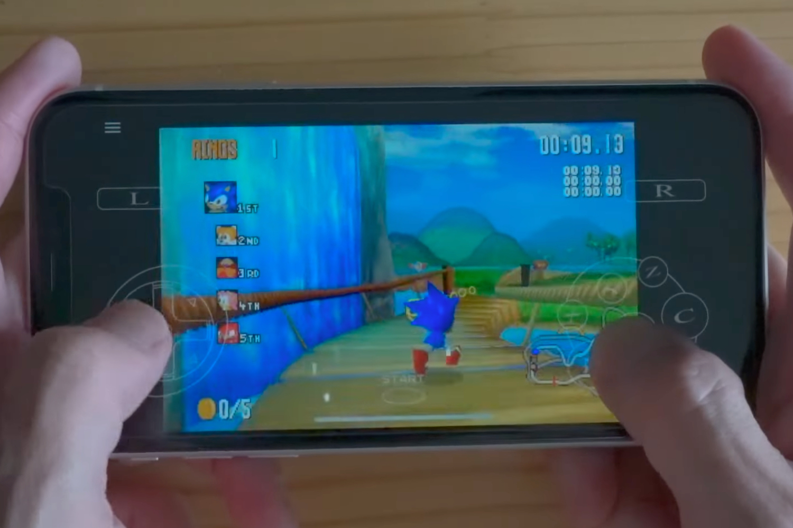

+++
title = "Yaba Sanshiro 2 : un émulateur Saturn pour iPhone et iPad qui ne vole pas très haut"
date = 2024-08-14T09:47:32+01:00
draft = false
author = "Mickael"
tags = ["Actu"]
image = "https://nostick.fr/articles/vignettes/aout/Yaba-Sanshiro-2.jpg"
+++

La Saturn ne l'a pas eu facile. Lancée à partir de 1994, la console de Sega a en effet la lourde tâche de succéder à la Mega Drive, tout en tentant de se faire une place entre la première PlayStation et la N64. Le marché de la console était brutal dans les années 90 ! Malgré un succès d'estime, au Japon surtout, Sega arrête les frais en 1998 pour se consacrer à la Dreamcast — la console allait précipiter la transformation du constructeur en éditeur multiplateformes, pour le meilleur comme pour le pire.

La console de 5e génération a toutefois eu le temps de marquer les esprits avec un catalogue certes ramassé (les développeurs tiers n'étaient pas fous de la Saturn) mais de qualité. *Virtua Fighter* et *Virtua Cop*, *Panzer Dragoon*, *Nights into Dreams*… Ces jeux ont marqué la rétine et les pouces des joueurs ! Et les utilisateurs d'iPhone et d'iPad[^1] pourront aujourd'hui les retrouver grâce à l'émulateur Yaba Sanshiro 2 tout juste sorti.

 

Deux versions de l'app, déjà disponible sur Android depuis belle lurette, sont proposées : une [gratuite](https://apps.apple.com/fr/app/yaba-sanshiro-2-lite/id6630365688?l=zh-Hant-TW) limitée au support de 3 jeux maximum et affichant de la réclame, et une à [5,99 €](https://apps.apple.com/fr/app/yaba-sanshiro-2/id1549144351) qui vire la réclame et les limitations. Je ne saurais trop vous conseiller de tester la démo avant de passer à la caisse, car l'application manque sérieusement de polish.

Il peut arriver que des jeux ne passent pas, ou alors juste un bout. Classique pour un émulateur, mais l'app ne propose aucune option pour changer l'emplacement des boutons. Seule leur taille peut être modifiée. Les retours haptiques sont quant à eux aux abonnés absents, tout l'inverse des crashs. Meh. Il existe heureusement une fonction de sauvegarde rapide. Globalement, j'attendais tout de même un peu plus de cet émulateur même si aucun d'entre eux ne parviendra à la cheville du [mètre-étalon du genre, Delta](https://nostick.fr/articles/2024/avril/1904-comment-installer-et-utiliser-delta/).

Pour ceux qui cherchent une solution meilleur marché, rappelons l'existence du *core* [Beetle Saturn](https://docs.libretro.com/library/beetle_saturn/) pour RetroArch ([qui se trouve être compatible iPhone, iPad et Apple TV](https://nostick.fr/articles/2024/mai/1705-apple-tv-retroarch/)), ou encore d'[OpenEmu](https://openemu.org) qui fait ça très bien aussi.

[^1]: Et aussi de Mac via la version iPad.