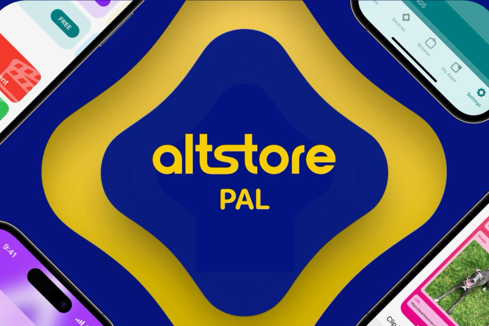
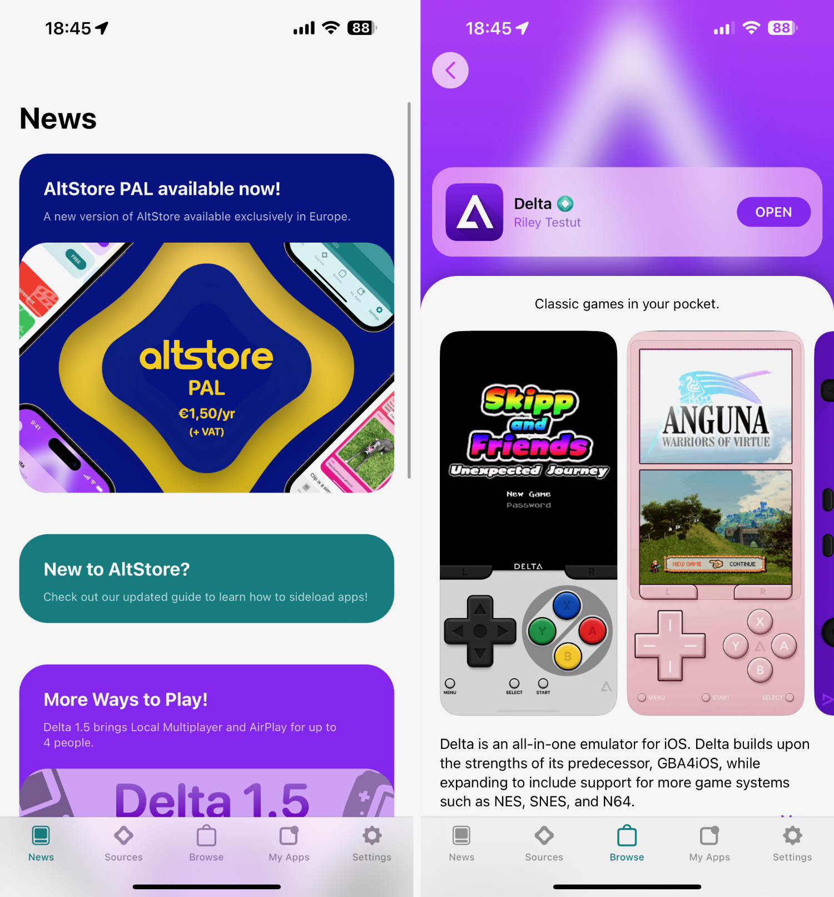

+++
title = "AltStore PAL et l'émulateur Delta sont maintenant complètement gratuits en Europe !"
date = 2024-08-14T20:47:32+01:00
draft = false
author = "Mickael"
tags = ["Actu"]
image = "https://nostick.fr/articles/vignettes/aout/altstore-pal.jpg"
+++

Tous ceux qui n'ont pas installé AltStore PAL sur leur iPhone en raison du prix demandé (1,80 € par an) n'ont plus aucune raison de bouder ! Il n'y a en effet [plus aucun abonnement](https://fosstodon.org/@altstore/112962388607680148) à payer pour télécharger la boutique alternative iOS. Tous les obstacles ont sauté, à vous l'émulateur Delta et toutes les autres apps distribuées dans le magasin !

AltStore PAL a obtenu d'Epic un coup de main financier (via le programme [MegaGrants](https://www.unrealengine.com/en-US/megagrants)) qui lui permet de couvrir les frais de technologie de base (CTF) à verser à Apple. Cela représente 0,50 € par installation, dès la première installation[^1], ce à quoi il faut ajouter les frais bancaires classiques.

C'est une excellente nouvelle qui va permettre à AltStore PAL de trouver de nouveaux utilisateurs plus facilement, et de découvrir un autre monde loin de l'App Store. Devoir payer pour installer la boutique, même une somme aussi modeste, n'est pas forcément évident pour tout le monde.

Les utilisateurs payants ne seront pas prélevés lors du renouvellement de leur abonnement. Et histoire de les remercier de leur contribution, AltStore PAL va leur faire un petit cadeau dans une prochaine mise à jour. Peut-être l'occasion de tester en avant-première [Fortnite, qui doit être distribué dans la boutique](https://nostick.fr/articles/2024/juillet/2507-fortnite-altstore-pal/) ?

Pour installer AltStore PAL ainsi que Delta, [direction notre guide](https://nostick.fr/articles/2024/avril/1904-comment-installer-et-utiliser-delta/) !

[^1]: Pour les applications qui ne sont pas des boutiques, le CTF est à verser à partir du premier million d'installations.