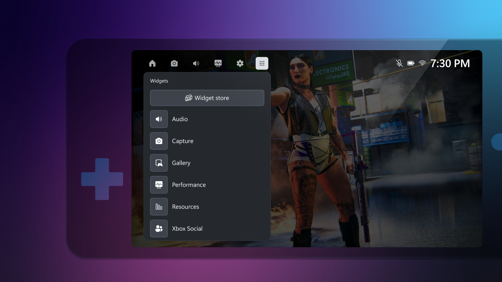

+++
title = "Microsoft se hâte lentement pour adapter l'expérience Xbox aux petits écrans"
date = 2024-08-14T08:17:32+01:00
draft = false
author = "Mickael"
tags = ["Actu"]
image = "https://nostick.fr/articles/vignettes/aout/xbox-game-bar-1.jpg"
+++

Franchement, il y a de quoi en perdre son latin de cuisine. Microsoft a une occasion en or de prendre la main sur le marché certes naissant mais extrêmement prometteur des consoles PC portables sous Windows. Les joueurs, les constructeurs et les éditeurs ont bien vu tout l'intérêt de ces appareils pour jouer en mobilité à des jeux aussi bien indés que AAA.

Mais alors bon sang de bois, mais que fabrique Microsoft ?! Au lieu de tout mettre en œuvre pour adapter le plus rapidement possible Windows à ce format (le système d'exploitation s'adapte très mal aux écrans de 7/8 pouces), ou mieux encore, pour optimiser l'app Xbox afin qu'elle se sente à l'aise dans ces diagonales, Microsoft tergiverse et fait dans la demi-mesure.

En novembre dernier, l'application Xbox gagnait un « mode compact » qui, attention les yeux, se contentait de réduire la barre latérale aux seules icônes. Super. Et hier, Microsoft [lançait](https://news.xbox.com/en-us/2024/08/13/compact-mode-is-now-in-game-bar-for-xbox-insiders/) un équivalent de ce mode compact pour la Game Bar, autrement dit la surcouche Xbox pour les jeux Windows. Ce nouvel affichage se veut plus facile à utiliser sur les petits écrans et quand on joue avec une manette.

L'accès aux widgets et à la navigation est plus simple, en particulier avec les boutons d'une manette (ou d'une console PC) ; on passe d'un widget à un autre avec les gâchettes LB et RB. La page d'accueil donne un accès direct aux différents lanceurs (Xbox donc, mais aussi Steam, Ubisoft Connect, etc.). La Game Bar s'affiche dans un jeu, elle donne accès à toutes sortes de fonctions comme des outils de capture d'écran et d'enregistrement, le suivi des perfs du PC, les discussions vocales…

Cette nouvelle interface compacte n'est pour le moment proposée qu'aux Xbox Insiders (inscrivez-vous [ici](https://support.xbox.com/en-US/help/account-profile/manage-account/xbox-insider-program) si le cœur vous en dit). L'effort est louable, mais on est encore loin d'une application parfaitement calibrée pour ces petits écrans ! Il n'y a donc que Valve qui ait réfléchi à une interface efficace et sympa pour les consoles PC portables ? Dans ce cas, vivement [le portage de SteamOS pour le ROG Ally](https://nostick.fr/articles/2024/aout/1008-bientot-steamos-sur-la-rog-ally/)… et tant pis pour les ambitions de Xbox pour ce marché.