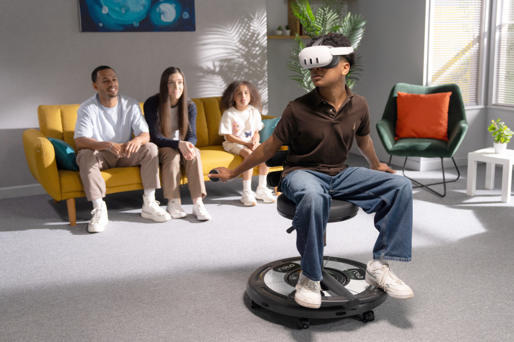

+++
title = "Roto VR Explorer : ceci est une chaise pour casques VR"
date = 2024-08-15T07:30:32+01:00
draft = false
author = "Mickael"
tags = ["Actu"]
image = "https://nostick.fr/articles/vignettes/aout/roto-vr-explorer.jpg"
+++

Après tout, si les chaises gaming ont su se créer une niche très profitable, pourquoi pas les chaises pour… casques VR ? La Roto VR Explorer est équipée d'un moteur sur sa base qui lui permet de tourner dans la direction où le joueur regarde. La technologie « Look & Turn » développée par Roto est censée résoudre les problèmes liés à la vision 360º, aux mouvements inhérents à l'immersion en réalité virtuelle, et aussi à la cinétose, le mal des transports.

 

Les casques VR, c'est très bien pour l'immersion, mais c'est vrai qu'il faut avoir un peu de place chez soi pour pouvoir faire de grands gestes. Et il arrive très souvent qu'on perde le sens de la réalité physique où on se trouve. Au moins, quand on est planté sur une chaise, pas de risque de se manger le mur du salon. La chaise fait aussi bouger le cul (et le reste du corps), avec un moteur haptique placé sous son assise.

Si cette chaise donne tous ces résultats, alors peut-être que l'idée n'est pas si farfelue ! Roto a travaillé de concert avec Meta, ce qui explique la prédominance de jeux pour casques Quest dans la pub ci-dessus. Le Roto VR Explorer n'est malheureusement pas donné : 799 $, avec des livraisons qui débutent en octobre.