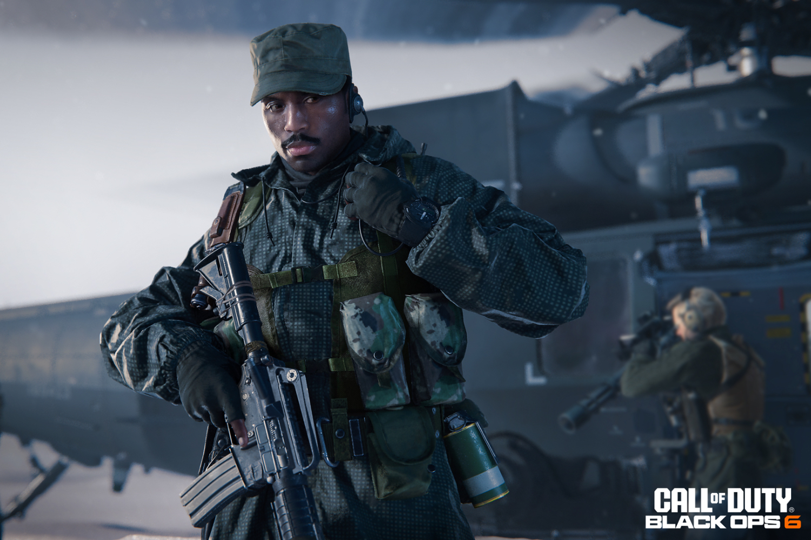
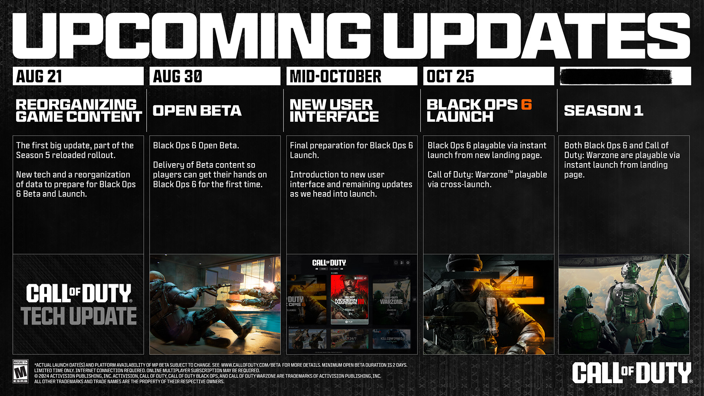
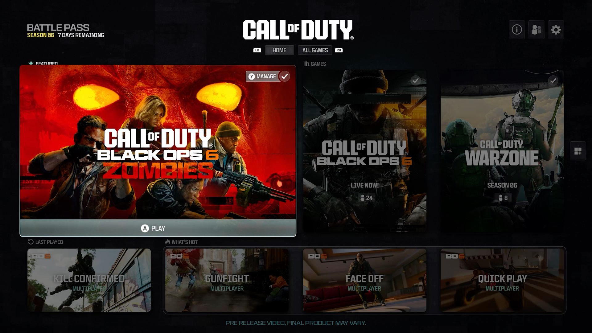
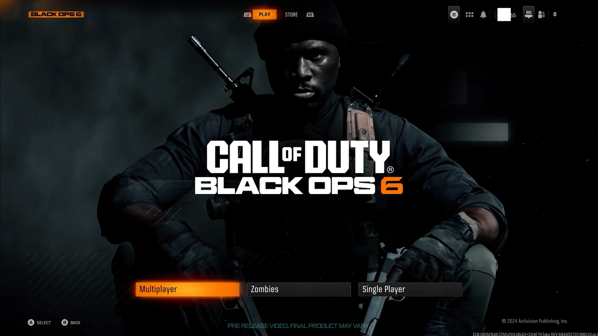

+++
title = "Les grandes manœuvres pour réduire le poids de Call of Duty"
date = 2024-08-16T08:06:32+01:00
draft = false
author = "Mickael"
tags = ["Actu"]
image = "https://nostick.fr/articles/vignettes/aout/Call-of-duty-feuille-route-2.jpg"
+++

Les joueurs Xbox ont dû sentir une goutte de sueur froide couler dans leur dos quand, début juin, ils ont découvert que *Call of Duty: Black Ops 6* allait peser la bagatelle de 310 Go. Activision a rapidement [rassuré](https://x.com/CODUpdates/status/1800273804389941699) ses troupes : cet âne mort comprend en fait les installations complètes de *Modern Warfare II* et III, *Warzone*, ainsi que les packs de localisation.

Ouf ! Mais malgré tout, *Call of Duty* est un monstre qui pèse toujours plus lourd et ça devient un sérieux problème. Les espaces de stockage ne sont pas illimités, surtout sur les consoles (la Series S de base se contente toujours de 512 Go), et le téléchargement de tels fichiers demande des plombes si on n'a pas la chance d'avoir la fibre dernier cri — et même avec.

Activision a fini par prendre le problème à bras le corps. Jusqu'au 25 octobre et la sortie de *Black Ops 6*, l'éditeur va [livrer](https://www.callofduty.com/blog/2024/08/call-of-duty-optimizing-experience-roadmap) une série de mises à jour pour réorganiser tout le bazar de *Call of*, avec en bout de course une promesse : *Black Ops 6* pèsera moins lourd que *Modern Warfare III*. Dommage qu'il n'y ait pas d'infos chiffrées pour se faire une idée, mais c'est toujours bon à prendre.

Cette réorganisation débutera le 21 août, en même temps que la saison 5 Reloaded pour *MWIII* et *Warzone*. À partir de la semaine prochaine, le téléchargement du *Call of Duty* annuel sera découplé de *Warzone* ; autrement dit, le *battle royale* gratuit ne s'invitera plus sans y être invité. Le joueur aura toujours la possibilité de le récupérer en même temps.

Activision revoit aussi sa manière de déployer les textures du jeu : celles qui servent moins souvent sont stockées dans un cache en ligne, ce qui évite qu'elles prennent de la place sur le SSD du joueur. Ce qu'on gagne d'un côté, on le perdra de l'autre : la qualité des textures pourra être affectée pendant quelques secondes, le temps qu'elles chargent. Heureusement, des options permettront de régler cette fonction au petit poil.

Cette mise à jour du 21 août sera particulièrement lourde, mais elle « *n'ajoutera pas de manière permanente la taille de fichier indiquée dans l'espace de stockage occupé par Call of Duty sur l'appareil* ». Ouf ! En fait, la place prise par *Call of Duty* devrait diminuer par la suite grâce aux optimisations.

L'autre gros changement à venir n'est autre qu'une interface remaniée pour faciliter l'accès aux différentes parties du jeu, que ce soit les modes multi, le mode zombie ou d'autres titres (*Warzone* et les précédents épisodes). Cette nouvelle interface sera déployée mi-octobre.