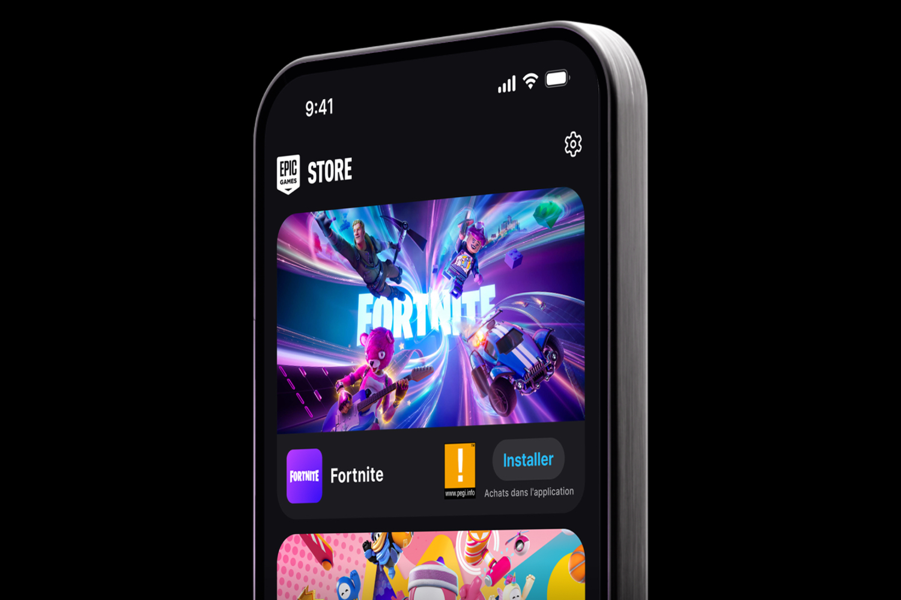
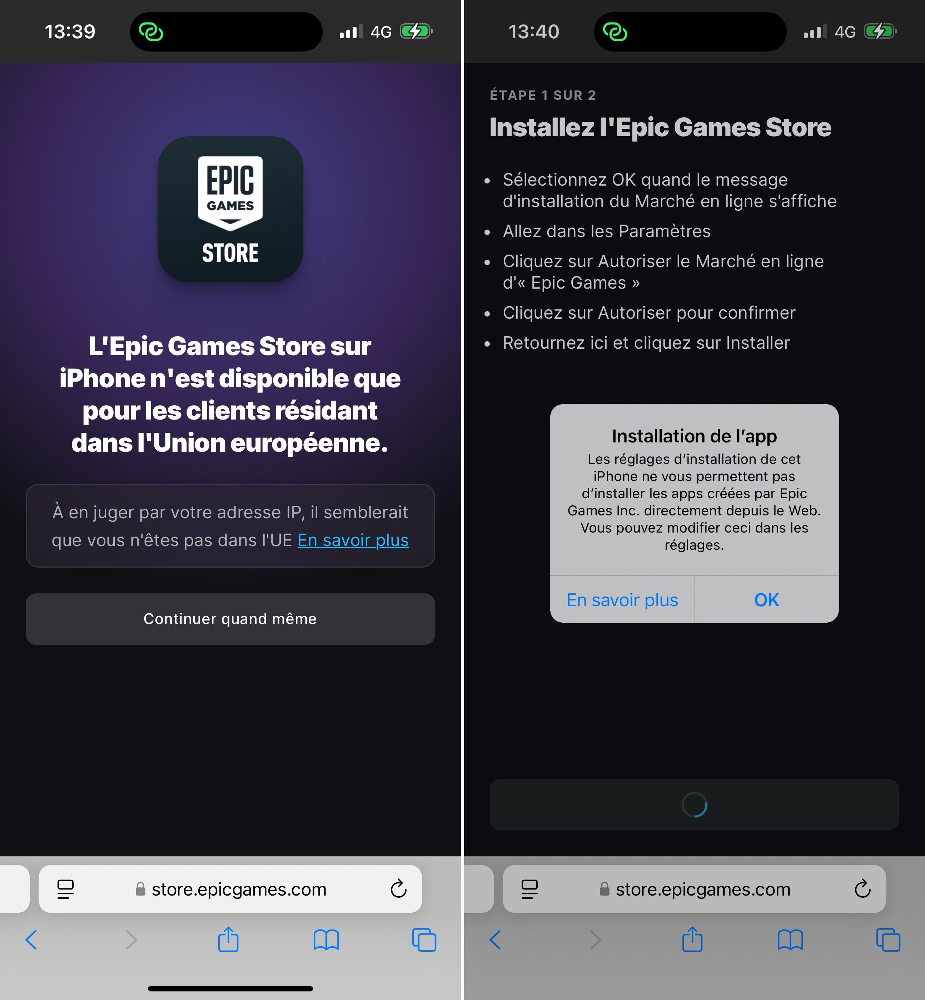
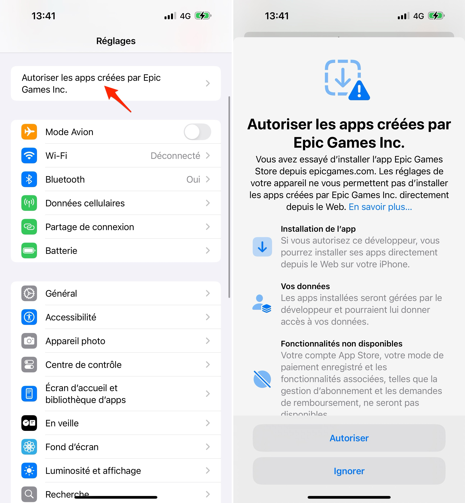
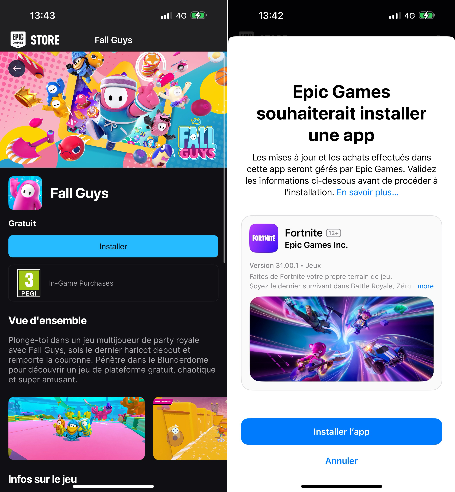
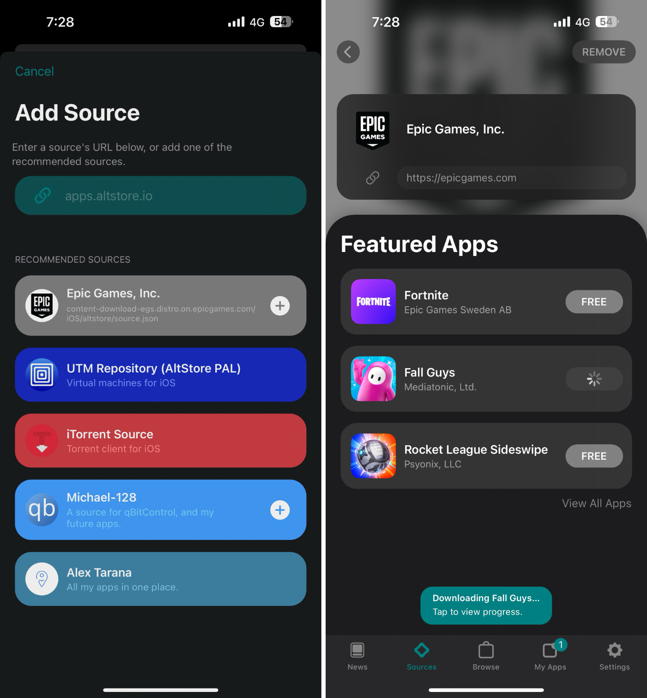

+++
title = "Fortnite, Fall Guys et Rocket League sont maintenant jouables sur iPhone et Android en Europe"
date = 2024-08-16T11:47:32+01:00
draft = false
author = "Mickael"
tags = ["Actu"]
type = "une"
image = "https://nostick.fr/articles/vignettes/nostick.jpg"
+++

Quatre ans quasiment jour pour jour après sa suppression de l'App Store, *Fortnite* est de retour en Europe… mais pas via la boutique officielle d'Apple. Le *battle royale* peut être téléchargé depuis AltStore PAL [comme promis](https://nostick.fr/articles/2024/juillet/2507-fortnite-altstore-pal/), mais aussi avec l'Epic Games Store qui est désormais disponible sur iOS comme sur Android[^1].

Pour télécharger la boutique alternative d'Epic sur iPhone ou un smartphone Android, rendez-vous sur cette [page](https://store.epicgames.com/fr/mobile). L'installation est gratuite, tout comme Fortnite bien sûr, mais aussi *Fall Guys* et *Rocket League* qui font donc leur apparition sur iPhone (et bientôt sur iPad).

Il faudra avant tout ça franchir les barrières mises en place par Apple qui n'aime pas trop la concurrence à l'App Store (Epic explique tout bien cette [vidéo](https://store.epicgames.com/fr/mobile/ios)). C'est similaire à [l'installation d'AltStore PAL](https://nostick.fr/articles/2024/avril/1904-comment-installer-et-utiliser-delta/).

Epic a l'intention d'accueillir des jeux de développeurs tiers à partir de décembre, ce qui signifie que le Games Store va devenir un réel concurrent de l'App Store pour les jeux. La commission de l'éditeur ne dépassera pas les 12 %, c'est bien moins que les 30 % habituels ponctionnés par Apple. De fait, Epic a une bonne chance de grignoter des parts de marché à l'App Store.

[^1]: L'Epic Games Store mobile est proposé sur iOS en Europe, et dans le monde entier sur Android.