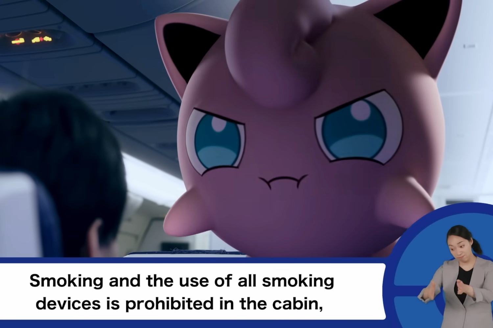
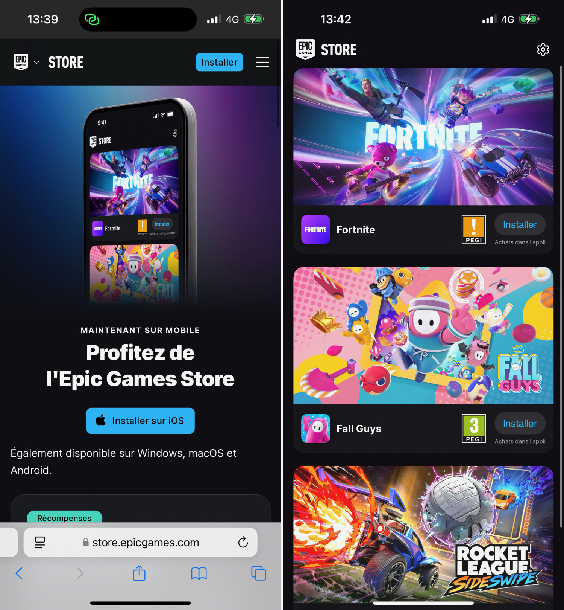
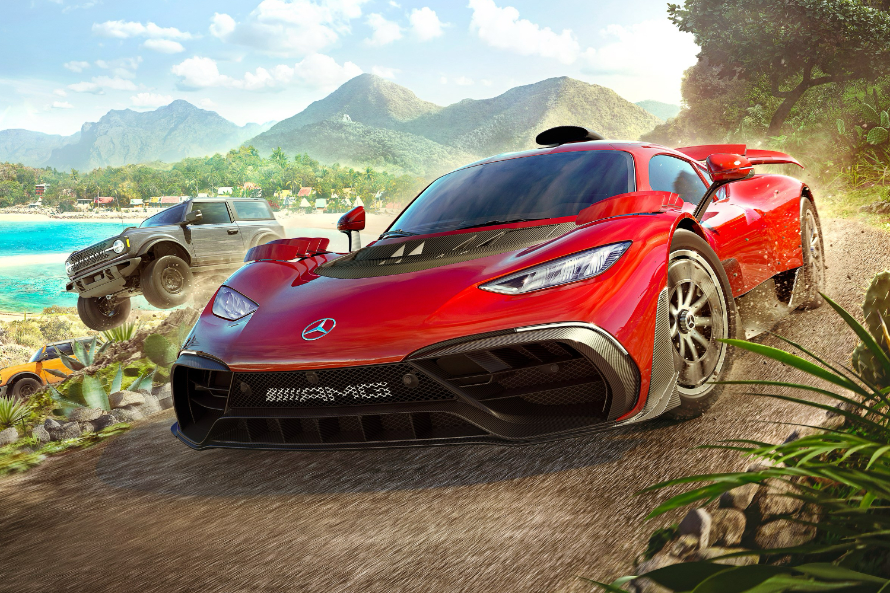
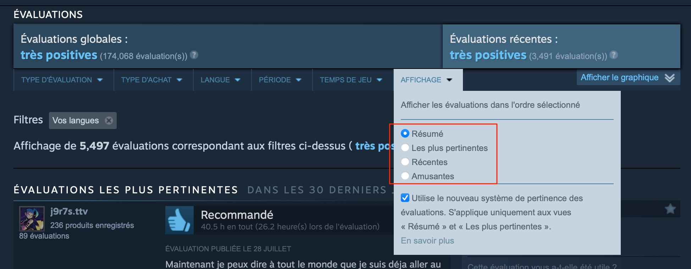
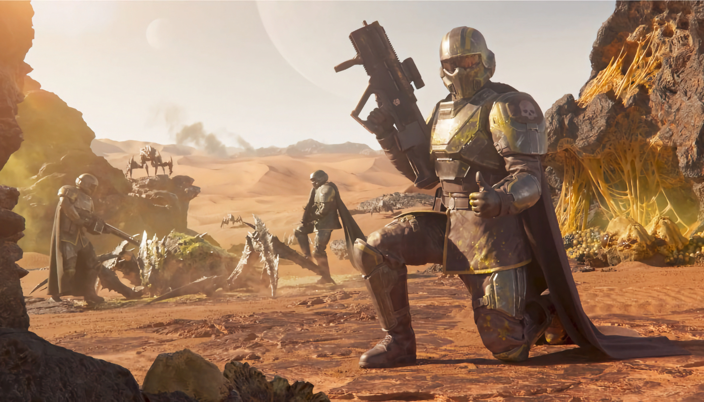

+++
title = "On vide le backlog de la semaine : Forza Horizon 5, Steam, Helldivers 2, Pokémon…"
date = 2024-08-17T02:45:32+01:00
draft = false
author = "Mickael"
tags = ["XXL"]
image = "https://nostick.fr/articles/vignettes/aout/pokemon.jpg"
+++

L’actualité du jeu vidéo ne s’arrête pas à la poignée d’articles publiés sur *Nostick* ! Histoire de rattraper le retard accumulé, voici un retour rapide sur quelques unes des infos les plus importantes (ou insignifiantes) de la semaine.

## La vidéo de la semaine

 

En avion, aucun passager ne regarde jamais les vidéos des instructions de bord. Enfin, sauf quand il y a des Pokémon dedans ! La compagnie aérienne All Nippon Airways (ANA) a fait appel aux créatures de poche pour animer sa dernière vidéo pour la sécurité en vol, et même si vous n'êtes pas en train de décoller là tout de suite, vous aurez envie de la voir en entier.

## La grosse info de la semaine : l'Epic Games Store et Fortnite sur iPhone en Europe

Grosse semaine sur le front des boutiques alternatives pour iPhone ! [*Fortnite* est finalement de retour](https://nostick.fr/articles/2024/aout/1608-fortnite-fall-guys-rocket-league-epic-games-store/), quatre ans après son éviction de l'App Store. Le battle royale, ainsi que *Fall Guys* (jamais proposé jusqu'à maintenant sur iPhone) et *Rocket League* sont jouables sur les smartphones d'Apple et prochainement sur les iPad par la grâce de l'Epic Games Store.

Cette nouvelle boutique concurrente de l'App Store peut être installée gratuitement, même s'il faut en passer par un processus pas évident — Apple a beau se défendre de toute mauvaise volonté, le constructeur fait quand même tout son possible pour décourager l'installation de magasins alternatifs. Il faut dire que ces magasins empêchent le constructeur de prélever sa précieuse commission de 30 % sur tout et n'importe quoi.

Epic compte bien ne pas s'arrêter là et va ouvrir les portes de son Games Store à d'autres jeux tiers. La commission de l'éditeur est de 12 %, et les développeurs peuvent utiliser leur propre système de paiement. On verra si la proposition séduira les développeurs, car embarquer pour une distribution en dehors de l'App Store n'a rien d'évident, Apple ayant là aussi mis en place des règles et des critères confinant au supplice de la goutte.

*Fortnite* et les autres jeux d'Epic sont aussi téléchargeables depuis AltStore PAL, la première boutique alternative européenne pour l'iPhone. [Le magasin indépendant est désormais gratuit au téléchargement](https://nostick.fr/articles/2024/aout/1408-altstore-pal-gratuite-boutique-alternative/), au lieu des 1,80 € par an demandés jusqu'à présent. Les développeurs ont reçu un coup de pouce financier d'Epic, ce qui couvre les frais versés à Apple.

## La rumeur de la semaine : Forza Horizon 5 sur PS5 ?

Ça se bouscule chez les spécialistes de la fuite : plusieurs d'entre eux — [Jez Corden](https://www.windowscentral.com/gaming/xbox/rumor-another-big-xbox-game-is-heading-to-ps5-to-be-announced-next-week), [Tom Warren](https://x.com/tomwarren/status/1824040533418823730), [Tom Henderson](https://x.com/Tom_Henderson/status/1824106348344430795) — prévoient en effet un ou plusieurs nouveaux portages d'exclusivités Xbox sur d'autres consoles (PS5 et/ou Switch). 

Au moins un « gros » Xbox jeu pourrait franchir le Rubicon et devenir multiplateforme, dans une annonce qui tomberait la semaine prochaine à l'occasion de la Gamescom. *Forza Horizon 5* serait le client du jour, même si les fuiteurs ont du mal à s'accorder sur le nom du jeu.

Les précédentes exclusivités Xbox portés sur d'autres consoles (*Pentiment*, *Grounded*, *Hi-Fi Rush*, *Sea of Thieves*) sont, toutes proportions gardées, des « petits » jeux par rapport à
*Forza Horizon 5*, un AAA extrêmement populaire que Microsoft continue d'enrichir, trois ans après sa sortie. Il fait presque figure de jeu service avec ses saisons et une sorte de battle pass.

Ces rumeurs sont à prendre avec les pincettes habituelles bien sûr, mais il est probable que Microsoft veuille poursuivre sa stratégie multiplat' qui donne d'excellents résultats : *Sea of Thieves* fait un carton sur PS5…

## Le grand ménage de la semaine chez Steam

Écoutez, les petits gars de Steam sont comme tout le monde, ils aiment bien rigoler devant un mème de chat. Mais trop, c'est trop : les commentaires de certaines fiches de jeux sont tellement saturés de blagues, d'ASCII art et autres bêtises que le client qui cherche à savoir si le jeu pourrait l'intéresser finit par passer son chemin. C'est quand même ballot de louper une vente.

Le hic, c'est que ces évaluations sont souvent les plus populaires, elles accumulent les votes « utiles » et passent donc au premier plan devant les commentaires plus « sérieux », ceux que recherchent les consommateurs pour se renseigner sur un jeu. C'est pourquoi la boutique a mis en place un nouveau système de tri, activé par défaut.

Ce système [modifie](https://store.steampowered.com/news/app/593110/view/4326355263805583415) la manière dont les évaluations s'affichent pour mieux les hiérarchiser. En gros, les commentaires rigolol sont relégués tout en bas de la page produit. S'il n'est pas question de les supprimer, ils ne bénéficieront plus de la même visibilité, comme l'admet Steam. Il existe fort heureusement une option pour conserver ce type d'évaluations à leur place habituelle.

Pour classer les évaluations, le magasin utilise plusieurs techniques (apprentissage automatique, signalement des utilisateurs, évaluations déjà publiées). C'est un projet de longue haleine, car plus de 140 millions d'évaluations ont été postées sur Steam à ce jour.

## Les emmerdes de la semaine pour Helldivers 2

Il fallait bien à un moment donné que *Helldivers 2* recommence à faire des bêtises. Depuis son lancement début février, le jeu d'Arrowhead, sorti sous le drapeau PlayStation, a ravi les millions de joueurs qui répandent vaillamment la démocratie contre la racaille extra-terrestre. Sony avait bien tenté d'imposer la connexion à un compte PSN, mais [le constructeur s'est ravisé](https://nostick.fr/articles/2024/mai/0505-sony-fait-plonger-helldivers-2-en-enfer/).

Le problème du jour est plus embarrassant pour Arrowhead, puisqu'il provient non pas de Sony, mais de l'intérieur. La mise à jour du 6 août bride en effet un grand nombre des armes du jeu. Le résultat ne s'est pas fait attendre, de nombreux joueurs ont pris d'assaut les réseaux sociaux pour se plaindre que ce rééquilibrage du gameplay n'était pas le bienvenu !

Pour calmer la colère de la foule, Mikael Eriksson, un des directeurs du jeu, s'est [adressé](https://www.reddit.com/r/Helldivers/comments/1erc9w5/the_message_to_the_community_from_our_game/) à la communauté sur Reddit. « *Nous n'avons pas atteint notre objectif avec la dernière mise à jour* », admet-il. Certaines choses « *n'ont pas été bien faites, et il y a également des incohérences plus fondamentales dans notre approche de l'équilibrage du jeu et de la direction du jeu* ».

Au-delà des mots, ce qui compte désormais pour redresser la barre et regagner la confiance des joueurs, c'est d'agir. Une nouvelle mise à jour va tomber dans les 60 prochains jours avec plusieurs objectifs : ajuster le gameplay, repenser l'approche de conception des armes, prioriser de nouveau les corrections de bugs, améliorer les perfs du jeu…

Un travail de fond qui va accompagner la mise en place d'un environnement de jeu spécial pour les bêta-testeurs. Les joueurs cobayes pourront expérimenter les nouveautés et les changements avant qu'ils soient livrés à tout le monde. Et s'éviter ainsi les coups de gueule des joueurs.

## On n’a pas eu le temps cette semaine mais on pense à eux

 

 

Oh que oui on y pense à *Marvel vs. Capcom Fighting Collection: Arcade Classics* ! En attendant de révéler la date de lancement, Capcom a fait monter la pression en balançant deux trailers pour autant de jeux de la compile, *X-Men Children of the Atom* et *Marvel Super Heroes*. Il y en a 7 en tout.

 

Si les personnages et les graphismes d'*Omega 6: The Triangle Stars* vous évoquent quelque chose, c'est que ce jeu de rôle 16 bits est basé sur le manga *Omega 6* créé par Takaya Imamura, qui est aussi le directeur artistique du jeu… et celui qui a imaginé les héros et l'histoire de *Star Fox* quand il travaillait chez Nintendo ! Le titre, édité par Clear River Games et City Connection, sortira en anglais sur PC et Switch l'année prochaine (déjà dispo en japonais).

 

Jouer du trombone, une activité qui de prime abord ne réjouit personne. Mais jouer du *Trombone Champ*, ça oui ! Le fameux simulateur de ~~[couac](https://x.com/jules_su/status/182317000852598000)~~ trombone façon *Rock Band* va s'adapter à… la réalité virtuelle. *Trombone Champ: Unflattened* est une « réinvention » VR du jeu sorti en 2022, avec plus de 50 morceaux à massacrer. Sortie prévue cet automne sur Meta Quest, SteamVR et PSVR2.

 

Le prochain jeu de nos chouchous de chez Devolver, *The Plucky Squire*, sortira le 17 septembre sur toutes les plateformes. Et vous avez plutôt intérêt à ne pas le louper ! Ce jeu d'action/aventure mêle habilement 2D et 3D dans un livre d'images plein de dangers.

## osef

Uwe Boll [pense](https://x.com/UweBollRAWUSA/status/1822800146628784521) qu'il aurait réalisé un meilleur *Borderlands*. Et il sait de quoi il parle : on lui doit en effet d'impérissables adaptations au ciné de jeux vidéo comme *Alone in the Dark* (un des [pires films](https://en.wikipedia.org/wiki/Alone_in_the_Dark_(2005_film)) de l'histoire de l'humanité), *BloodRayne*, *House of the Dead* ou encore *Portal*. Des chefs d'œuvre qui ont probablement rapporté plus que la purge d'Eli Roth.

## Dans le reste de l’actu déchaînée

- C'est toujours pas la joie chez Bungie : après les licenciements massifs, le studio de *Destiny 2* tente de sauver les meubles avec les joueurs. [Est-ce que ça a une chance de marcher ?](https://nostick.fr/articles/2024/aout/1208-bungie-maraton-destiny-2-craindre/)
- *Fallout: London* est un gros carton, et pour cause : les joueurs de *Fallout 4* n'en peuvent plus d'attendre un nouvel épisode signé Bethesda. Le studio à l'origine du mod a de son côté [pas mal d'ambition pour la suite](https://nostick.fr/articles/2024/aout/1208-fallout-london-team-folon-nouveaux-jeux/).
- La bonne nouvelle de la semaine, c'est le sauvetage du studio Tango et d'*Hi-Fi Rush*, bêtement lâchés par Microsoft, et qui sont désormais la propriété du géant Krafton. [Pour en savoir plus, c'est par ici.](https://nostick.fr/articles/2024/aout/1208-krafton-a-la-rescousse-de-tango/)
- Le film *Halloween* a inspiré des générations de cinéastes… et aussi de développeurs de jeux ! Deux nouveaux titres ont été annoncés, dont un conçu avec l'aide de John Carpenter. [Attention derrière vous, c'est taffreux.](https://nostick.fr/articles/2024/aout/1308-halloween-adaptation-john-carpenter/)
- Et puisqu'on en parle, un de ces jeux *Halloween* a été annoncé cette semaine, il s'agit d'un beat'em up 16 bits qui a l'air… pas mal ? [Jetez un œil par ici !](https://nostick.fr/articles/2024/aout/1408-evil-dead-halloween-beat-em-up-16-bits/)
- *Stalker 2* a été une fois de plus retardé, mais pour se faire pardonner GSC Games a publié un long aperçu de ce qui nous attend. [C'est à découvrir par ici.](https://nostick.fr/articles/2024/aout/1308-stalker-2-coeur-tchernobyl-video/)
- L'attente pour la Switch 2 s'annonce encore plus long que ce qu'on pouvait craindre. Urgh ! [Pas merci Nintendo.](https://nostick.fr/articles/2024/aout/1408-nintendo-switch-avril-mai-2025/)
- Microsoft a optimisé sa surcouche Game Bar pour les petits écrans. Ça n'est pas encore l'app Xbox adaptée aux consoles PC portables sous Windows, mais [on s'en rapproche… lentement.](https://nostick.fr/articles/2024/aout/1408-xbox-game-bar-mode-compact/)
- Émuler la Saturn, c'est une très bonne idée pour découvrir ou redécouvrir d'excellents jeux. Mais avec *Yaba Sanshiro 2* ? Pas sûr. [Faites-vous votre idée dans cette actu.](https://nostick.fr/articles/2024/aout/1408-yaba-sanshiro-2-emulateur-saturn/)
- Une chaise gaming, c'est bien. Mais une chaise gaming pour les jeux VR ? C'est encore mieux, et [ça se découvre par ici](https://nostick.fr/articles/2024/aout/1508-roto-vr-explorer-chaise-meta-quest/).
- Par contre, pas la peine d'acheter cette chaise si vous comptiez jouer à *GTA San Andreas VR* avec votre casque Quest : Meta a annoncé la suspension du développement de ce portage. Dommage, [Los Santos en VR aurait eu de l'allure](https://nostick.fr/articles/2024/aout/1608-gta-san-andreas-vr-meta-quest-suspendu/).
- *Dragon Age: The Veilguard* est un des gros jeux de l'année, et il n'y a plus que quelques mois à attendre pour pouvoir mettre la main dessus. [Mais combien bon sang ?](https://nostick.fr/articles/2024/aout/1508-dragon-age-the-veilguard-octobre/)
- *Call of Duty* pèse un âne mort dans votre PC ou votre console. Activision a fini par le comprendre et a sorti les grands moyens pour alléger le monstre. [Plus d'infos par ici.](https://nostick.fr/articles/2024/aout/1608-call-of-duty-poids-grandes-manoeuvres-activision/)