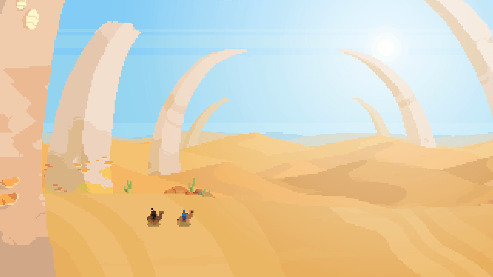
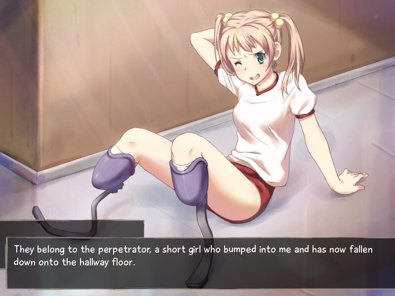

+++
title = "Arco, Katawa Shôjo : le récap des sorties de la semaine (18/08)"
date = 2024-08-18T08:00:02+01:00
draft = false
author = "Félix"
tags = ["C’est dispo"]
image = "https://nostick.fr/articles/2024/1808-katawa-shojo-arco-les-sorties-de-la-semaine/arco.jpg"
+++

Entre le pont du 15 août, le retour des vacances et la Dacia qui ne passe pas au contrôle technique, vous n’avez peut-être pas eu le temps de vous intéresser aux nouveautés du moment. Qu’à cela ne tienne : voici les sorties de ces derniers jours qui ont retenu notre attention.

## Arcoté de ses pompes ?

Le jeu d'action tactique édité par Panic ***Arco*** est sorti cette semaine. Celui-ci nous invite à explorer un superbe univers western en pixel-art rempli de peuples indigènes et de colons avides. C’est un RPG avec des combats qui donnent envie : on se bat au tour par tour, sauf qu’ici les deux camps planifient leurs mouvements et les exécutent en même temps. Le concept est visiblement réussi, tout comme la très chouette atmosphère sud-américaine incluant une bonne dose de surnaturel et des moments plus axés tranches de vie. La critique a globalement apprécié ce titre, et vous ne devriez pas regretter les 18 € demandés [sur Steam](https://store.steampowered.com/app/2366970/Arco/). Dispo sur Mac, PC et Switch.

## Moins que zéro

Si vous avez un peu lâché *Escape from Tarkov* et cherchez un jeu du même genre, ***Level Zero : Extraction*** pourra peut être vous intéresser. Le titre se présente comme le croisement entre un extraction shooter tactique et un survival horror asymétrique. Il va falloir partir à la recherche d’objets de valeur tout en se canardant avec d’autres joueurs sur plusieurs maps remplies de pièges (mutants, tourelles automatiques, mines…), et ce d’autant plus que vos coquins d’adversaires peuvent également contrôler des aliens. Le concept est prometteur tant il mélange un paquet d’éléments stressants, mais les débuts en early acess n’ont pas entièrement convaincus à cause de problèmes d’équilibrages et de bugs. Bon, ça ne coûte [que 19,50 €](https://store.steampowered.com/app/1456940/Level_Zero_Extraction/) et les développeurs ont encore le temps de s’améliorer, mais en l’état, on réservera ça aux fans du genre.



## Votre lecture de l’été

À la fin des années 2000, plusieurs membres de 4chan se sont regroupés pour créer un *dating-sim* dont les protagonistes sont de jeunes filles souffrant d'un handicap physique. Dit comme ça vous vous attendez sûrement au pire, mais étonnamment l’histoire se termine bien : ***Katawa Shōjo*** est un très chouette visual novel, prenant et pas aussi bizarre qu’il en a l’air. La critique a salué la sensibilité avec laquelle il traite le sujet ainsi que ses personnages, et j’en garde personnellement un souvenir assez marqué alors que j’ai dû y jouer 2 h entre la poire et le fromage en 2015. Ça reste du *dating sim* forcément limité niveau gameplay et loin d’être du Balzac, mais ça mérite un coup d’œil juste pour voir comment fonctionne ce curieux projet. Bonne nouvelle : *Katawa Shōjo* est désormais disponible [sur Steam](https://store.steampowered.com/app/3068300/Katawa_Shoujo/) en français, ce qui en fait une super occasion de l’essayer si vous êtes un minimum intéressé par le genre. 

## Chien flic et lapin hyperkinétique

Il fallait bien qu’il y ait un remake cette semaine, et c’est 
Skunkape Games qui s’y colle avec une révision du troisième opus de la saga ***Sam & Max***. Cette version mise au goût du jour de *‌The Devil's Playhouse* améliore tout un tas d’éléments : l’éclairage, la synchro labiale et la musique ont été mis aux standards de 2024. Le jeu détecte quand le joueur est bloqué pour lui filer un coup de main, évitant de devoir aller regarder un *walkthrough* sur YouTube comme un gros looser. Mis à part ça, le titre garde la même trame tournant autour des enquêtes d’un duo de flics dont le plus dinguo des deux récupère des pouvoirs psychiques. Le remaster à l’air correct et est désormais dispo [pour 20 €](https://store.steampowered.com/app/2648050/Sam__Max_The_Devils_Playhouse/) sur Steam. Également sur toutes les consoles (y compris les vieilles) et Switch. 



## En vrac

Après des années d’attentes, la bêta de **Dofus Unity** est [enfin ouverte](https://www.dofus.com/fr/mmorpg/actualites/news/1732429-beta-dofus-unity-ligne-entrez-futur-monde-douze). Ce dinosaure du MMORPG va abandonner Flash pour passer sur un nouveau moteur, se payant au passage un lifting et tout un tas d’améliorations. Mis à part ça, le **mod NoVR pour *Half-Life Alyx*** a eu droit [à une mise à jour](https://www.moddb.com/mods/half-life-alyx-novr/downloads) qui fluidifie les déplacements et la prise en charge sur Steam Deck. Si vous n’avez pas de casque et que vous ne comptez pas en acheter un, ça peut valoir le coup d’œil même si l’expérience sera logiquement bien moins impressionnante. Le STR ***Stormgate*** dont on parlait il y a peu et désormais dispo [gratuitement](https://store.steampowered.com/app/2012510/Stormgate/) pour tous, bien que les notes restent très moyennes.