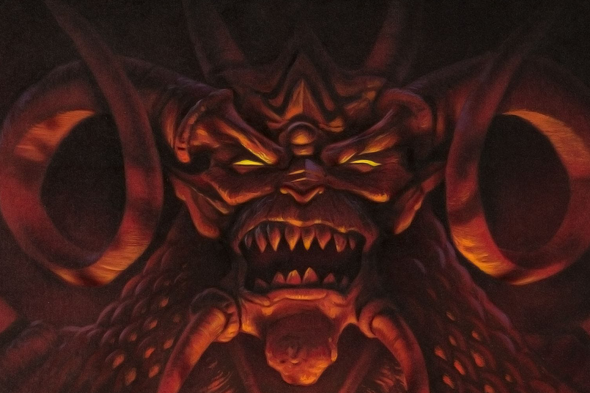

+++
title = "Diablo de retour dans votre navigateur web"
date = 2024-08-19T09:46:32+01:00
draft = false
author = "Mickael"
tags = ["Actu"]
image = "https://nostick.fr/articles/2024/aout/1908-diablo-retour-navigateur/diablo-1997.jpg"
+++

*Diablo 4* est très bien (et c'est encore mieux depuis la saison 4), mais vous savez quoi ? *Diablo 1* c'est encore mieux. C'est sûr qu'on manque de toutes ces fonctions qui facilitent la vie et que bon, les graphismes se sont légèrement améliorés depuis 1997, mais les vieux de la vieille auront toujours un petit pincement au cœur en se remémorant les innombrables heures nocturnes passées à dégommer de la créature des Enfers dans cette bonne vieille ville pourrie de Tristam.

Plus besoin de s'embêter avec un émulateur ou de dépoussiérer le vieux PC 486 du grenier : le développeur GalaXyHaXz a porté le Diablo originel pour navigateur web, avec l'aide de la team Devilution. Pour retrouver les sensations d'antan, direction ce [site web](https://d07riv.github.io/diabloweb/) (ça marche aussi sur les smartphones et tablettes !). 

Si vous n'avez pas sous la main votre copie de DIABDAT.MPQ (que l'on peut encore acheter aujourd'hui, sur [GOG](https://www.gog.com/en/game/diablo) par exemple), pas de souci, il est toujours possible de lancer la version shareware au contenu certes plus limité (seul le guerrier est disponible, et les options de dialogues sont restreintes), mais le jeu reste jouable. Si les graphismes et le gameplay ont pris un petit coup de vieux, gare tout de même : c'est toujours aussi addictif.

