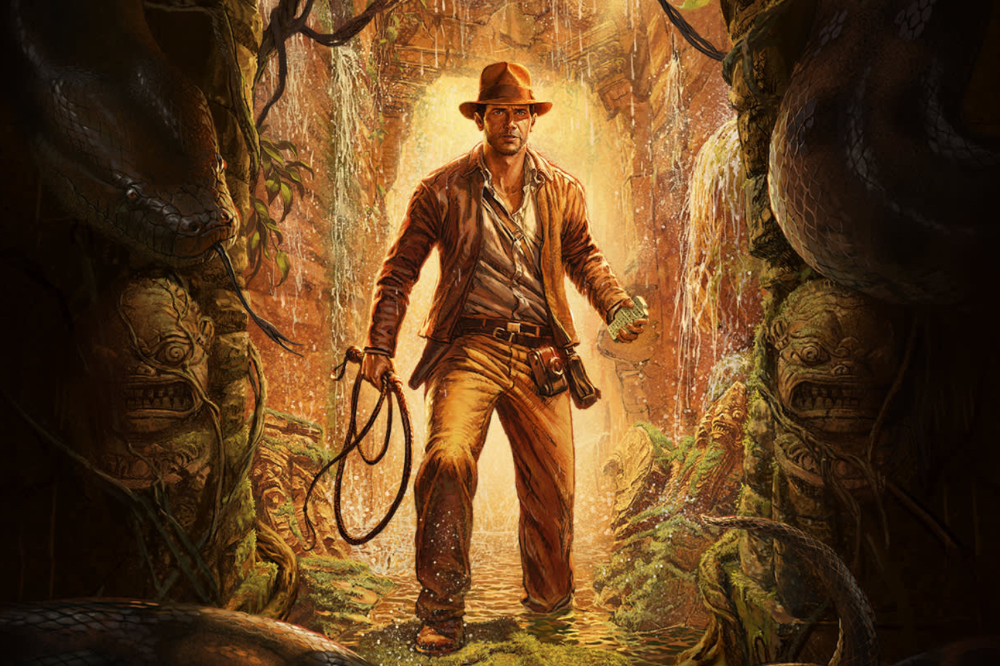
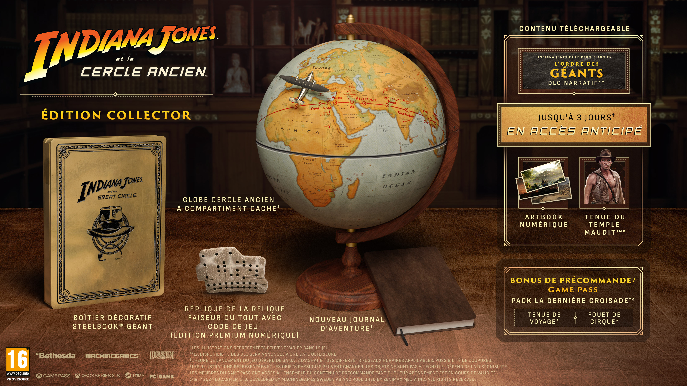

+++
title = "Indiana Jones et le Cercle Ancien s'aventurera aussi sur PS5"
date = 2024-08-20T14:48:32+01:00
draft = false
author = "Mickael"
tags = ["Actu"]
type = "une"
image = "https://nostick.fr/articles/2024/aout/2008-indiana-jones-et-le-cercle-ancien-ps5/indy-cercle-ancien.jpg"
+++

*Indiana Jones et le Cercle Ancien* ne restera pas une exclusivité Xbox très longtemps. La rumeur annonçait que [Microsoft allait de nouveau ouvrir les vannes](https://nostick.fr/articles/2024/aout/1708-backlog-semaine-plucky-squire-forza-horizon-steam/#la-rumeur-de-la-semaine--forza-horizon-5-sur-ps5-) des portages multiplateforme, après *Hi-Fi Rush* ou encore *Sea of Thieves* en début d'année. Mais on ne s'attendait pas à ce que cela concerne le gros jeu AAA de la fin d'année !

 

Bethesda a donc [annoncé](https://bethesda.net/fr/article/75UbsSjcgLIkfwqjJIgRfu/indiana-jones-and-the-great-circle-launch-december-9) que le jeu de MachineGames sortira sur PC et Xbox Series S/X le 9 décembre (et même 3 jours plus tôt pour ceux qui craqueront pour la super édition spéciale)… mais qu'il sera aussi disponible au printemps 2025 sur PS5. Il n'y a pas vraiment plus d'info concernant le portage PlayStation, mais sa simple existence fait sauter un nouveau verrou pour Microsoft, après l'annonce que *Doom: The Dark Ages* sera lui aussi multiplat' dès sa sortie.

3 éditions seront proposées : Standard en numérique ou en physique ; Premium avec le jeu anticipé 3 jours, le DLC « L'Ordre des Géants », un artbook et des cosmétiques ; et enfin un Collector avec tout ça plus une mappemonde (une vraie et tout), une réplique d'une relique, un journal d'aventures, et un étui steelbook.