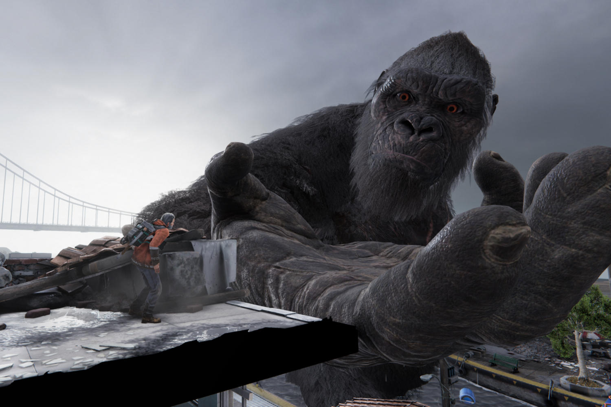

+++
title = "Kong Survivor Instinct a l'air Kong comme la Lune"
date = 2024-08-20T09:11:32+01:00
draft = false
author = "Mickael"
tags = ["Actu"]
image = "https://nostick.fr/articles/vignettes/aout/Kong-Survivor-Instinct.jpg"
+++

En général, ce qui attire dans les films de Godzilla ou de King Kong, c'est plus les destructions et les bagarres entre kaijus que les affres des personnages humains, à de rares exceptions près (comme les deux derniers films de la Toho, *Shin Godzilla* et *Godzilla Minus One*). 

Mais alors pourquoi, mais pourquoi bon sang de bois le studio 7Levels et Legendary, qui gère le versant US de la filmo de Godzilla embringué dans le ~~fumeux~~ fameux « Monsterverse », se sont-ils cru obligés de nous faire un jeu avec… des bonshommes ?!

 

Bon allez, l'idée de *Kong: Survivor Instinct* est peut-être bonne, allez savoir. On y incarnera un papa à la recherche de sa fille, perdue dans une ville devenue le terrain de chasse de créatures géantes, juste après les événements du mauvais film *Godzilla vs. Kong* de 2021. Le jeu en 2,5D combine plateformes, action et aventures. Vous allez me dire, mais c'est quand qu'il vient tout taper King Kong ? De ce qu'on en comprend, le héros pourra demander un coup de patte de temps en temps.

Le tout donne l'impression de mixer deux jeux qui n'ont pas beaucoup de rapports entre eux, entre le jeu de plateformes et le jeu de tape (espérons qu'on pourra prendre le contrôle de Kong). En tout cas, question rapport d'échelle, ça n'est pas inintéressant. Le titre sortira sur PS5, Xbox Series S/X et PC à un moment donné cet automne.