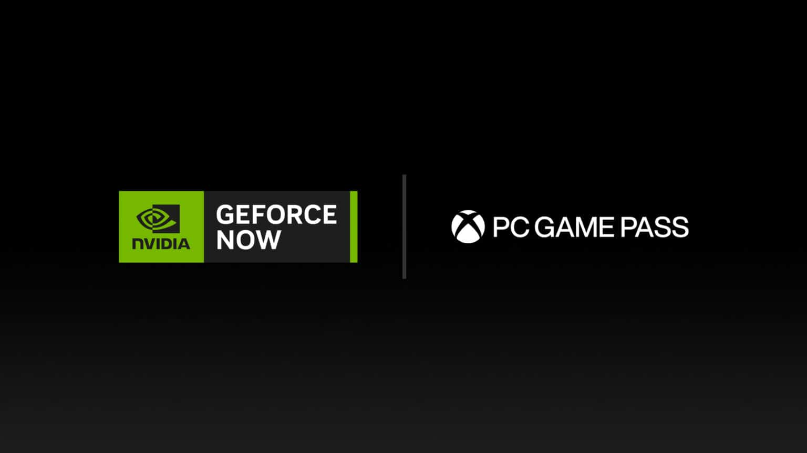

+++
title = "Il est enfin plus facile de se connecter à ses jeux Xbox avec GeForce Now"
date = 2024-08-20T14:44:32+01:00
draft = false
author = "Mickael"
tags = ["Actu"]
type = "telex"
+++

Les abonnés GeForce Now n'auront plus à saisir leurs identifiants Xbox à chaque fois qu'ils veulent jouer à un jeu de leur bibliothèque sur le service de cloud gaming ! Nvidia a fini par entendre les cris de rage et de douleur du monde entier (et plus spécifiquement ceux provenant de la rue St Denis à Montréal) : à compter du 22 août, la connexion entre les deux plateformes sera [automatique](https://blogs.nvidia.com/blog/geforce-now-gamescom-2024/?linkId=100000281783530).

 

Il faudra tout de même se connecter une fois à son profil Xbox depuis l'app GeForce Now, mais ensuite on sera tranquille. La synchronisation de la bibliothèque Xbox remonte à novembre dernier, autant dire que la connexion automatique était attendue. Ce système fonctionnait déjà avec les jeux de l'Epic Games Store et d'Ubisoft.

Plus de 2 000 jeux sont maintenant compatibles avec GeForce Now, dont le principe est de pouvoir jouer aux jeux de ses différentes bibliothèques dans le cloud, avec les capacités graphiques des GPU Nvidia. *Black Myth: Wukong* et la démo de *Final Fantasy XVI* sont d'ores et déjà compatibles.