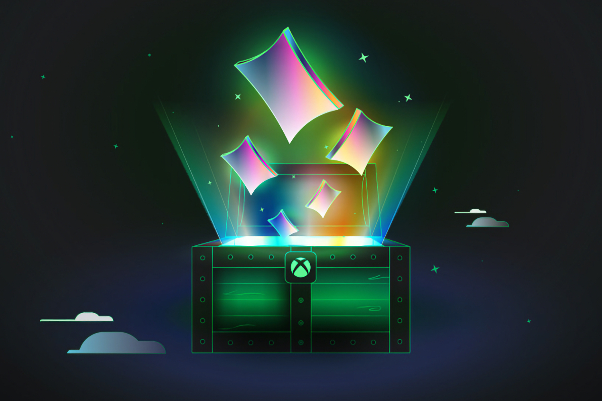
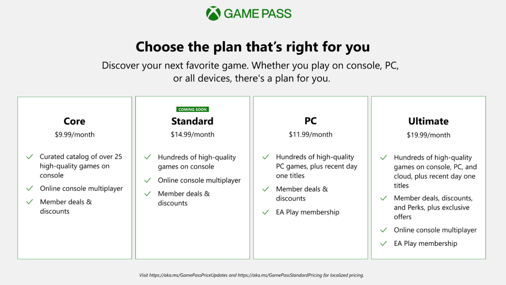

+++
title = "Les premiers pas à 1 $ du Game Pass Standard"
date = 2024-08-21T10:02:32+01:00
draft = false
author = "Mickael"
tags = ["Actu"]
image = "https://nostick.fr/articles/2024/juillet/0907-game-pass-xbox-bordel-hausse-prix/xbox-game-pass.jpg"
+++

[Microsoft a secoué le cocotier du Game Pass début juillet](https://nostick.fr/articles/2024/juillet/0907-game-pass-xbox-bordel-hausse-prix/), en augmentant les prix ici, en réduisant les avantages là, et surtout en créant une nouvelle formule baptisée Standard qui remplace le Game Pass Console. Mais pas au même prix (14,99 € au lieu de 10,99 €) ni avec les mêmes prestations. 

Le Game Pass Standard intègre le multijoueur, ce que n'avait pas son prédécesseur ; en revanche, il faudra dire adieu à l'accès aux nouveautés le jour de leur sortie. Les consoleux qui voudraient profiter du multi *et* des jeux « day one » doivent souscrire au Game Pass Ultimate qui lui aussi, a fortement augmenté à 17,99 €.

Microsoft a [lancé](https://news.xbox.com/en-us/2024/08/20/xbox-insiders-everything-you-need-to-know-about-xbox-game-pass-standard/) le bêta test de la formule Standard, en la proposant aux utilisateurs inscrits au programme [Xbox Insiders](https://support.xbox.com/fr-fr/help/account-profile/manage-account/guide-to-insider-program). Ils pourront bénéficier de ce nouvel abonnement au prix d'1 $ par mois pendant la période de test. Ensuite, il faudra payer le gros prix.

L'éditeur précise aussi (enfin, façon de parler) quand les nouveautés atterriront dans le catalogue accessible aux abonnés Standard. Ils seront ajoutés « *à une date ultérieure [après leur sortie], ce qui peut prendre jusqu'à 12 mois ou plus, selon le titre* ». Ce sera visiblement à la tête du client.

On imagine ainsi qu'*Indiana Jones et le Cercle Ancien*, qui sera dispo le 9 décembre, ne tardera pas trop : [le jeu sortant en effet sur PS5 au printemps](https://nostick.fr/articles/2024/aout/2008-indiana-jones-et-le-cercle-ancien-ps5/), on imagine que Microsoft voudra en faire profiter les abonnés Standard dans la foulée, ou peut-être un peu avant.