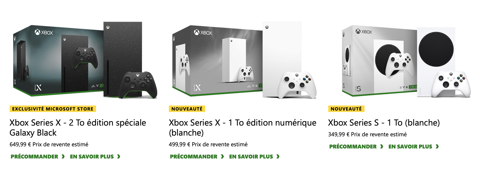

+++
title = "Les nouvelles Xbox sont en préco, mais pour qui ?"
date = 2024-08-21T14:44:32+01:00
draft = false
author = "Mickael"
tags = ["Actu"]
type = "telex"
+++

Il faut vraiment le vouloir pour acheter une Xbox, vu la manière dont Microsoft traite ses exclusivités : *Indiana Jones* sera [dispo sur PS5](https://nostick.fr/articles/2024/aout/2008-indiana-jones-et-le-cercle-ancien-ps5/) une poignée de mois après la sortie sur Xbox, *Towerborne* sera [proposée d'abord sur Steam](https://nostick.fr/articles/2024/aout/2108-towerborne-exclusivite-xbox-steam/)… Et qui sait ce que l'avenir nous prépare. [Dévoilée en juin](https://nostick.fr/articles/2024/juin/0906-microsoft-revoit-sa-gamme-xbox/), la nouvelle gamme de consoles est maintenant en préco pour les collectionneurs j'imagine !

La Xbox Series X édition numérique (sans lecteur optique, quoi) vous soulagera de 500 €, soit 50 € de moins que la version avec lecteur de disques. La Xbox Series X 2 To avec son lecteur CD et un boîtier pailleté du plus bel effet revient à 650 €. Enfin, la Series S avec 1 To dans sa livrée blanche coûte 350 €.