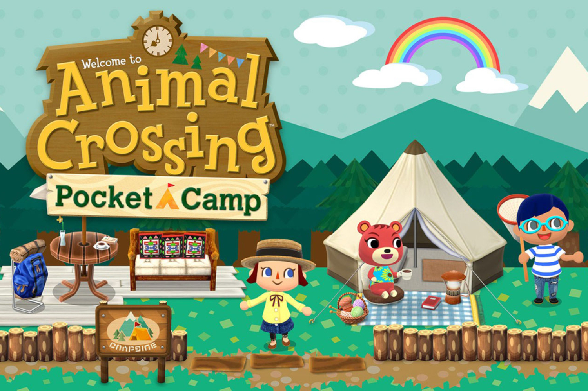

+++
title = "Animal Crossing Pocket Camp va passer du free-to-play au premium"
date = 2024-08-22T11:44:32+01:00
draft = false
author = "Mickael"
tags = ["Actu"]
type = "telex"
+++

Nintendo lâche petit à petit ses jeux mobiles : sur les 8 titres sortis sur iOS et Android depuis 2016, cinq ont été soit abandonnés, soit tout simplement retirés de la circulation. *Animal Crossing Pocket Camp*, lancé il y a 7 ans, va [connaitre](https://faq.ac-pocketcamp.com/hc/en-us/categories/35735633685657-Notice-Regarding-the-End-of-Service) une fin de service à compter du 29 novembre. Les joueurs ne pourront plus faire d'achats intégrés dans le jeu, et l'abonnement mensuel va s'arrêter lui aussi. 

Ça ne signifie pas pour autant la disparition complète du jeu. Contrairement à *Miitomo* ou *Dr. Mario World*, *Pocket Camp* va rester disponible au travers d'une nouvelle version dans laquelle les joueurs retrouveront les données du précédent jeu ; il ne sera pas possible de faire des achats et tout l'aspect social sera expurgé. La jouabilité restera la même, et il ne sera plus obligatoire d'avoir une connexion à internet.

L'un dans l'autre, le sort de *Pocket Camp* est plus enviable que pour d'autres jeux mobiles de Nintendo, même s'il faudra acheter le jeu à un prix encore non défini (la version actuelle est free-to-play). On aura plus de détails en octobre.