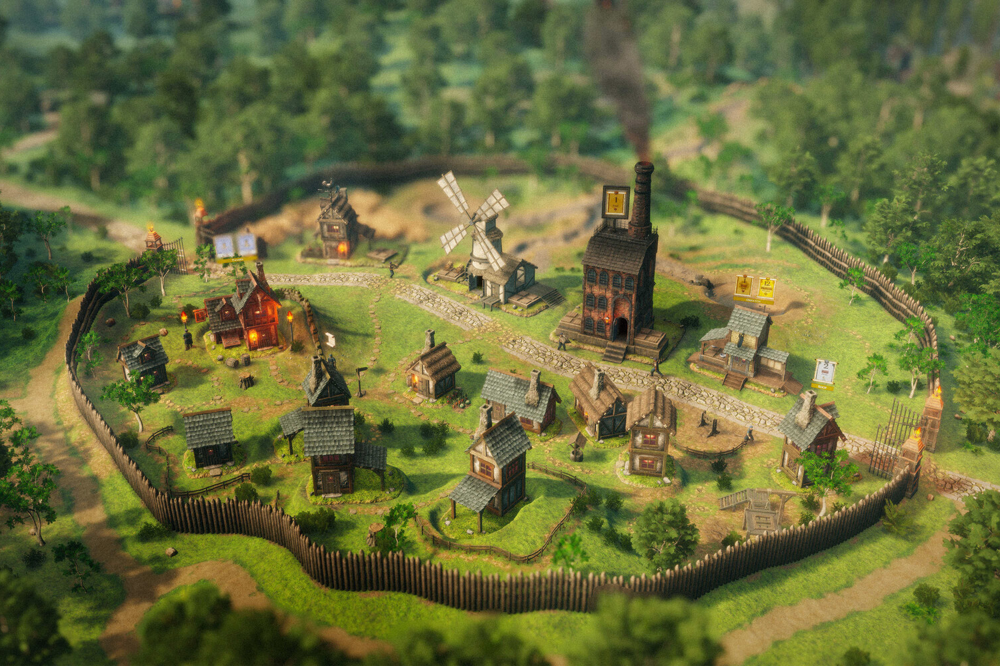
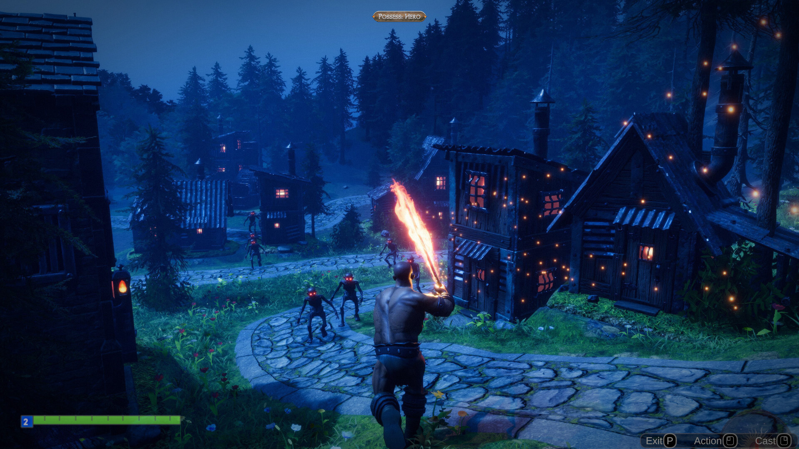

+++
title = "Masters of Albion : le dernier coup de folie de Peter Molyneux"
date = 2024-08-23T08:17:32+01:00
draft = false
author = "Mickael"
tags = ["Actu"]
type = "une"
image = "https://nostick.fr/articles/vignettes/aout/Masters-of-Albion-1.jpg"
+++

Alors que revoilà Peter Molyneux. Le concepteur de *Black & White*, de *Fable*, de *Populous*, de *Dungeon Keeper* et de tant d'autres jeux a un pedigree qui lui garantit assez aisément sa place au panthéon du jeu vidéo. 

Mais le bonhomme a aussi un sacré melon, ses promesses — notamment à l'époque de *Fable* — n'ont engagé que ceux qui y croyaient, le projet *Godus* a laissé un sale goût dans la bouche de tous ceux qui ont participé à son financement sur Kickstarter, il s'est lancé à corps perdu dans les NFT, il n'a jamais été très tendre avec ses équipes…

Mais malgré tout, Peter Molyneux a signé son grand retour dans l'actualité à l'occasion de la Gamescom, en présentant son nouveau jeu *Masters of Albion*. En développement depuis trois ans au sein de son studio 22cans, le titre ressemble à un mix entre *Populous* et *Black & White*, arrosé de *tower defense*.

 

Comme son nom l'indique, le jeu se déroule en Albion à l'époque des rois et de la magie, qui menace les fondations de la société. Le joueur devra gérer son petit royaume, répondre aux commandes des différentes factions (nourriture, vêtements, armes…), et combattre des créatures en plaçant judicieusement des tours et en contrôlant des héros.

*Masters of Albion* a indéniablement une bonne tête, et il faudra surveiller le lancement sur [Steam](https://store.steampowered.com/app/3165650/Masters_of_Albion/), où on peut l'ajouter à sa liste de souhaits (accès anticipé prévu en 2025 sur PC et Mac). Mais Peter Molyneux étant Peter Molyneux, le jeu n'est pas sans controverses. D'abord par l'univers dans lequel il se déroule… et qui évoque évidemment celui de *Fable*.

Molyneux a laissé la franchise *Fable* entre les mains de Microsoft, après l'acquisition de son ancien studio Lionhead. Un nouveau jeu est d'ailleurs attendu en 2025… Hasard ou coïncidence ? « *Fable se déroule en Albion, Masters of Albion se déroule en Albion* », explique-t-il à *[VGC](https://www.videogameschronicle.com/news/albion-cant-be-copyrighted-peter-molyneux-explains-how-his-new-game-is-set-in-the-same-world-as-fable/)*. Albion est un terme ancien pour désigner l'île de Grande-Bretagne.

## Masters of polémiques

« *C'est comme dire que si vous placez un jeu en Amérique, vous ne pouvez pas placer un autre jeu en Amérique* », soutient-il. « *Donc, Albion ne peut pas être protégé par le droit d'auteur. C'est le nom de l'Angleterre et du Pays de Galles, et c'est ainsi que nous nous en sortons* ». *Masters of Albion* ne sera pas *Fable 5*, « *mais si vous avez joué à Fable, alors Masters of Albion vous sera familier* ».

On verra comment Microsoft appréciera l'emprunt, mais ce sera difficile de reprocher à Molyneux une inspiration provenant d'un jeu qu'il a lui-même créé. En revanche, certains investisseurs dans sa précédente tentative, *Legacy*, pourraient l'avoir mauvaise : les 54 millions de dollars (supposés) de préventes du jeu basé sur une blockchain ont servi au développement de *Masters of Albion*.

*Legacy* a été lancé en 2023 et s'est immédiatement planté, comme toutes les tentatives de gamifier le web3 (on peut toujours y [jouer](https://games.gala.com/games/legacy?availability=available) d'ailleurs). La simulation de business vendait des terrains virtuels, qu'il fallait acheter pour pouvoir participer à l'économie du jeu.

Le montant avancé est « *exagéré* », se [défend](https://www.eurogamer.net/peter-molyneux-a-fallen-god-of-game-design-seeking-one-final-chance)-t-il auprès d'*Eurogamer*, mais les sommes ont bien servi à développer *Masters of Albion* (qui a priori ne contient aucun élément web3). « *Le modèle économique [de Legacy] — et je ne suis pas quelqu'un qui comprend ça en profondeur — ne fonctionne pas vraiment ni financièrement, ni en termes de gameplay* », convient-il. Il est tout de même étonnant qu'il se soit lancé dans ce truc sans en comprendre tous les fondements !

Mais au moins, des NFT ont servi à quelque chose… 