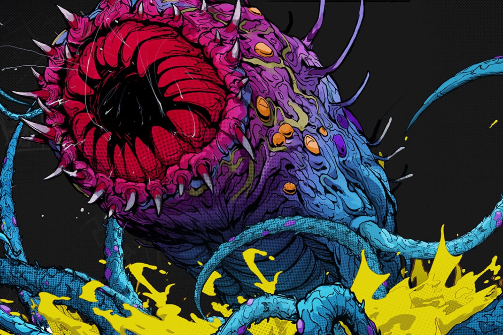

+++
title = "[REDACTED] se la joue Hades dans l'univers de Callisto Protocol"
date = 2024-08-23T09:47:32+01:00
draft = false
author = "Mickael"
tags = ["Actu"]
image = "https://nostick.fr/articles/vignettes/aout/redacted.jpg"
+++

*Callisto Protocol* n'a pas mis le monde à feu et à sang. Le jeu d'horreur du studio Striking Distance, successeur spirituel de *Dead Space*, a fait un four à sa sortie en décembre 2022. À tel point qu'on le retrouve régulièrement en soldes ou carrément gratos sur l'Epic Games Store comme en ce moment. 

Le jeu n'est pas mauvais en soi, grâce entre autres à Glen Schofield, fondateur du studio (il l'a quitté depuis) et créateur de… *Dead Space*. Mais peut-être que l'ambition était trop grande pour la jeune équipe : rivaliser avec les grands noms de l'industrie avec un AAA.

 

Après une période qu'on imagine difficile — remise en question, licenciements —, Striking Distance se relance avec un projet peut-être davantage à sa portée : *[REDACTED]*, un roguelike qui n'est pas sans évoquer *Hades*. Rejouabilité infinie, builds à construire, nouvelles armes toujours plus puissantes, beaucoup de morts… Vous connaissez la musique.

*[REDACTED]* a ceci de particulier qu'il se déroule dans l'univers de *Callisto Protocol*, en l'occurrence dans la prison de Black Iron installée sur Callisto, la lune glacée de Jupiter. On y affrontera des prisonniers infectés et des survivants qui tentent, tout comme le joueur, de se tirer de ce mauvais pas en s'envolant dans l'unique pod de secours.

Avec sa vue isométrique, le style comics et son action effrénée, le jeu a l'air plutôt sympa. Son seul problème, c'est qu'il va avoir à faire à forte partie : [*Hades II* est dispo en accès anticipé depuis quelques mois](https://nostick.fr/articles/2024/mai/1005-hades-ii-divin-et-diabolique/) et il va être difficile de le déloger.