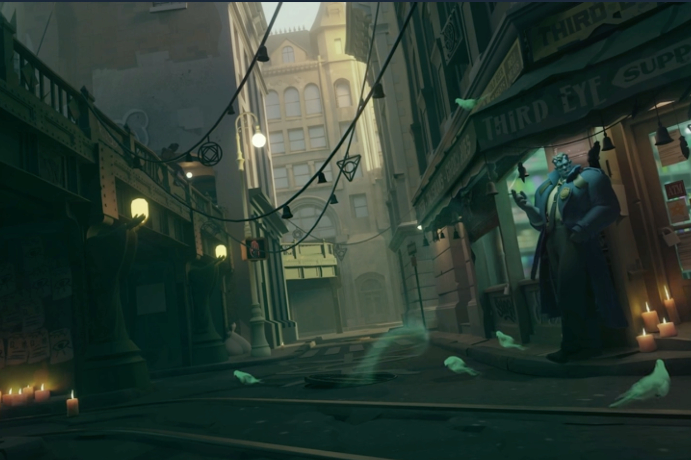

+++
title = "Valve officialise son nouveau jeu Deadlock"
date = 2024-08-23T23:47:32+01:00
draft = false
author = "Mickael"
tags = ["Actu"]
type = "une"
image = "https://nostick.fr/articles/2024/aout/2308-valve-officialise-deadlock/deadlock.jpg"
+++

Ce n'est pas tous les jours que Valve annonce un nouveau jeu, alors ça valait bien le coup d'une petite actu nocturne : *Deadlock* a été officiellement annoncé vendredi dans la nuit, et… c'est à peu près tout ce que l'éditeur veut bien en dire ! La [page Steam](https://store.steampowered.com/app/1422450/Deadlock/) apporte vraiment très peu d'infos, si ce n'est que le jeu est en « *développement précoce* », beaucoup d'assets sont temporaires et la jouabilité est encore « *expérimentale* ». La date de sortie est à déterminer.

 

L'accès à *Deadlock* est tout aussi limité… ou presque : il faut recevoir une invitation par un ami testeur. Il semble toutefois que Steam soit assez généreux alors pensez à [moi](https://steamcommunity.com/profiles/76561199521727350/) 😬 ! Le jeu est peut-être sous le radar, mais il n'est pas spécialement discret : il compte actuellement près de [30 000 joueurs](https://steamdb.info/app/1422450/charts/), et il a enregistré un pic à 44 500 joueurs il y a une semaine. Des chiffres qui feraient pâlir d'envie le pauvre *Concord* qui peine à atteindre les [700 joueurs](https://steamdb.info/app/2443720/charts/) en ce moment…

Évidemment, si vous suivez un peu l'actualité sur *Nostick* (quoi d'autre ?), [vous connaissez un petit peu de quoi il est question](https://nostick.fr/articles/2024/aout/1308-deadlock-valve-steam-carton/) : c'est un jeu multi aux frontières de *Valorant*, *Overwatch*, *Dota 2* et *Team Fortress 2*. Pour en savoir plus, c'est assez simple : un petit tour sur [Twitch](https://www.twitch.tv/directory/category/deadlock-2016) vous renseignera sur le gameplay et l'univers, les streameurs sont nombreux à proposer des parties.