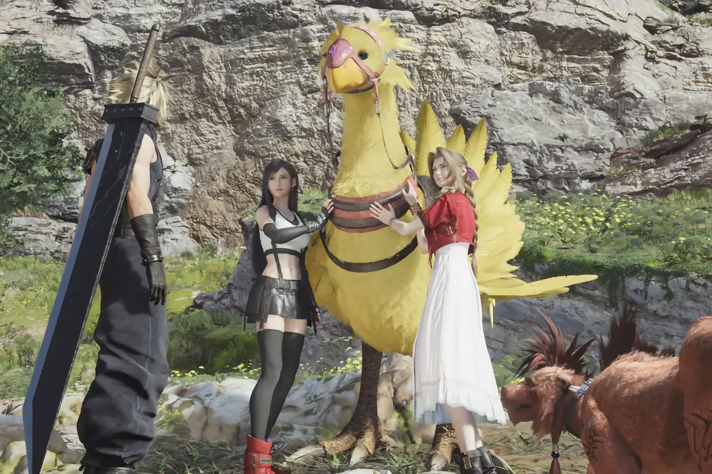
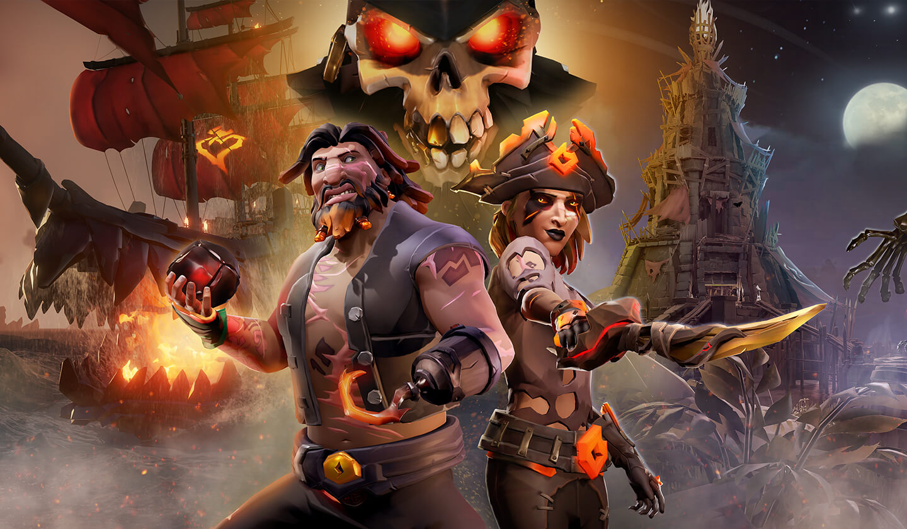

+++
title = "On vide le backlog de la semaine : Dead Cells, Final Fantasy, Indy, Silent Hill 2…"
date = 2024-08-24T02:00:32+01:00
draft = false
author = "Mickael"
tags = ["XXL"]
image = "https://nostick.fr/articles/vignettes/aout/chocobo.jpg"
+++

L’actualité du jeu vidéo ne s’arrête pas à la poignée d’articles publiés sur *Nostick* ! Histoire de rattraper le retard accumulé, voici un retour rapide sur quelques unes des infos les plus importantes (ou insignifiantes) de la semaine.

## Le chiffre de la semaine : 35

Tout a une fin, même un *roguelite* ! *[Dead Cells](https://deadcells.com)* a reçu sa dernière mise à jour numérotée 35 et habilement baptisée « The End is Near ». Les fans — ils sont nombreux — ont droit à de nouvelles armes, capacités, mutations et autres effets de biomes. 40 skins de têtes supplémentaires pour notre héros bondissant sont aussi à décrocher, tout comme 20 affixes légendaires. De nouvelles options d'accessibilité font aussi leur apparition.



Bref, il y a de quoi s'occuper et de toute manière, *Dead Cells* a été pensé pour être joué jusqu'à la fin des temps ! Le titre lancé en 2018, a conquis le monde et à peu près toutes les plateformes imaginables depuis. Un sacré morceau de jeux indépendant…

Motion Twin, le studio français créateur du jeu, prépare le lancement de *[Windblown](https://windblown.game)*, qui reprend le principe du roguelite en vue isométrique. C'est Evil Empire qui s'est occupé des extensions, et là aussi le studio est bien occupé avec *The Rogue Prince of Persia*, actuellement en accès anticipé sur [Steam](https://store.steampowered.com/app/2717880/The_Rogue_Prince_of_Persia/).

## La bonne nouvelle : les futurs Final Fantasy pour tous ?

Après 15 mois d'exclusivité sur la PS5, [*Final Fantasy XVI* est finalement dispo sur PC](https://nostick.fr/articles/2024/aout/1908-final-fantasy-xvi-pc-septembre/) ! D'abord sous la forme d'une démo, les deux premiers chapitres sont ainsi proposés gratuitement, puis le jeu au complet sera en ligne le 17 septembre au prix menu de 50 €. À l'avenir, il y a des chances pour que les futurs *Final Fantasy* sortent en même temps sur consoles et sur PC.



C'est du moins ce que laisse espérer les déclarations d'Hiroshi Takai, le directeur de *FF16* : « *Je pense que c'est possible, et même probable* » que les prochains épisodes de la saga soient proposés en même temps sur toutes les plateformes, a-t-il [expliqué](https://www.gamesradar.com/games/final-fantasy/final-fantasy-16-confirms-september-pc-release-date-director-says-its-possible-probably-even-likely-future-final-fantasy-games-launch-day-1-on-pc/) à *GamesRadar+*. Il met toutefois un bémol très rapidement : tout dépend de l'équipe chargée du développement du jeu. 

Il s'agit donc d'une « *opinion personnelle* », mais elle n'est pas dénuée de sens : pour redresser ses finances, Square Enix a décidé de s'adresser à un maximum de joueurs et de freiner sur les exclusivités qui provoquent plus de frustration et de manque à gagner qu'autre chose.

L'éditeur devra toutefois mettre en place une structure permettant de développer plusieurs versions d'un même jeu en parallèle. Hiroshi Takai explique ainsi qu'il a fait tout ce qu'il a pu pour accélérer le processus de portage PC. « *Nous voulions mettre la version PC entre les mains des joueurs aussi rapidement que possible. Nous n'avons rien à gagner à retarder la sortie non plus* ». 

## La grosse info de la semaine : Microsoft glisse la Xbox sous le tapis

Dans une année plutôt creuse niveau nouveautés pour PlayStation, Sony peut remercier Microsoft de faire le sale boulot et remplir le catalogue du rival ! *Indiana Jones et le Cercle Ancien* sortira certes le 9 décembre sur Xbox et PC, mais [aussi au printemps prochain sur PS5](https://nostick.fr/articles/2024/aout/2008-indiana-jones-et-le-cercle-ancien-ps5/).



L'annonce a été faite durant la soirée inaugurale de la Gamescom, ce qui a été vécu comme une humiliation supplémentaire chez les fans de la team green. Microsoft n'a en effet pas attendu la sortie du jeu sur « leur » plateforme pour faire mousser le lancement sur PS5. La fenêtre de quelques mois d'exclusivité ne leur sera probablement d'aucun réconfort. 

Il y a de fortes chances pour que les joueurs Xbox essuient les plâtres des bugs du jeu : au bout du compte, la meilleure version du blockbuster pourrait bien être celle qui roulera sur PlayStation ! Non seulement MachineGames se sera normalement occupé des bugs de jeunesse, mais il n'est pas impossible que le titre tourne mieux sur la PS5 Pro… Et ce ne sont pas [les nouvelles Xbox en préco](https://nostick.fr/articles/2024/aout/2108-nouvelles-xbox-preco/) qui y changeront grand chose, avec leur fiche technique similaire aux précédents modèles.

Tout cela dépeint [un tableau guère reluisant pour la plateforme](https://nostick.fr/articles/2024/mai/1505-bonjour-tristesse-chez-xbox/) : pourquoi acheter une Xbox si en face, on peut jouer aux mêmes jeux sur PS5… avec en plus les exclus PlayStation ? Phil Spencer, le grand patron de la division jeux vidéo de Microsoft, ne prend plus de gants : « *nous devons anticiper les changements de plus en plus importants dans certaines des méthodes traditionnelles de création et de distribution des jeux, et cela va changer. Cela va changer pour nous tous* », a-t-il [prévenu](https://www.youtube.com/live/L1Qd1cFr9VY?feature=shared) durant le livestream Xbox de la Gamescom.

Autrement dit : d'autres « exclusivités » Xbox vont franchir le Rubicon et devenir multiplateforme. « *Nous dirigeons une entreprise* », a-t-il aussi rappelé, sous-entendu : il faut qu'on gagne du pognon. Et c'est encore plus vrai au sein de Microsoft, qui a signé un chèque de 70 milliards de dollars pour racheter Activision Blizzard. Il faut du retour sur investissement, et puisque les consoles Xbox ne rapportent pas un flèche, la solution est de vendre plus de jeux sur les plateformes concurrentes. « *La barre est haute pour ce que nous devons rendre à [Microsoft]* ».

Il est d'autant plus urgent de ramasser des sous qu'« *il y a beaucoup de pression [sur l'industrie du jeu vidéo] qui a connu une croissance continue depuis longtemps, et maintenant les gens cherchent de nouveaux relais de croissance* », ajoute-t-il. Du côté Xbox, Phil Spencer se dit satisfait des résultats : « *Nos franchises deviennent de plus en plus fortes. Le nombre de joueurs sur nos consoles Xbox n'a jamais été aussi élevé cette année* ». 

Le dernier point à propos du nombre de joueurs Xbox changera peut-être un jour, mais pour ce qui concerne la croissance des franchises, la stratégie multiplat' semble donner ses premiers fruits : *Sea of Thieves* [aurait](https://www.windowscentral.com/gaming/xbox/phil-spencer-we-have-more-xbox-console-players-than-ever-as-fans-question-microsofts-multi-platform-strategy) dépassé le million de copies vendues sur PlayStation, d'après *Windows Central*. Un succès qui en appelle d'autres, et cela pourrait commencer au printemps prochain avec *Indy*. Le tout au profit de Microsoft Gaming… mais peut-être pas de Xbox !

## On n'a pas eu le temps cette semaine mais on pense à eux

 

Le remake de *Silent Hill 2* est finalement sur de bons rails, [après l'inquiétude des premières vidéos pas très engageantes](https://nostick.fr/articles/2024/aout/0708-silent-hill-2-developpeurs-donnez-chance/). Les aperçus rassurent en tout cas sur l'ambition du jeu, son ampleur et le respect à l'original. On respire ! Il sera dispo sur PC et PS5 le 8 octobre.

 

Capcom continue d'enrichir *Street Fighter 6* et ses poches avec de nouveaux combattants. Terry Bogard sera de la fête cet automne, dans le deuxième Character Pass payant, et cela valait bien une vidéo dédiée au moveset du champion de *Fatal Fury*.



Si *Lost Records: Bloom & Rage* vous rappelle quelque chose et notamment *Life Is Strange*, vous n'avez pas la berlue : le studio Don't Node comprend en effet pas mal des talents qui ont planché sur cette saga. Le jeu se déroule entre 1995 et 2022 et tourne autour de quatre amies d'enfance et d'un secret. La première partie sera livrée le 18 février, la seconde le 18 mars, sur PC, PS5 et Xbox Series S/X.

## osef

Six mois après son lancement officiel, *Skull and Bones*, le quadruple A d'Ubisoft, est dispo sur [Steam](https://store.steampowered.com/app/2853730/Skull_and_Bones/)… avec 60 % de réduction. Pas sûr que ça vaut le coup pour autant.

## Dans le reste de l'actu déchaînée

- Le tout premier *Diablo* vaut toujours le coup d'œil, même après toutes ces années ! Retrouvez le hack'n slash originel… [dans votre navigateur web](https://nostick.fr/articles/2024/aout/1908-diablo-retour-navigateur/).
- *Black Myth: Wukong* a fait parler de lui en bien comme en mal cette semaine. En bien tout d'abord, en étant [le jeu solo le plus populaire de tous les temps sur Steam](https://nostick.fr/articles/2024/aout/2008-black-myth-wukong-jeu-populaire-steam/) ! Et aussi en mal, vue [la polémique sur les critères assez hallucinants](https://nostick.fr/articles/2024/aout/1908-black-myth-wukomg-propagande-feministe/) imposés aux créateurs de contenus par le studio Game Science…
- Parce qu'on a jamais assez de Pokémon, un nouveau jeu de cartes sera dispo sur iOS et Android en octobre. [Partez donc à la chasse !](https://nostick.fr/articles/2024/aout/2008-pokemon-pocket-cartes-poche/)
- Malgré son nom et l'affiliation au « Monsterverse », le jeu *Kong Survivor Instinct* ne tourne pas vraiment autour de King Kong. Bizarre ? [Tous les détails dans cette actu.](https://nostick.fr/articles/2024/aout/2008-kong-survivor-instinct-automne/)
- La soirée inaugurale de la Gamescom a mine de rien été bien chargée en trailers et en dates de sortie ! *Borderlands 4*, *Dune Awakening*, *Civilization VII*… [C'est à découvrir par ici.](https://nostick.fr/articles/2024/aout/2008-borderlands-4-dune-awakening-batman-arkham-shadow-civilization-vii/)
- Parmi les nouveautés annoncées à la Gamescom, *Mafia: The Old Country* a fait son petit effet et trouve immédiatement une place tout en haut du backlog de Félix. [C'est vrai que ça a l'air bien.](https://nostick.fr/articles/2024/aout/2108-mafia-the-old-country-2025/)
- *Monument Valley*, véritable monument (!) du jeu mobile, revient dans un troisième opus… mais uniquement pour les abonnés Netflix. [On vous explique tout ici.](https://nostick.fr/articles/2024/aout/2108-monument-valley-3-netflix/)
- Microsoft prépare le lancement de la nouvelle formule Game Pass Standard pour les consoleux. Plus chère et pas forcément plus intéressante, elle est proposée à 1 $ par mois pour les cobayes Xbox Insiders. [À lire dans cette actu.](https://nostick.fr/articles/2024/aout/2108-game-pass-microsoft-standard/)
- Nvidia est le champion de l'IA générative, en bien comme en mal. *Mecha Break* sera le premier jeu à utiliser la technologie de la boîte qui insuffle un peu de jugeote aux NPC. [Pas sûr que ce soit une bonne idée.](https://nostick.fr/articles/2024/aout/2108-pnj-nvidia-mecha-break/)
- Alerte, Peter Molyneux est de retour, pour le meilleur et peut-être pour le pire. *Masters of Albion* est le futur « God game » du créateur de *Populous* et de *Black & White*, et [il se dévoile dans cette actu.](https://nostick.fr/articles/2024/aout/2308-masters-of-albion-peter-molyneux/)
- *Callisto Protocol* a fait un four, qu'à cela ne tienne, les développeurs sont de retour avec un jeu moins ambitieux, mais qui a peut-être plus de chance de connaitre le succès malgré son nom impossible, *[REDACTED]*. [À découvrir par ici.](https://nostick.fr/articles/2024/aout/2308-redacted-joue-hades-callisto-protocol/)