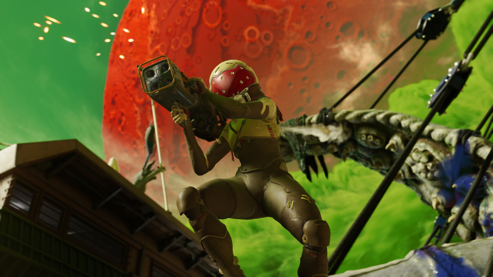

+++
title = "Concord se crashe au décollage"
date = 2024-08-24T02:00:32+01:00
draft = false
author = "Félix"
tags = ["Actu"]
image = "https://nostick.fr/articles/2024/aout/2408-concord-se-crashe-au-decollage/concord.jpg"
+++ 

 

Après 8 ans en cuisine, le nouveau *hero-shooter* de Sony est sorti aujourd’hui dans l’indifférence générale. Le titre n’a même pas [dépassé](https://steamdb.info/app/2443720/charts/) les 700 joueurs en simultané sur Steam et affiche moins de 200 avis. Le jeu était en bêta ouverte depuis la fin du mois de juillet, période pendant laquelle il n’avait pas fait [beaucoup de bruit non plus](https://nostick.fr/articles/2024/juillet/2207-concord-playstation-flop/) (j’avais complètement oublié son existence jusqu’à aujourd’hui, pour être honnête).

Soyons clairs : c’est un énorme flop pour Sony. *Suicide Squad* a réuni 13 000 joueurs à sa sortie, ce qui était déjà considéré comme vraiment [pas terrible](https://www.vg247.com/suicide-squad-steam-launch-numbers-less-than-half-marvels-avengers). Les [6 000 joueurs](https://hitmarker.net/news/redfall-peaks-at-6-000-concurrent-players-on-steam-2060086) au lancement *Redfall* ont été vus comme « *un désastre* ». Ne pas passer le cap des 700 sur Steam, c’est un nouveau record. D’après [SteamDB](https://steamdb.info/app/3011460/charts/#1w), *Concord* a bien réussi à attirer 2 388 curieux sur ses serveurs… pendant sa période de bêta, qui était gratuite alors que le titre coûte maintenant 40 €. Les statistiques sont peut-être plus reluisantes sur PS5 (Sony se garde bien de donner les chiffres), mais étant donné que le jeu est déjà [à -25 %](https://www.amazon.fr/CONCORDTM-multijoueur-Standard-Physique-PlayStation/dp/B0D642ZMZ8) sur Amazon, on peut avancer sans trop se mouiller que ce n’est pas le carton attendu.

Ce flop s’explique sans doute par la stratégie de Sony, à savoir proposer un jeu payant sans battle pass. Un choix qui va à l’encontre du reste de l’industrie, misant sur une base *free-to-play* pour appâter le chaland (*Valorant*, *Overwatch*) et les faire sortir la CB. L’univers et la patte graphique du jeu ne l’ont pas aidé à s’attirer les bonnes grâces des joueurs, qui se sont allègrement moqués de son côté « *Gardien de la Galaxy de chez Wish* » dans les [commentaires](https://www.youtube.com/watch?v=mBnStS9d2xg) des multiples trailers. Beaucoup sont aussi énervés par le tournant de Sony vers les jeux-services, là où l’entreprise s’est fait connaître pour ses jeux AAA solo aux identités très fortes.

*Concord* n’a pourtant pas l’air si mauvais pour peu que vous soyez client des FPS à héros et de science-fiction. Les critiques sont moyennes, mais ne présentent pas un jeu criblé de défauts comme l’a pu être *Redfall*. La note de 69/100 sur Metacritic laisse pressentir un jeu correct mais sans plus qui va sans doute avoir toutes les peines du monde à créer l’engouement après ce faux départ. Le studio Firewalk a bien dévoilé sa [feuille de route](https://insider-gaming.com/concord-new-gameplay-trailer/) pour les 2 prochaines saisons qui arriveront d’ici janvier, mais on ne parierait pas sur une troisième…

