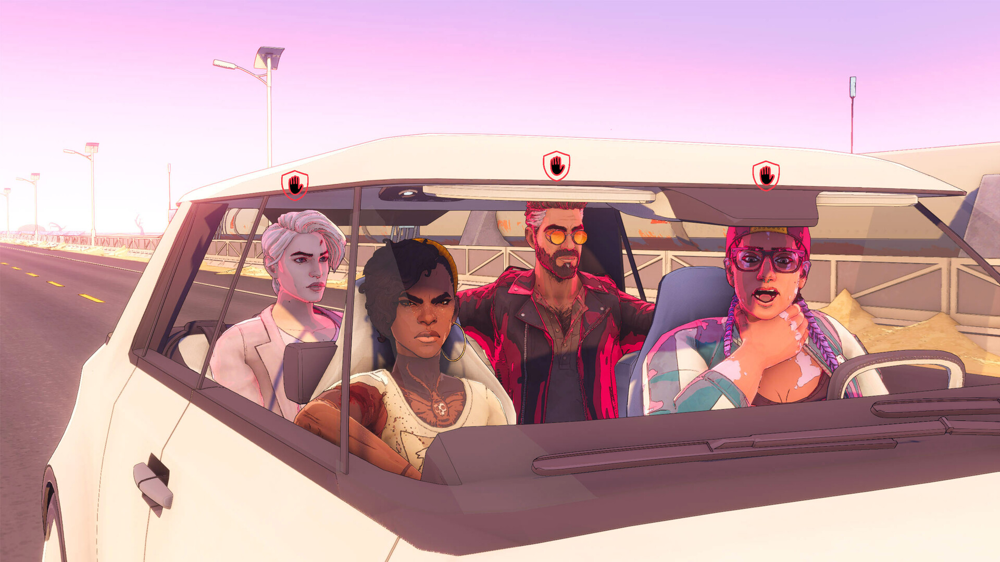

+++
title = "Black Myth : Wukong, Concord : le récap des sorties de la semaine (25/08)"
date = 2024-08-25T08:00:02+01:00
draft = false
author = "Félix"
tags = ["C’est dispo"]
image = "https://nostick.fr/articles/2024/aout/2508-les-sorties-de-la-semaine/wukong.jpg"
+++

Entre la garderie, les courses et le mois de septembre qui approche à grands pas, vous n’avez peut-être pas eu le temps de vous intéresser aux nouveautés du moment. Qu’à cela ne tienne : voici les sorties de ces derniers jours qui ont retenu notre attention.

## Le singe qui arrivait à pied par la Chine

Le gros AAA chinois *Black Myth: Wukong* est sorti cette semaine. Le titre s’inspire des *[Pérégrination vers l'Ouest](https://fr.wikipedia.org/wiki/La_Pérégrination_vers_l%27Ouest)*, un classique de la littérature chinoise suivant le Roi-Singe en voyage vers l'Inde avec différents compagnons. Contrairement à ce que l’on a pu croire, il s’agit d’un jeu d’action plus proche d’un *Bayonetta* ou d’un *God of War* que d’un *souls-like*. Le titre se démarque par ses inspirations piochant dans la mythologie chinoise pour offrir un univers intéressant : la critique a salué un jeu très joli (UE5 inside), moins punitif que certains sans pour autant être facile. Le tableau est noirci par de gros bugs, des oublis de traductions ici ou là ou encore des faiblesses de gameplay qui n’ont pas empêché le jeu de faire un carton étant donné qu’il affichait [1,7 million de joueurs](https://nostick.fr/articles/2024/aout/2008-black-myth-wukong-jeu-populaire-steam/) en simultané le jour de sa sortie et que 10 millions de copies s’en sont écoulées en 3 jours. Vous pouvez sans doute attendre une semaine ou deux que des correctifs soient mis en ligne, mais même sans ça ça a l’air d’être de la bonne came. 60 € sur [Steam](https://store.steampowered.com/app/2358720/Black_Myth_Wukong/), aussi dispo sur consoles.

## Concord : tout droit vers le crash ?

Lancement difficile pour **Concord**, le nouveau *hero-shooter* financé par Sony qui semble être un *Overwatch* inspiré des *Gardiens de la Galaxie*. Disponible depuis quelques heures au moment où j’écris ces lignes, le jeu affiche [un pic](https://steamdb.info/app/2443720/charts/) de 697 joueurs sur Steam… ce qui n’est vraiment, *vraiment* pas beaucoup. Pour rappel, on se moquait des [6 000 joueurs](https://hitmarker.net/news/redfall-peaks-at-6-000-concurrent-players-on-steam-2060086) du lancement de *Redfall*. Le titre n’est pourtant visiblement si pas mauvais que ça et propose quelques bonnes idées, mais rien de bien frais non plus : le cumul des notes sur Metacritic atteint 69/100, ce qui ne devrait pas motiver les fans d’*Apex* ou de *Valorant* à changer de crémerie. Le ticket d’entrée est facturé [40 €](https://store.steampowered.com/app/2443720/Concord/), un pari audacieux dans un secteur blindé de free-to-play. *Concord* méritera peut être un essai quand il sera gratuit avec Prime Gaming ou à -95 % sur Steam dans 3 mois, mais en l’état, aucune raison de se précipiter.



## Another one bites the Dust(born)

Le jeu de road trip narratif ***Dustborn*** est sorti cette semaine et on va pas se mentir, ça a pas l’air folichon. On y suit les aventures d’un groupe en cavale traversant une version dystopique des États-Unis dans laquelle la caboche de JFK n’a jamais explosé. La direction artistique est visiblement sympa, mais le gameplay reste assez plan-plan avec quelques tentatives de dynamiser le tout par des mini jeux de combat pas plus prenant que ça. Le jeu a laissé de marbre la plupart des testeurs, qui décrivent un univers intrigant rempli de personnages beaucoup trop bavards ainsi qu’une histoire imparfaite. Le jeu fait l’objet d’un review bombing de la part d’incels trouvant le jeu trop woke : il n’avait pourtant pas besoin de ça vu que les notes des professionnels oscillent entre 5 et 6 sur 10. Vous pouvez voir si la sauce prend chez vous en essayant la démo disponible sur Steam, mais c’est sans doute à réserver aux fans du genre ou à ceux qui ne sont pas à 30 € prêts. Dispo sur [PC](https://store.steampowered.com/app/721180/Dustborn/?l=french) et consoles (même les vieilles sauf la Switch).

## C’est pas sorcier

***Tactical Breach Wizards*** est un jeu d’action tactique pour le moins original étant donné qu’on y incarne une équipe de sorciers rebelles en kevlar. C’est du tour par tour où chaque magicien dispose de capacités spéciales rigolotes, pouvant faire un dash éclair ou encore se transformer en chien. On nous promet une intrigue prenante et plutôt poussée tournant autour d’une conspiration mondiale, et les quelques tests que j’ai lus ici ou là sont tous très positifs : les joueurs louent un humour qui fait mouche ainsi que des personnages sympathiques auxquels on a le temps de s’attacher, ce qui est quand même pas mal pour un jeu du genre. Si le concept vous botte, l’aventure fait une vingtaine d’heures pour 26 €, ce qui me semble honnête. Une démo est dispo [sur Steam](https://store.steampowered.com/app/1043810/Tactical_Breach_Wizards/). 

