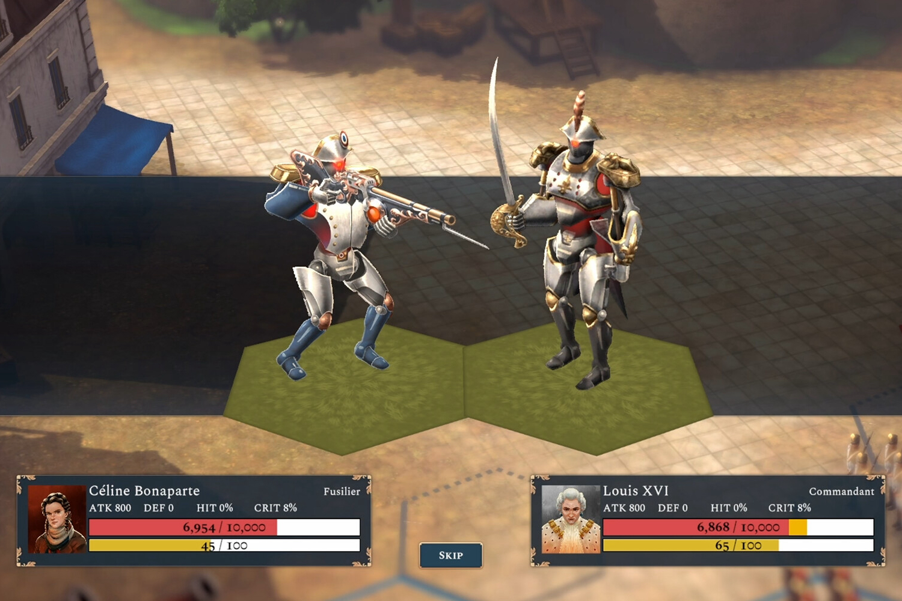

+++
title = "La Révolution française, mais avec des mechas"
date = 2024-08-26T05:29:32+01:00
draft = false
author = "Mickael"
tags = ["Actu"]
image = "https://nostick.fr/articles/vignettes/aout/Bonaparte-A-Mechanized-Revolution.jpg"
+++

L'histoire de la Révolution française, ça vous barbe ? OK, je peux comprendre ça. Mais l'histoire de la Révolution française *avec des méchas*, là vous parle ! *Bonaparte: A Mechanized Revolution* est le futur jeu de stratégie du studio Imugi, dans lequel on trouve des anciens de Sabotage (*Sea of Stars*).

 

Comme son nom l'indique, le joueur portera le bicorne de Bonaparte, mais pas de Napoléon : soit de Céline, soit de César, deux personnages fictifs. Il faudra plonger au cœur de Paris en 1789, où les esprits s'échauffent. En fonction de ses actions, on pourra soit s'opposer la monarchie (🤘), soit la réformer (😑), soit la soutenir (🫠). Au fil de l'aventure, on retrouvera les principaux acteurs des événements, comme Robespierre et le comte d'Artois, qui tous vont tenter de vous influencer.

En plus des combats au tour par tour, le jeu fera une grande place aux manipulations politiques. Comme aujourd'hui en somme, mais en plus rigolo car *Bonaparte: A Mechanized Revolution* permet aussi de contrôler des… mechas. Mais si vous savez, ces grands robots qui ont permis de renverser l'histoire de France ! Bon, c'est plutôt curieux comme idée, mais pas tellement plus que de vouloir sauver le Roi après tout. Le jeu est prévu sur [Steam](https://store.steampowered.com/app/2560340/Bonaparte__A_Mechanized_Revolution/) pour le 1er trimestre 2025.